# EU greenhouse gas emissions project

## 1. The data

This project explores the European greenhouse gas emissions (GHG) data which can be found here:https://ec.europa.eu/eurostat/databrowser/view/env_air_gge/default/table?lang=en

This dataset includes data on the "greenhouse gas emissions (GHG) inventory", as reported by each EU country to the European Environment Agency (EEA) between 2009-2018 and was last updated in June 2020. 

The European Union (EU), as a party to the United Nations Framework Convention on Climate Change (UNFCCC), reports annually its greenhouse gas inventory for the year t-2 (ie data is published 18 months after the reference year) and within the area covered by its Member States. The data forms the official data for international climate policies.

The GHG inventory contains data on:

- amounts of various air pollutants and greenhouse gases emitted (in total for the EU and by country): carbon dioxide (CO2), methane (CH4), nitrous oxide (N2O), perfluorocarbons (PFCs), hydrofluorocarbons (HFCs), sulphur hexafluoride (SF6) and nitrogen trifluoride (NF3); and 

- emissions by five key GHG "source sectors": Energy, Industrial processes, Agriculture, Land use and forestry and Waste management (again by country and EU total).

Greenhouse gases are generally measured in 1000's of tonnes of ‘carbon dioxide-equivalents’ (CO2e).

The Eurostat dataset used here has 99 Excel sheets as the data is sliced per pollutant and per sector. 

We'll pick a key sheet to explore first - sheet 1 - which include the consolidated total GHG for EU countries across all air pollutants and sectors (including international aviation).


## 2. Questions to explore

It would be interesting to see if we can discover:

- how have GHGs trended over the years across the EU - are EU emissions going up or down?
- which country is responsible for the most emissions and which is the least polluting country in the EU?
- which industry/sector is the most polluting and what percentage of GHG are emitted by each of the 5 key industries?
- how is each sector faring over time - are GHG emissions increasing or decreasing in each of the five key sectors?

## 3. Data manipulation techniques

We'll be using various data manipulation techniques in pandas to pre-process and wrangle the original data as well as conduct exploratory data analysis and visualise some of our findings in matplotlib, seaborn and Tableau. 

Specifically, this project will demonstrate pandas best practices and the following data manipulation topics:

- Sorting and subsetting dataframes
- Aggregation and summary statistics
- Slicing and indexing data 
- Pivoting tables
- Handling missing data
- Plotting/visualising

## 4. Basic data cleaning and re-shaping

Before we can start exploring the data for insights, we'll need to import the relevant sheet we want to analyse and reshape the data to get rid of unwanted columns and rows which may contain null values or other irrelevant data.

We start by reading the entire file and accessing the sheet names to see what's in the file. 

As mentioned above, we only want to look at "Sheet 1" for now so we'll be importing that sheet and transforming it into a dataframe. Here's what that looks like in code:


```python
#import pandas
import pandas as pd

#read the excel file data

file = 'ENV_AIR_GGE$DEFAULTVIEW1607409763857.xlsx'
data = pd.ExcelFile(file)

#access the sheet names
print(data.sheet_names)
```

    ['Summary', 'Structure', 'Sheet 1', 'Sheet 2', 'Sheet 3', 'Sheet 4', 'Sheet 5', 'Sheet 6', 'Sheet 7', 'Sheet 8', 'Sheet 9', 'Sheet 10', 'Sheet 11', 'Sheet 12', 'Sheet 13', 'Sheet 14', 'Sheet 15', 'Sheet 16', 'Sheet 17', 'Sheet 18', 'Sheet 19', 'Sheet 20', 'Sheet 21', 'Sheet 22', 'Sheet 23', 'Sheet 24', 'Sheet 25', 'Sheet 26', 'Sheet 27', 'Sheet 28', 'Sheet 29', 'Sheet 30', 'Sheet 31', 'Sheet 32', 'Sheet 33', 'Sheet 34', 'Sheet 35', 'Sheet 36', 'Sheet 37', 'Sheet 38', 'Sheet 39', 'Sheet 40', 'Sheet 41', 'Sheet 42', 'Sheet 43', 'Sheet 44', 'Sheet 45', 'Sheet 46', 'Sheet 47', 'Sheet 48', 'Sheet 49', 'Sheet 50', 'Sheet 51', 'Sheet 52', 'Sheet 53', 'Sheet 54', 'Sheet 55', 'Sheet 56', 'Sheet 57', 'Sheet 58', 'Sheet 59', 'Sheet 60', 'Sheet 61', 'Sheet 62', 'Sheet 63', 'Sheet 64', 'Sheet 65', 'Sheet 66', 'Sheet 67', 'Sheet 68', 'Sheet 69', 'Sheet 70', 'Sheet 71', 'Sheet 72', 'Sheet 73', 'Sheet 74', 'Sheet 75', 'Sheet 76', 'Sheet 77', 'Sheet 78', 'Sheet 79', 'Sheet 80', 'Sheet 81', 'Sheet 82', 'Sheet 83', 'Sheet 84', 'Sheet 85', 'Sheet 86', 'Sheet 87', 'Sheet 88', 'Sheet 89', 'Sheet 90', 'Sheet 91', 'Sheet 92', 'Sheet 93', 'Sheet 94', 'Sheet 95', 'Sheet 96', 'Sheet 97', 'Sheet 98', 'Sheet 99']


```python
#import excel file sheet 1 into pandas as DF, use row 10 (zero indexed) as header
df_sheet1 = pd.read_excel(file, sheet_name='Sheet 1', header=9)

#display the sheet
df_sheet1
```


<div>
<style scoped>
    .dataframe tbody tr th:only-of-type {
        vertical-align: middle;
    }

    .dataframe tbody tr th {
        vertical-align: top;
    }

    .dataframe thead th {
        text-align: right;
    }
</style>
<table border="1" class="dataframe">
  <thead>
    <tr style="text-align: right;">
      <th></th>
      <th>TIME</th>
      <th>2009</th>
      <th>Unnamed: 2</th>
      <th>2010</th>
      <th>Unnamed: 4</th>
      <th>2011</th>
      <th>Unnamed: 6</th>
      <th>2012</th>
      <th>Unnamed: 8</th>
      <th>2013</th>
      <th>...</th>
      <th>2014</th>
      <th>Unnamed: 12</th>
      <th>2015</th>
      <th>Unnamed: 14</th>
      <th>2016</th>
      <th>Unnamed: 16</th>
      <th>2017</th>
      <th>Unnamed: 18</th>
      <th>2018</th>
      <th>Unnamed: 20</th>
    </tr>
  </thead>
  <tbody>
    <tr>
      <th>0</th>
      <td>GEO (Labels)</td>
      <td>NaN</td>
      <td>NaN</td>
      <td>NaN</td>
      <td>NaN</td>
      <td>NaN</td>
      <td>NaN</td>
      <td>NaN</td>
      <td>NaN</td>
      <td>NaN</td>
      <td>...</td>
      <td>NaN</td>
      <td>NaN</td>
      <td>NaN</td>
      <td>NaN</td>
      <td>NaN</td>
      <td>NaN</td>
      <td>NaN</td>
      <td>NaN</td>
      <td>NaN</td>
      <td>NaN</td>
    </tr>
    <tr>
      <th>1</th>
      <td>European Union - 27 countries (from 2020)</td>
      <td>3.76892e+06</td>
      <td>NaN</td>
      <td>3862747.61</td>
      <td>NaN</td>
      <td>3755309.45</td>
      <td>NaN</td>
      <td>3674289.61</td>
      <td>NaN</td>
      <td>3588728.61</td>
      <td>...</td>
      <td>3473826.70</td>
      <td>NaN</td>
      <td>3535584.01</td>
      <td>NaN</td>
      <td>3541154.42</td>
      <td>NaN</td>
      <td>3601730.63</td>
      <td>NaN</td>
      <td>3501175.75</td>
      <td>NaN</td>
    </tr>
    <tr>
      <th>2</th>
      <td>European Union - 28 countries (2013-2020) and ...</td>
      <td>4.37382e+06</td>
      <td>NaN</td>
      <td>4481660.67</td>
      <td>NaN</td>
      <td>4326227.24</td>
      <td>NaN</td>
      <td>4262123.15</td>
      <td>NaN</td>
      <td>4162704.54</td>
      <td>...</td>
      <td>4007559.97</td>
      <td>NaN</td>
      <td>4051218.23</td>
      <td>NaN</td>
      <td>4031055.80</td>
      <td>NaN</td>
      <td>4080310.08</td>
      <td>NaN</td>
      <td>3970229.30</td>
      <td>NaN</td>
    </tr>
    <tr>
      <th>3</th>
      <td>European Union - 28 countries (2013-2020)</td>
      <td>4.35605e+06</td>
      <td>NaN</td>
      <td>4464048.08</td>
      <td>NaN</td>
      <td>4308863.74</td>
      <td>NaN</td>
      <td>4244733.68</td>
      <td>NaN</td>
      <td>4145286.23</td>
      <td>...</td>
      <td>3990237.08</td>
      <td>NaN</td>
      <td>4033916.72</td>
      <td>NaN</td>
      <td>4013969.53</td>
      <td>NaN</td>
      <td>4063117.51</td>
      <td>NaN</td>
      <td>3953005.69</td>
      <td>NaN</td>
    </tr>
    <tr>
      <th>4</th>
      <td>Belgium</td>
      <td>125925</td>
      <td>NaN</td>
      <td>133614.01</td>
      <td>NaN</td>
      <td>123165.11</td>
      <td>NaN</td>
      <td>120209.26</td>
      <td>NaN</td>
      <td>119717.78</td>
      <td>...</td>
      <td>114004.25</td>
      <td>NaN</td>
      <td>118156.05</td>
      <td>NaN</td>
      <td>117147.49</td>
      <td>NaN</td>
      <td>116982.87</td>
      <td>NaN</td>
      <td>117441.12</td>
      <td>NaN</td>
    </tr>
    <tr>
      <th>5</th>
      <td>Bulgaria</td>
      <td>44829</td>
      <td>NaN</td>
      <td>48066.69</td>
      <td>NaN</td>
      <td>56217.53</td>
      <td>NaN</td>
      <td>51743.63</td>
      <td>NaN</td>
      <td>47764.77</td>
      <td>...</td>
      <td>49506.46</td>
      <td>NaN</td>
      <td>53239.29</td>
      <td>NaN</td>
      <td>50702.97</td>
      <td>NaN</td>
      <td>53286.09</td>
      <td>NaN</td>
      <td>49354.98</td>
      <td>NaN</td>
    </tr>
    <tr>
      <th>6</th>
      <td>Czechia</td>
      <td>131122</td>
      <td>NaN</td>
      <td>134638.25</td>
      <td>NaN</td>
      <td>132045.36</td>
      <td>NaN</td>
      <td>127684.43</td>
      <td>NaN</td>
      <td>123010.92</td>
      <td>...</td>
      <td>120997.69</td>
      <td>NaN</td>
      <td>123280.02</td>
      <td>NaN</td>
      <td>126211.87</td>
      <td>NaN</td>
      <td>127461.72</td>
      <td>NaN</td>
      <td>133933.57</td>
      <td>NaN</td>
    </tr>
    <tr>
      <th>7</th>
      <td>Denmark</td>
      <td>66717.6</td>
      <td>NaN</td>
      <td>64073.28</td>
      <td>NaN</td>
      <td>57312.85</td>
      <td>NaN</td>
      <td>54416.21</td>
      <td>NaN</td>
      <td>57389.66</td>
      <td>...</td>
      <td>52828.27</td>
      <td>NaN</td>
      <td>53788.45</td>
      <td>NaN</td>
      <td>56830.19</td>
      <td>NaN</td>
      <td>52839.21</td>
      <td>NaN</td>
      <td>54817.35</td>
      <td>NaN</td>
    </tr>
    <tr>
      <th>8</th>
      <td>Germany (until 1990 former territory of the FRG)</td>
      <td>887961</td>
      <td>NaN</td>
      <td>922674.52</td>
      <td>NaN</td>
      <td>900566.23</td>
      <td>NaN</td>
      <td>895339.80</td>
      <td>NaN</td>
      <td>914157.78</td>
      <td>...</td>
      <td>874325.02</td>
      <td>NaN</td>
      <td>878734.01</td>
      <td>NaN</td>
      <td>881479.57</td>
      <td>NaN</td>
      <td>867667.61</td>
      <td>NaN</td>
      <td>831436.95</td>
      <td>NaN</td>
    </tr>
    <tr>
      <th>9</th>
      <td>Estonia</td>
      <td>13720.8</td>
      <td>NaN</td>
      <td>17279.56</td>
      <td>NaN</td>
      <td>16967.22</td>
      <td>NaN</td>
      <td>16330.69</td>
      <td>NaN</td>
      <td>18640.57</td>
      <td>...</td>
      <td>19498.76</td>
      <td>NaN</td>
      <td>15893.72</td>
      <td>NaN</td>
      <td>17201.14</td>
      <td>NaN</td>
      <td>19088.86</td>
      <td>NaN</td>
      <td>17983.96</td>
      <td>NaN</td>
    </tr>
    <tr>
      <th>10</th>
      <td>Ireland</td>
      <td>65841.8</td>
      <td>NaN</td>
      <td>66810.06</td>
      <td>NaN</td>
      <td>61812.85</td>
      <td>NaN</td>
      <td>61807.76</td>
      <td>NaN</td>
      <td>62060.97</td>
      <td>...</td>
      <td>61272.03</td>
      <td>NaN</td>
      <td>63936.55</td>
      <td>NaN</td>
      <td>64874.36</td>
      <td>NaN</td>
      <td>66343.05</td>
      <td>NaN</td>
      <td>65232.23</td>
      <td>NaN</td>
    </tr>
    <tr>
      <th>11</th>
      <td>Greece</td>
      <td>121603</td>
      <td>NaN</td>
      <td>115479.17</td>
      <td>NaN</td>
      <td>112462.11</td>
      <td>NaN</td>
      <td>109240.72</td>
      <td>NaN</td>
      <td>101122.94</td>
      <td>...</td>
      <td>99151.11</td>
      <td>NaN</td>
      <td>91762.95</td>
      <td>NaN</td>
      <td>88366.33</td>
      <td>NaN</td>
      <td>92376.88</td>
      <td>NaN</td>
      <td>89243.77</td>
      <td>NaN</td>
    </tr>
    <tr>
      <th>12</th>
      <td>Spain</td>
      <td>338400</td>
      <td>NaN</td>
      <td>321583.33</td>
      <td>NaN</td>
      <td>320958.42</td>
      <td>NaN</td>
      <td>315632.22</td>
      <td>NaN</td>
      <td>290421.02</td>
      <td>...</td>
      <td>290516.93</td>
      <td>NaN</td>
      <td>299712.24</td>
      <td>NaN</td>
      <td>288984.21</td>
      <td>NaN</td>
      <td>301362.04</td>
      <td>NaN</td>
      <td>296158.86</td>
      <td>NaN</td>
    </tr>
    <tr>
      <th>13</th>
      <td>France</td>
      <td>468073</td>
      <td>NaN</td>
      <td>474543.48</td>
      <td>NaN</td>
      <td>447777.20</td>
      <td>NaN</td>
      <td>447326.30</td>
      <td>NaN</td>
      <td>446186.63</td>
      <td>...</td>
      <td>421813.69</td>
      <td>NaN</td>
      <td>430950.58</td>
      <td>NaN</td>
      <td>429574.36</td>
      <td>NaN</td>
      <td>436899.38</td>
      <td>NaN</td>
      <td>419118.49</td>
      <td>NaN</td>
    </tr>
    <tr>
      <th>14</th>
      <td>Croatia</td>
      <td>21360.8</td>
      <td>NaN</td>
      <td>21107.73</td>
      <td>NaN</td>
      <td>21984.34</td>
      <td>NaN</td>
      <td>20609.98</td>
      <td>NaN</td>
      <td>18403.46</td>
      <td>...</td>
      <td>17611.01</td>
      <td>NaN</td>
      <td>19003.17</td>
      <td>NaN</td>
      <td>19095.63</td>
      <td>NaN</td>
      <td>20542.48</td>
      <td>NaN</td>
      <td>18698.57</td>
      <td>NaN</td>
    </tr>
    <tr>
      <th>15</th>
      <td>Italy</td>
      <td>467023</td>
      <td>NaN</td>
      <td>471781.75</td>
      <td>NaN</td>
      <td>467342.14</td>
      <td>NaN</td>
      <td>457343.52</td>
      <td>NaN</td>
      <td>407098.03</td>
      <td>...</td>
      <td>385404.56</td>
      <td>NaN</td>
      <td>395821.99</td>
      <td>NaN</td>
      <td>395857.23</td>
      <td>NaN</td>
      <td>409964.22</td>
      <td>NaN</td>
      <td>391263.13</td>
      <td>NaN</td>
    </tr>
    <tr>
      <th>16</th>
      <td>Cyprus</td>
      <td>9417.22</td>
      <td>NaN</td>
      <td>9117.15</td>
      <td>NaN</td>
      <td>8737.28</td>
      <td>NaN</td>
      <td>8207.43</td>
      <td>NaN</td>
      <td>7473.53</td>
      <td>...</td>
      <td>7853.07</td>
      <td>NaN</td>
      <td>7911.16</td>
      <td>NaN</td>
      <td>8741.97</td>
      <td>NaN</td>
      <td>8554.86</td>
      <td>NaN</td>
      <td>8411.15</td>
      <td>NaN</td>
    </tr>
    <tr>
      <th>17</th>
      <td>Latvia</td>
      <td>9217.02</td>
      <td>NaN</td>
      <td>12036.43</td>
      <td>NaN</td>
      <td>10835.43</td>
      <td>NaN</td>
      <td>9301.69</td>
      <td>NaN</td>
      <td>10492.69</td>
      <td>...</td>
      <td>14143.29</td>
      <td>NaN</td>
      <td>12910.19</td>
      <td>NaN</td>
      <td>11050.64</td>
      <td>NaN</td>
      <td>9914.90</td>
      <td>NaN</td>
      <td>13145.02</td>
      <td>NaN</td>
    </tr>
    <tr>
      <th>18</th>
      <td>Lithuania</td>
      <td>12782.4</td>
      <td>NaN</td>
      <td>10602.75</td>
      <td>NaN</td>
      <td>10909.80</td>
      <td>NaN</td>
      <td>10695.15</td>
      <td>NaN</td>
      <td>10801.81</td>
      <td>...</td>
      <td>11511.51</td>
      <td>NaN</td>
      <td>14870.68</td>
      <td>NaN</td>
      <td>16163.52</td>
      <td>NaN</td>
      <td>16883.20</td>
      <td>NaN</td>
      <td>16400.11</td>
      <td>NaN</td>
    </tr>
    <tr>
      <th>19</th>
      <td>Luxembourg</td>
      <td>11155.8</td>
      <td>NaN</td>
      <td>12049.58</td>
      <td>NaN</td>
      <td>11755.30</td>
      <td>NaN</td>
      <td>11391.50</td>
      <td>NaN</td>
      <td>10675.20</td>
      <td>...</td>
      <td>10304.55</td>
      <td>NaN</td>
      <td>9868.52</td>
      <td>NaN</td>
      <td>9541.33</td>
      <td>NaN</td>
      <td>9833.28</td>
      <td>NaN</td>
      <td>10333.88</td>
      <td>NaN</td>
    </tr>
    <tr>
      <th>20</th>
      <td>Hungary</td>
      <td>60510.9</td>
      <td>NaN</td>
      <td>60534.82</td>
      <td>NaN</td>
      <td>59324.07</td>
      <td>NaN</td>
      <td>54918.40</td>
      <td>NaN</td>
      <td>53071.18</td>
      <td>...</td>
      <td>52243.50</td>
      <td>NaN</td>
      <td>55074.47</td>
      <td>NaN</td>
      <td>56729.19</td>
      <td>NaN</td>
      <td>58607.31</td>
      <td>NaN</td>
      <td>58559.63</td>
      <td>NaN</td>
    </tr>
    <tr>
      <th>21</th>
      <td>Malta</td>
      <td>2902.73</td>
      <td>NaN</td>
      <td>2986.53</td>
      <td>NaN</td>
      <td>2995.03</td>
      <td>NaN</td>
      <td>3210.45</td>
      <td>NaN</td>
      <td>2897.34</td>
      <td>...</td>
      <td>2936.64</td>
      <td>NaN</td>
      <td>2258.93</td>
      <td>NaN</td>
      <td>1947.92</td>
      <td>NaN</td>
      <td>2160.29</td>
      <td>NaN</td>
      <td>2190.45</td>
      <td>NaN</td>
    </tr>
    <tr>
      <th>22</th>
      <td>Netherlands</td>
      <td>207182</td>
      <td>NaN</td>
      <td>219014.33</td>
      <td>NaN</td>
      <td>204885.51</td>
      <td>NaN</td>
      <td>200889.14</td>
      <td>NaN</td>
      <td>200633.39</td>
      <td>...</td>
      <td>192774.30</td>
      <td>NaN</td>
      <td>200974.76</td>
      <td>NaN</td>
      <td>200385.65</td>
      <td>NaN</td>
      <td>198377.44</td>
      <td>NaN</td>
      <td>193111.69</td>
      <td>NaN</td>
    </tr>
    <tr>
      <th>23</th>
      <td>Austria</td>
      <td>75714.3</td>
      <td>NaN</td>
      <td>78835.78</td>
      <td>NaN</td>
      <td>76282.06</td>
      <td>NaN</td>
      <td>74181.27</td>
      <td>NaN</td>
      <td>75575.74</td>
      <td>...</td>
      <td>71743.12</td>
      <td>NaN</td>
      <td>74070.77</td>
      <td>NaN</td>
      <td>75196.41</td>
      <td>NaN</td>
      <td>77171.50</td>
      <td>NaN</td>
      <td>73797.67</td>
      <td>NaN</td>
    </tr>
    <tr>
      <th>24</th>
      <td>Poland</td>
      <td>357002</td>
      <td>NaN</td>
      <td>378411.95</td>
      <td>NaN</td>
      <td>370677.19</td>
      <td>NaN</td>
      <td>363506.76</td>
      <td>NaN</td>
      <td>357969.88</td>
      <td>...</td>
      <td>353915.03</td>
      <td>NaN</td>
      <td>359690.40</td>
      <td>NaN</td>
      <td>369425.88</td>
      <td>NaN</td>
      <td>377808.91</td>
      <td>NaN</td>
      <td>376405.33</td>
      <td>NaN</td>
    </tr>
    <tr>
      <th>25</th>
      <td>Portugal</td>
      <td>59672.3</td>
      <td>NaN</td>
      <td>57747.64</td>
      <td>NaN</td>
      <td>56471.42</td>
      <td>NaN</td>
      <td>56821.34</td>
      <td>NaN</td>
      <td>55765.22</td>
      <td>...</td>
      <td>54069.07</td>
      <td>NaN</td>
      <td>59213.06</td>
      <td>NaN</td>
      <td>61249.38</td>
      <td>NaN</td>
      <td>80472.20</td>
      <td>NaN</td>
      <td>61129.40</td>
      <td>NaN</td>
    </tr>
    <tr>
      <th>26</th>
      <td>Romania</td>
      <td>107969</td>
      <td>NaN</td>
      <td>103455.22</td>
      <td>NaN</td>
      <td>109533.32</td>
      <td>NaN</td>
      <td>104815.28</td>
      <td>NaN</td>
      <td>94683.20</td>
      <td>...</td>
      <td>93878.21</td>
      <td>NaN</td>
      <td>94488.55</td>
      <td>NaN</td>
      <td>91182.74</td>
      <td>NaN</td>
      <td>95195.44</td>
      <td>NaN</td>
      <td>91656.49</td>
      <td>NaN</td>
    </tr>
    <tr>
      <th>27</th>
      <td>Slovenia</td>
      <td>13343.3</td>
      <td>NaN</td>
      <td>13429.75</td>
      <td>NaN</td>
      <td>13523.84</td>
      <td>NaN</td>
      <td>13028.71</td>
      <td>NaN</td>
      <td>10980.73</td>
      <td>...</td>
      <td>16611.92</td>
      <td>NaN</td>
      <td>16741.62</td>
      <td>NaN</td>
      <td>17750.33</td>
      <td>NaN</td>
      <td>17191.66</td>
      <td>NaN</td>
      <td>17745.28</td>
      <td>NaN</td>
    </tr>
    <tr>
      <th>28</th>
      <td>Slovakia</td>
      <td>38736.7</td>
      <td>NaN</td>
      <td>40257.64</td>
      <td>NaN</td>
      <td>39243.34</td>
      <td>NaN</td>
      <td>35761.97</td>
      <td>NaN</td>
      <td>34759.29</td>
      <td>...</td>
      <td>34672.54</td>
      <td>NaN</td>
      <td>35214.02</td>
      <td>NaN</td>
      <td>35625.68</td>
      <td>NaN</td>
      <td>36890.91</td>
      <td>NaN</td>
      <td>37677.97</td>
      <td>NaN</td>
    </tr>
    <tr>
      <th>29</th>
      <td>Finland</td>
      <td>34051.1</td>
      <td>NaN</td>
      <td>53256.56</td>
      <td>NaN</td>
      <td>45230.91</td>
      <td>NaN</td>
      <td>37030.99</td>
      <td>NaN</td>
      <td>43874.51</td>
      <td>...</td>
      <td>37413.18</td>
      <td>NaN</td>
      <td>36271.36</td>
      <td>NaN</td>
      <td>41340.98</td>
      <td>NaN</td>
      <td>38207.19</td>
      <td>NaN</td>
      <td>46143.44</td>
      <td>NaN</td>
    </tr>
    <tr>
      <th>30</th>
      <td>Sweden</td>
      <td>16686.6</td>
      <td>NaN</td>
      <td>19359.65</td>
      <td>NaN</td>
      <td>16293.57</td>
      <td>NaN</td>
      <td>12845.03</td>
      <td>NaN</td>
      <td>13100.37</td>
      <td>...</td>
      <td>12827.01</td>
      <td>NaN</td>
      <td>11746.49</td>
      <td>NaN</td>
      <td>8497.46</td>
      <td>NaN</td>
      <td>9647.15</td>
      <td>NaN</td>
      <td>9785.28</td>
      <td>NaN</td>
    </tr>
    <tr>
      <th>31</th>
      <td>United Kingdom</td>
      <td>587132</td>
      <td>NaN</td>
      <td>601300.46</td>
      <td>NaN</td>
      <td>553554.29</td>
      <td>NaN</td>
      <td>570444.06</td>
      <td>NaN</td>
      <td>556557.61</td>
      <td>...</td>
      <td>516410.38</td>
      <td>NaN</td>
      <td>498332.71</td>
      <td>NaN</td>
      <td>472815.11</td>
      <td>NaN</td>
      <td>461386.88</td>
      <td>NaN</td>
      <td>451829.94</td>
      <td>NaN</td>
    </tr>
    <tr>
      <th>32</th>
      <td>Iceland</td>
      <td>14295.3</td>
      <td>NaN</td>
      <td>14190.67</td>
      <td>NaN</td>
      <td>13911.48</td>
      <td>NaN</td>
      <td>13902.81</td>
      <td>NaN</td>
      <td>13888.21</td>
      <td>...</td>
      <td>13892.62</td>
      <td>NaN</td>
      <td>13940.80</td>
      <td>NaN</td>
      <td>13865.02</td>
      <td>NaN</td>
      <td>13888.66</td>
      <td>NaN</td>
      <td>13866.71</td>
      <td>NaN</td>
    </tr>
    <tr>
      <th>33</th>
      <td>Liechtenstein</td>
      <td>265.66</td>
      <td>NaN</td>
      <td>249.27</td>
      <td>NaN</td>
      <td>240.02</td>
      <td>NaN</td>
      <td>249.50</td>
      <td>NaN</td>
      <td>248.38</td>
      <td>...</td>
      <td>216.24</td>
      <td>NaN</td>
      <td>208.85</td>
      <td>NaN</td>
      <td>197.20</td>
      <td>NaN</td>
      <td>204.54</td>
      <td>NaN</td>
      <td>203.00</td>
      <td>NaN</td>
    </tr>
    <tr>
      <th>34</th>
      <td>Norway</td>
      <td>22788.7</td>
      <td>NaN</td>
      <td>29009.22</td>
      <td>NaN</td>
      <td>26668.12</td>
      <td>NaN</td>
      <td>29584.55</td>
      <td>NaN</td>
      <td>28690.37</td>
      <td>...</td>
      <td>31809.54</td>
      <td>NaN</td>
      <td>33123.29</td>
      <td>NaN</td>
      <td>31658.43</td>
      <td>NaN</td>
      <td>29365.45</td>
      <td>NaN</td>
      <td>28354.94</td>
      <td>NaN</td>
    </tr>
    <tr>
      <th>35</th>
      <td>Switzerland</td>
      <td>50308.4</td>
      <td>NaN</td>
      <td>52413.22</td>
      <td>NaN</td>
      <td>49685.97</td>
      <td>NaN</td>
      <td>50578.01</td>
      <td>NaN</td>
      <td>51182.34</td>
      <td>...</td>
      <td>48708.11</td>
      <td>NaN</td>
      <td>46443.20</td>
      <td>NaN</td>
      <td>46744.14</td>
      <td>NaN</td>
      <td>46649.08</td>
      <td>NaN</td>
      <td>45140.41</td>
      <td>NaN</td>
    </tr>
    <tr>
      <th>36</th>
      <td>Turkey</td>
      <td>322824</td>
      <td>NaN</td>
      <td>325463.11</td>
      <td>NaN</td>
      <td>350750.19</td>
      <td>NaN</td>
      <td>372783.11</td>
      <td>NaN</td>
      <td>362834.19</td>
      <td>...</td>
      <td>380860.38</td>
      <td>NaN</td>
      <td>375329.53</td>
      <td>NaN</td>
      <td>401803.27</td>
      <td>NaN</td>
      <td>423870.49</td>
      <td>NaN</td>
      <td>426371.90</td>
      <td>NaN</td>
    </tr>
    <tr>
      <th>37</th>
      <td>NaN</td>
      <td>NaN</td>
      <td>NaN</td>
      <td>NaN</td>
      <td>NaN</td>
      <td>NaN</td>
      <td>NaN</td>
      <td>NaN</td>
      <td>NaN</td>
      <td>NaN</td>
      <td>...</td>
      <td>NaN</td>
      <td>NaN</td>
      <td>NaN</td>
      <td>NaN</td>
      <td>NaN</td>
      <td>NaN</td>
      <td>NaN</td>
      <td>NaN</td>
      <td>NaN</td>
      <td>NaN</td>
    </tr>
    <tr>
      <th>38</th>
      <td>Special value</td>
      <td>NaN</td>
      <td>NaN</td>
      <td>NaN</td>
      <td>NaN</td>
      <td>NaN</td>
      <td>NaN</td>
      <td>NaN</td>
      <td>NaN</td>
      <td>NaN</td>
      <td>...</td>
      <td>NaN</td>
      <td>NaN</td>
      <td>NaN</td>
      <td>NaN</td>
      <td>NaN</td>
      <td>NaN</td>
      <td>NaN</td>
      <td>NaN</td>
      <td>NaN</td>
      <td>NaN</td>
    </tr>
    <tr>
      <th>39</th>
      <td>:</td>
      <td>not available</td>
      <td>NaN</td>
      <td>NaN</td>
      <td>NaN</td>
      <td>NaN</td>
      <td>NaN</td>
      <td>NaN</td>
      <td>NaN</td>
      <td>NaN</td>
      <td>...</td>
      <td>NaN</td>
      <td>NaN</td>
      <td>NaN</td>
      <td>NaN</td>
      <td>NaN</td>
      <td>NaN</td>
      <td>NaN</td>
      <td>NaN</td>
      <td>NaN</td>
      <td>NaN</td>
    </tr>
  </tbody>
</table>
<p>40 rows × 21 columns</p>
</div>


As we can see above, there are various columns and rows with NaN values which we need to remove with dropna.


```python
#drop all columns with NaN values 
df_sheet1.dropna(how='all', axis=1, inplace=True)

#drop all rows with NaN values
df_sheet1.dropna(how='all', axis=0, inplace=True)
```


```python
#display the DF again
df_sheet1
```


<div>
<style scoped>
    .dataframe tbody tr th:only-of-type {
        vertical-align: middle;
    }

    .dataframe tbody tr th {
        vertical-align: top;
    }

    .dataframe thead th {
        text-align: right;
    }
</style>
<table border="1" class="dataframe">
  <thead>
    <tr style="text-align: right;">
      <th></th>
      <th>TIME</th>
      <th>2009</th>
      <th>2010</th>
      <th>2011</th>
      <th>2012</th>
      <th>2013</th>
      <th>2014</th>
      <th>2015</th>
      <th>2016</th>
      <th>2017</th>
      <th>2018</th>
    </tr>
  </thead>
  <tbody>
    <tr>
      <th>0</th>
      <td>GEO (Labels)</td>
      <td>NaN</td>
      <td>NaN</td>
      <td>NaN</td>
      <td>NaN</td>
      <td>NaN</td>
      <td>NaN</td>
      <td>NaN</td>
      <td>NaN</td>
      <td>NaN</td>
      <td>NaN</td>
    </tr>
    <tr>
      <th>1</th>
      <td>European Union - 27 countries (from 2020)</td>
      <td>3.76892e+06</td>
      <td>3862747.61</td>
      <td>3755309.45</td>
      <td>3674289.61</td>
      <td>3588728.61</td>
      <td>3473826.70</td>
      <td>3535584.01</td>
      <td>3541154.42</td>
      <td>3601730.63</td>
      <td>3501175.75</td>
    </tr>
    <tr>
      <th>2</th>
      <td>European Union - 28 countries (2013-2020) and ...</td>
      <td>4.37382e+06</td>
      <td>4481660.67</td>
      <td>4326227.24</td>
      <td>4262123.15</td>
      <td>4162704.54</td>
      <td>4007559.97</td>
      <td>4051218.23</td>
      <td>4031055.80</td>
      <td>4080310.08</td>
      <td>3970229.30</td>
    </tr>
    <tr>
      <th>3</th>
      <td>European Union - 28 countries (2013-2020)</td>
      <td>4.35605e+06</td>
      <td>4464048.08</td>
      <td>4308863.74</td>
      <td>4244733.68</td>
      <td>4145286.23</td>
      <td>3990237.08</td>
      <td>4033916.72</td>
      <td>4013969.53</td>
      <td>4063117.51</td>
      <td>3953005.69</td>
    </tr>
    <tr>
      <th>4</th>
      <td>Belgium</td>
      <td>125925</td>
      <td>133614.01</td>
      <td>123165.11</td>
      <td>120209.26</td>
      <td>119717.78</td>
      <td>114004.25</td>
      <td>118156.05</td>
      <td>117147.49</td>
      <td>116982.87</td>
      <td>117441.12</td>
    </tr>
    <tr>
      <th>5</th>
      <td>Bulgaria</td>
      <td>44829</td>
      <td>48066.69</td>
      <td>56217.53</td>
      <td>51743.63</td>
      <td>47764.77</td>
      <td>49506.46</td>
      <td>53239.29</td>
      <td>50702.97</td>
      <td>53286.09</td>
      <td>49354.98</td>
    </tr>
    <tr>
      <th>6</th>
      <td>Czechia</td>
      <td>131122</td>
      <td>134638.25</td>
      <td>132045.36</td>
      <td>127684.43</td>
      <td>123010.92</td>
      <td>120997.69</td>
      <td>123280.02</td>
      <td>126211.87</td>
      <td>127461.72</td>
      <td>133933.57</td>
    </tr>
    <tr>
      <th>7</th>
      <td>Denmark</td>
      <td>66717.6</td>
      <td>64073.28</td>
      <td>57312.85</td>
      <td>54416.21</td>
      <td>57389.66</td>
      <td>52828.27</td>
      <td>53788.45</td>
      <td>56830.19</td>
      <td>52839.21</td>
      <td>54817.35</td>
    </tr>
    <tr>
      <th>8</th>
      <td>Germany (until 1990 former territory of the FRG)</td>
      <td>887961</td>
      <td>922674.52</td>
      <td>900566.23</td>
      <td>895339.80</td>
      <td>914157.78</td>
      <td>874325.02</td>
      <td>878734.01</td>
      <td>881479.57</td>
      <td>867667.61</td>
      <td>831436.95</td>
    </tr>
    <tr>
      <th>9</th>
      <td>Estonia</td>
      <td>13720.8</td>
      <td>17279.56</td>
      <td>16967.22</td>
      <td>16330.69</td>
      <td>18640.57</td>
      <td>19498.76</td>
      <td>15893.72</td>
      <td>17201.14</td>
      <td>19088.86</td>
      <td>17983.96</td>
    </tr>
    <tr>
      <th>10</th>
      <td>Ireland</td>
      <td>65841.8</td>
      <td>66810.06</td>
      <td>61812.85</td>
      <td>61807.76</td>
      <td>62060.97</td>
      <td>61272.03</td>
      <td>63936.55</td>
      <td>64874.36</td>
      <td>66343.05</td>
      <td>65232.23</td>
    </tr>
    <tr>
      <th>11</th>
      <td>Greece</td>
      <td>121603</td>
      <td>115479.17</td>
      <td>112462.11</td>
      <td>109240.72</td>
      <td>101122.94</td>
      <td>99151.11</td>
      <td>91762.95</td>
      <td>88366.33</td>
      <td>92376.88</td>
      <td>89243.77</td>
    </tr>
    <tr>
      <th>12</th>
      <td>Spain</td>
      <td>338400</td>
      <td>321583.33</td>
      <td>320958.42</td>
      <td>315632.22</td>
      <td>290421.02</td>
      <td>290516.93</td>
      <td>299712.24</td>
      <td>288984.21</td>
      <td>301362.04</td>
      <td>296158.86</td>
    </tr>
    <tr>
      <th>13</th>
      <td>France</td>
      <td>468073</td>
      <td>474543.48</td>
      <td>447777.20</td>
      <td>447326.30</td>
      <td>446186.63</td>
      <td>421813.69</td>
      <td>430950.58</td>
      <td>429574.36</td>
      <td>436899.38</td>
      <td>419118.49</td>
    </tr>
    <tr>
      <th>14</th>
      <td>Croatia</td>
      <td>21360.8</td>
      <td>21107.73</td>
      <td>21984.34</td>
      <td>20609.98</td>
      <td>18403.46</td>
      <td>17611.01</td>
      <td>19003.17</td>
      <td>19095.63</td>
      <td>20542.48</td>
      <td>18698.57</td>
    </tr>
    <tr>
      <th>15</th>
      <td>Italy</td>
      <td>467023</td>
      <td>471781.75</td>
      <td>467342.14</td>
      <td>457343.52</td>
      <td>407098.03</td>
      <td>385404.56</td>
      <td>395821.99</td>
      <td>395857.23</td>
      <td>409964.22</td>
      <td>391263.13</td>
    </tr>
    <tr>
      <th>16</th>
      <td>Cyprus</td>
      <td>9417.22</td>
      <td>9117.15</td>
      <td>8737.28</td>
      <td>8207.43</td>
      <td>7473.53</td>
      <td>7853.07</td>
      <td>7911.16</td>
      <td>8741.97</td>
      <td>8554.86</td>
      <td>8411.15</td>
    </tr>
    <tr>
      <th>17</th>
      <td>Latvia</td>
      <td>9217.02</td>
      <td>12036.43</td>
      <td>10835.43</td>
      <td>9301.69</td>
      <td>10492.69</td>
      <td>14143.29</td>
      <td>12910.19</td>
      <td>11050.64</td>
      <td>9914.90</td>
      <td>13145.02</td>
    </tr>
    <tr>
      <th>18</th>
      <td>Lithuania</td>
      <td>12782.4</td>
      <td>10602.75</td>
      <td>10909.80</td>
      <td>10695.15</td>
      <td>10801.81</td>
      <td>11511.51</td>
      <td>14870.68</td>
      <td>16163.52</td>
      <td>16883.20</td>
      <td>16400.11</td>
    </tr>
    <tr>
      <th>19</th>
      <td>Luxembourg</td>
      <td>11155.8</td>
      <td>12049.58</td>
      <td>11755.30</td>
      <td>11391.50</td>
      <td>10675.20</td>
      <td>10304.55</td>
      <td>9868.52</td>
      <td>9541.33</td>
      <td>9833.28</td>
      <td>10333.88</td>
    </tr>
    <tr>
      <th>20</th>
      <td>Hungary</td>
      <td>60510.9</td>
      <td>60534.82</td>
      <td>59324.07</td>
      <td>54918.40</td>
      <td>53071.18</td>
      <td>52243.50</td>
      <td>55074.47</td>
      <td>56729.19</td>
      <td>58607.31</td>
      <td>58559.63</td>
    </tr>
    <tr>
      <th>21</th>
      <td>Malta</td>
      <td>2902.73</td>
      <td>2986.53</td>
      <td>2995.03</td>
      <td>3210.45</td>
      <td>2897.34</td>
      <td>2936.64</td>
      <td>2258.93</td>
      <td>1947.92</td>
      <td>2160.29</td>
      <td>2190.45</td>
    </tr>
    <tr>
      <th>22</th>
      <td>Netherlands</td>
      <td>207182</td>
      <td>219014.33</td>
      <td>204885.51</td>
      <td>200889.14</td>
      <td>200633.39</td>
      <td>192774.30</td>
      <td>200974.76</td>
      <td>200385.65</td>
      <td>198377.44</td>
      <td>193111.69</td>
    </tr>
    <tr>
      <th>23</th>
      <td>Austria</td>
      <td>75714.3</td>
      <td>78835.78</td>
      <td>76282.06</td>
      <td>74181.27</td>
      <td>75575.74</td>
      <td>71743.12</td>
      <td>74070.77</td>
      <td>75196.41</td>
      <td>77171.50</td>
      <td>73797.67</td>
    </tr>
    <tr>
      <th>24</th>
      <td>Poland</td>
      <td>357002</td>
      <td>378411.95</td>
      <td>370677.19</td>
      <td>363506.76</td>
      <td>357969.88</td>
      <td>353915.03</td>
      <td>359690.40</td>
      <td>369425.88</td>
      <td>377808.91</td>
      <td>376405.33</td>
    </tr>
    <tr>
      <th>25</th>
      <td>Portugal</td>
      <td>59672.3</td>
      <td>57747.64</td>
      <td>56471.42</td>
      <td>56821.34</td>
      <td>55765.22</td>
      <td>54069.07</td>
      <td>59213.06</td>
      <td>61249.38</td>
      <td>80472.20</td>
      <td>61129.40</td>
    </tr>
    <tr>
      <th>26</th>
      <td>Romania</td>
      <td>107969</td>
      <td>103455.22</td>
      <td>109533.32</td>
      <td>104815.28</td>
      <td>94683.20</td>
      <td>93878.21</td>
      <td>94488.55</td>
      <td>91182.74</td>
      <td>95195.44</td>
      <td>91656.49</td>
    </tr>
    <tr>
      <th>27</th>
      <td>Slovenia</td>
      <td>13343.3</td>
      <td>13429.75</td>
      <td>13523.84</td>
      <td>13028.71</td>
      <td>10980.73</td>
      <td>16611.92</td>
      <td>16741.62</td>
      <td>17750.33</td>
      <td>17191.66</td>
      <td>17745.28</td>
    </tr>
    <tr>
      <th>28</th>
      <td>Slovakia</td>
      <td>38736.7</td>
      <td>40257.64</td>
      <td>39243.34</td>
      <td>35761.97</td>
      <td>34759.29</td>
      <td>34672.54</td>
      <td>35214.02</td>
      <td>35625.68</td>
      <td>36890.91</td>
      <td>37677.97</td>
    </tr>
    <tr>
      <th>29</th>
      <td>Finland</td>
      <td>34051.1</td>
      <td>53256.56</td>
      <td>45230.91</td>
      <td>37030.99</td>
      <td>43874.51</td>
      <td>37413.18</td>
      <td>36271.36</td>
      <td>41340.98</td>
      <td>38207.19</td>
      <td>46143.44</td>
    </tr>
    <tr>
      <th>30</th>
      <td>Sweden</td>
      <td>16686.6</td>
      <td>19359.65</td>
      <td>16293.57</td>
      <td>12845.03</td>
      <td>13100.37</td>
      <td>12827.01</td>
      <td>11746.49</td>
      <td>8497.46</td>
      <td>9647.15</td>
      <td>9785.28</td>
    </tr>
    <tr>
      <th>31</th>
      <td>United Kingdom</td>
      <td>587132</td>
      <td>601300.46</td>
      <td>553554.29</td>
      <td>570444.06</td>
      <td>556557.61</td>
      <td>516410.38</td>
      <td>498332.71</td>
      <td>472815.11</td>
      <td>461386.88</td>
      <td>451829.94</td>
    </tr>
    <tr>
      <th>32</th>
      <td>Iceland</td>
      <td>14295.3</td>
      <td>14190.67</td>
      <td>13911.48</td>
      <td>13902.81</td>
      <td>13888.21</td>
      <td>13892.62</td>
      <td>13940.80</td>
      <td>13865.02</td>
      <td>13888.66</td>
      <td>13866.71</td>
    </tr>
    <tr>
      <th>33</th>
      <td>Liechtenstein</td>
      <td>265.66</td>
      <td>249.27</td>
      <td>240.02</td>
      <td>249.50</td>
      <td>248.38</td>
      <td>216.24</td>
      <td>208.85</td>
      <td>197.20</td>
      <td>204.54</td>
      <td>203.00</td>
    </tr>
    <tr>
      <th>34</th>
      <td>Norway</td>
      <td>22788.7</td>
      <td>29009.22</td>
      <td>26668.12</td>
      <td>29584.55</td>
      <td>28690.37</td>
      <td>31809.54</td>
      <td>33123.29</td>
      <td>31658.43</td>
      <td>29365.45</td>
      <td>28354.94</td>
    </tr>
    <tr>
      <th>35</th>
      <td>Switzerland</td>
      <td>50308.4</td>
      <td>52413.22</td>
      <td>49685.97</td>
      <td>50578.01</td>
      <td>51182.34</td>
      <td>48708.11</td>
      <td>46443.20</td>
      <td>46744.14</td>
      <td>46649.08</td>
      <td>45140.41</td>
    </tr>
    <tr>
      <th>36</th>
      <td>Turkey</td>
      <td>322824</td>
      <td>325463.11</td>
      <td>350750.19</td>
      <td>372783.11</td>
      <td>362834.19</td>
      <td>380860.38</td>
      <td>375329.53</td>
      <td>401803.27</td>
      <td>423870.49</td>
      <td>426371.90</td>
    </tr>
    <tr>
      <th>38</th>
      <td>Special value</td>
      <td>NaN</td>
      <td>NaN</td>
      <td>NaN</td>
      <td>NaN</td>
      <td>NaN</td>
      <td>NaN</td>
      <td>NaN</td>
      <td>NaN</td>
      <td>NaN</td>
      <td>NaN</td>
    </tr>
    <tr>
      <th>39</th>
      <td>:</td>
      <td>not available</td>
      <td>NaN</td>
      <td>NaN</td>
      <td>NaN</td>
      <td>NaN</td>
      <td>NaN</td>
      <td>NaN</td>
      <td>NaN</td>
      <td>NaN</td>
      <td>NaN</td>
    </tr>
  </tbody>
</table>
</div>


As we can see, the DF looks much better now. Looking at the table, we can probably also get rid of row 0,1,3 and 39 as row 2 contains the totals we're interested in (all 28 EU countries and Iceland) so next, we'll just drop those rows from the table.


```python
df_sheet1=df_sheet1.drop([0,1,3,39])
df_sheet1
```


<div>
<style scoped>
    .dataframe tbody tr th:only-of-type {
        vertical-align: middle;
    }

    .dataframe tbody tr th {
        vertical-align: top;
    }

    .dataframe thead th {
        text-align: right;
    }
</style>
<table border="1" class="dataframe">
  <thead>
    <tr style="text-align: right;">
      <th></th>
      <th>TIME</th>
      <th>2009</th>
      <th>2010</th>
      <th>2011</th>
      <th>2012</th>
      <th>2013</th>
      <th>2014</th>
      <th>2015</th>
      <th>2016</th>
      <th>2017</th>
      <th>2018</th>
    </tr>
  </thead>
  <tbody>
    <tr>
      <th>2</th>
      <td>European Union - 28 countries (2013-2020) and ...</td>
      <td>4.37382e+06</td>
      <td>4481660.67</td>
      <td>4326227.24</td>
      <td>4262123.15</td>
      <td>4162704.54</td>
      <td>4007559.97</td>
      <td>4051218.23</td>
      <td>4031055.80</td>
      <td>4080310.08</td>
      <td>3970229.30</td>
    </tr>
    <tr>
      <th>4</th>
      <td>Belgium</td>
      <td>125925</td>
      <td>133614.01</td>
      <td>123165.11</td>
      <td>120209.26</td>
      <td>119717.78</td>
      <td>114004.25</td>
      <td>118156.05</td>
      <td>117147.49</td>
      <td>116982.87</td>
      <td>117441.12</td>
    </tr>
    <tr>
      <th>5</th>
      <td>Bulgaria</td>
      <td>44829</td>
      <td>48066.69</td>
      <td>56217.53</td>
      <td>51743.63</td>
      <td>47764.77</td>
      <td>49506.46</td>
      <td>53239.29</td>
      <td>50702.97</td>
      <td>53286.09</td>
      <td>49354.98</td>
    </tr>
    <tr>
      <th>6</th>
      <td>Czechia</td>
      <td>131122</td>
      <td>134638.25</td>
      <td>132045.36</td>
      <td>127684.43</td>
      <td>123010.92</td>
      <td>120997.69</td>
      <td>123280.02</td>
      <td>126211.87</td>
      <td>127461.72</td>
      <td>133933.57</td>
    </tr>
    <tr>
      <th>7</th>
      <td>Denmark</td>
      <td>66717.6</td>
      <td>64073.28</td>
      <td>57312.85</td>
      <td>54416.21</td>
      <td>57389.66</td>
      <td>52828.27</td>
      <td>53788.45</td>
      <td>56830.19</td>
      <td>52839.21</td>
      <td>54817.35</td>
    </tr>
    <tr>
      <th>8</th>
      <td>Germany (until 1990 former territory of the FRG)</td>
      <td>887961</td>
      <td>922674.52</td>
      <td>900566.23</td>
      <td>895339.80</td>
      <td>914157.78</td>
      <td>874325.02</td>
      <td>878734.01</td>
      <td>881479.57</td>
      <td>867667.61</td>
      <td>831436.95</td>
    </tr>
    <tr>
      <th>9</th>
      <td>Estonia</td>
      <td>13720.8</td>
      <td>17279.56</td>
      <td>16967.22</td>
      <td>16330.69</td>
      <td>18640.57</td>
      <td>19498.76</td>
      <td>15893.72</td>
      <td>17201.14</td>
      <td>19088.86</td>
      <td>17983.96</td>
    </tr>
    <tr>
      <th>10</th>
      <td>Ireland</td>
      <td>65841.8</td>
      <td>66810.06</td>
      <td>61812.85</td>
      <td>61807.76</td>
      <td>62060.97</td>
      <td>61272.03</td>
      <td>63936.55</td>
      <td>64874.36</td>
      <td>66343.05</td>
      <td>65232.23</td>
    </tr>
    <tr>
      <th>11</th>
      <td>Greece</td>
      <td>121603</td>
      <td>115479.17</td>
      <td>112462.11</td>
      <td>109240.72</td>
      <td>101122.94</td>
      <td>99151.11</td>
      <td>91762.95</td>
      <td>88366.33</td>
      <td>92376.88</td>
      <td>89243.77</td>
    </tr>
    <tr>
      <th>12</th>
      <td>Spain</td>
      <td>338400</td>
      <td>321583.33</td>
      <td>320958.42</td>
      <td>315632.22</td>
      <td>290421.02</td>
      <td>290516.93</td>
      <td>299712.24</td>
      <td>288984.21</td>
      <td>301362.04</td>
      <td>296158.86</td>
    </tr>
    <tr>
      <th>13</th>
      <td>France</td>
      <td>468073</td>
      <td>474543.48</td>
      <td>447777.20</td>
      <td>447326.30</td>
      <td>446186.63</td>
      <td>421813.69</td>
      <td>430950.58</td>
      <td>429574.36</td>
      <td>436899.38</td>
      <td>419118.49</td>
    </tr>
    <tr>
      <th>14</th>
      <td>Croatia</td>
      <td>21360.8</td>
      <td>21107.73</td>
      <td>21984.34</td>
      <td>20609.98</td>
      <td>18403.46</td>
      <td>17611.01</td>
      <td>19003.17</td>
      <td>19095.63</td>
      <td>20542.48</td>
      <td>18698.57</td>
    </tr>
    <tr>
      <th>15</th>
      <td>Italy</td>
      <td>467023</td>
      <td>471781.75</td>
      <td>467342.14</td>
      <td>457343.52</td>
      <td>407098.03</td>
      <td>385404.56</td>
      <td>395821.99</td>
      <td>395857.23</td>
      <td>409964.22</td>
      <td>391263.13</td>
    </tr>
    <tr>
      <th>16</th>
      <td>Cyprus</td>
      <td>9417.22</td>
      <td>9117.15</td>
      <td>8737.28</td>
      <td>8207.43</td>
      <td>7473.53</td>
      <td>7853.07</td>
      <td>7911.16</td>
      <td>8741.97</td>
      <td>8554.86</td>
      <td>8411.15</td>
    </tr>
    <tr>
      <th>17</th>
      <td>Latvia</td>
      <td>9217.02</td>
      <td>12036.43</td>
      <td>10835.43</td>
      <td>9301.69</td>
      <td>10492.69</td>
      <td>14143.29</td>
      <td>12910.19</td>
      <td>11050.64</td>
      <td>9914.90</td>
      <td>13145.02</td>
    </tr>
    <tr>
      <th>18</th>
      <td>Lithuania</td>
      <td>12782.4</td>
      <td>10602.75</td>
      <td>10909.80</td>
      <td>10695.15</td>
      <td>10801.81</td>
      <td>11511.51</td>
      <td>14870.68</td>
      <td>16163.52</td>
      <td>16883.20</td>
      <td>16400.11</td>
    </tr>
    <tr>
      <th>19</th>
      <td>Luxembourg</td>
      <td>11155.8</td>
      <td>12049.58</td>
      <td>11755.30</td>
      <td>11391.50</td>
      <td>10675.20</td>
      <td>10304.55</td>
      <td>9868.52</td>
      <td>9541.33</td>
      <td>9833.28</td>
      <td>10333.88</td>
    </tr>
    <tr>
      <th>20</th>
      <td>Hungary</td>
      <td>60510.9</td>
      <td>60534.82</td>
      <td>59324.07</td>
      <td>54918.40</td>
      <td>53071.18</td>
      <td>52243.50</td>
      <td>55074.47</td>
      <td>56729.19</td>
      <td>58607.31</td>
      <td>58559.63</td>
    </tr>
    <tr>
      <th>21</th>
      <td>Malta</td>
      <td>2902.73</td>
      <td>2986.53</td>
      <td>2995.03</td>
      <td>3210.45</td>
      <td>2897.34</td>
      <td>2936.64</td>
      <td>2258.93</td>
      <td>1947.92</td>
      <td>2160.29</td>
      <td>2190.45</td>
    </tr>
    <tr>
      <th>22</th>
      <td>Netherlands</td>
      <td>207182</td>
      <td>219014.33</td>
      <td>204885.51</td>
      <td>200889.14</td>
      <td>200633.39</td>
      <td>192774.30</td>
      <td>200974.76</td>
      <td>200385.65</td>
      <td>198377.44</td>
      <td>193111.69</td>
    </tr>
    <tr>
      <th>23</th>
      <td>Austria</td>
      <td>75714.3</td>
      <td>78835.78</td>
      <td>76282.06</td>
      <td>74181.27</td>
      <td>75575.74</td>
      <td>71743.12</td>
      <td>74070.77</td>
      <td>75196.41</td>
      <td>77171.50</td>
      <td>73797.67</td>
    </tr>
    <tr>
      <th>24</th>
      <td>Poland</td>
      <td>357002</td>
      <td>378411.95</td>
      <td>370677.19</td>
      <td>363506.76</td>
      <td>357969.88</td>
      <td>353915.03</td>
      <td>359690.40</td>
      <td>369425.88</td>
      <td>377808.91</td>
      <td>376405.33</td>
    </tr>
    <tr>
      <th>25</th>
      <td>Portugal</td>
      <td>59672.3</td>
      <td>57747.64</td>
      <td>56471.42</td>
      <td>56821.34</td>
      <td>55765.22</td>
      <td>54069.07</td>
      <td>59213.06</td>
      <td>61249.38</td>
      <td>80472.20</td>
      <td>61129.40</td>
    </tr>
    <tr>
      <th>26</th>
      <td>Romania</td>
      <td>107969</td>
      <td>103455.22</td>
      <td>109533.32</td>
      <td>104815.28</td>
      <td>94683.20</td>
      <td>93878.21</td>
      <td>94488.55</td>
      <td>91182.74</td>
      <td>95195.44</td>
      <td>91656.49</td>
    </tr>
    <tr>
      <th>27</th>
      <td>Slovenia</td>
      <td>13343.3</td>
      <td>13429.75</td>
      <td>13523.84</td>
      <td>13028.71</td>
      <td>10980.73</td>
      <td>16611.92</td>
      <td>16741.62</td>
      <td>17750.33</td>
      <td>17191.66</td>
      <td>17745.28</td>
    </tr>
    <tr>
      <th>28</th>
      <td>Slovakia</td>
      <td>38736.7</td>
      <td>40257.64</td>
      <td>39243.34</td>
      <td>35761.97</td>
      <td>34759.29</td>
      <td>34672.54</td>
      <td>35214.02</td>
      <td>35625.68</td>
      <td>36890.91</td>
      <td>37677.97</td>
    </tr>
    <tr>
      <th>29</th>
      <td>Finland</td>
      <td>34051.1</td>
      <td>53256.56</td>
      <td>45230.91</td>
      <td>37030.99</td>
      <td>43874.51</td>
      <td>37413.18</td>
      <td>36271.36</td>
      <td>41340.98</td>
      <td>38207.19</td>
      <td>46143.44</td>
    </tr>
    <tr>
      <th>30</th>
      <td>Sweden</td>
      <td>16686.6</td>
      <td>19359.65</td>
      <td>16293.57</td>
      <td>12845.03</td>
      <td>13100.37</td>
      <td>12827.01</td>
      <td>11746.49</td>
      <td>8497.46</td>
      <td>9647.15</td>
      <td>9785.28</td>
    </tr>
    <tr>
      <th>31</th>
      <td>United Kingdom</td>
      <td>587132</td>
      <td>601300.46</td>
      <td>553554.29</td>
      <td>570444.06</td>
      <td>556557.61</td>
      <td>516410.38</td>
      <td>498332.71</td>
      <td>472815.11</td>
      <td>461386.88</td>
      <td>451829.94</td>
    </tr>
    <tr>
      <th>32</th>
      <td>Iceland</td>
      <td>14295.3</td>
      <td>14190.67</td>
      <td>13911.48</td>
      <td>13902.81</td>
      <td>13888.21</td>
      <td>13892.62</td>
      <td>13940.80</td>
      <td>13865.02</td>
      <td>13888.66</td>
      <td>13866.71</td>
    </tr>
    <tr>
      <th>33</th>
      <td>Liechtenstein</td>
      <td>265.66</td>
      <td>249.27</td>
      <td>240.02</td>
      <td>249.50</td>
      <td>248.38</td>
      <td>216.24</td>
      <td>208.85</td>
      <td>197.20</td>
      <td>204.54</td>
      <td>203.00</td>
    </tr>
    <tr>
      <th>34</th>
      <td>Norway</td>
      <td>22788.7</td>
      <td>29009.22</td>
      <td>26668.12</td>
      <td>29584.55</td>
      <td>28690.37</td>
      <td>31809.54</td>
      <td>33123.29</td>
      <td>31658.43</td>
      <td>29365.45</td>
      <td>28354.94</td>
    </tr>
    <tr>
      <th>35</th>
      <td>Switzerland</td>
      <td>50308.4</td>
      <td>52413.22</td>
      <td>49685.97</td>
      <td>50578.01</td>
      <td>51182.34</td>
      <td>48708.11</td>
      <td>46443.20</td>
      <td>46744.14</td>
      <td>46649.08</td>
      <td>45140.41</td>
    </tr>
    <tr>
      <th>36</th>
      <td>Turkey</td>
      <td>322824</td>
      <td>325463.11</td>
      <td>350750.19</td>
      <td>372783.11</td>
      <td>362834.19</td>
      <td>380860.38</td>
      <td>375329.53</td>
      <td>401803.27</td>
      <td>423870.49</td>
      <td>426371.90</td>
    </tr>
    <tr>
      <th>38</th>
      <td>Special value</td>
      <td>NaN</td>
      <td>NaN</td>
      <td>NaN</td>
      <td>NaN</td>
      <td>NaN</td>
      <td>NaN</td>
      <td>NaN</td>
      <td>NaN</td>
      <td>NaN</td>
      <td>NaN</td>
    </tr>
  </tbody>
</table>
</div>


Notice the index is now missing a few numbers (from the deleted rows) so we'll need to reset the index. The drop arument is set to True to ensure that the original index is amended (rather than adding a new index).


```python
#reset the index
df_sheet1.reset_index(drop=True, inplace=True)
```


```python
#display the reset index
df_sheet1
```


<div>
<style scoped>
    .dataframe tbody tr th:only-of-type {
        vertical-align: middle;
    }

    .dataframe tbody tr th {
        vertical-align: top;
    }

    .dataframe thead th {
        text-align: right;
    }
</style>
<table border="1" class="dataframe">
  <thead>
    <tr style="text-align: right;">
      <th></th>
      <th>TIME</th>
      <th>2009</th>
      <th>2010</th>
      <th>2011</th>
      <th>2012</th>
      <th>2013</th>
      <th>2014</th>
      <th>2015</th>
      <th>2016</th>
      <th>2017</th>
      <th>2018</th>
    </tr>
  </thead>
  <tbody>
    <tr>
      <th>0</th>
      <td>European Union - 28 countries (2013-2020) and ...</td>
      <td>4.37382e+06</td>
      <td>4481660.67</td>
      <td>4326227.24</td>
      <td>4262123.15</td>
      <td>4162704.54</td>
      <td>4007559.97</td>
      <td>4051218.23</td>
      <td>4031055.80</td>
      <td>4080310.08</td>
      <td>3970229.30</td>
    </tr>
    <tr>
      <th>1</th>
      <td>Belgium</td>
      <td>125925</td>
      <td>133614.01</td>
      <td>123165.11</td>
      <td>120209.26</td>
      <td>119717.78</td>
      <td>114004.25</td>
      <td>118156.05</td>
      <td>117147.49</td>
      <td>116982.87</td>
      <td>117441.12</td>
    </tr>
    <tr>
      <th>2</th>
      <td>Bulgaria</td>
      <td>44829</td>
      <td>48066.69</td>
      <td>56217.53</td>
      <td>51743.63</td>
      <td>47764.77</td>
      <td>49506.46</td>
      <td>53239.29</td>
      <td>50702.97</td>
      <td>53286.09</td>
      <td>49354.98</td>
    </tr>
    <tr>
      <th>3</th>
      <td>Czechia</td>
      <td>131122</td>
      <td>134638.25</td>
      <td>132045.36</td>
      <td>127684.43</td>
      <td>123010.92</td>
      <td>120997.69</td>
      <td>123280.02</td>
      <td>126211.87</td>
      <td>127461.72</td>
      <td>133933.57</td>
    </tr>
    <tr>
      <th>4</th>
      <td>Denmark</td>
      <td>66717.6</td>
      <td>64073.28</td>
      <td>57312.85</td>
      <td>54416.21</td>
      <td>57389.66</td>
      <td>52828.27</td>
      <td>53788.45</td>
      <td>56830.19</td>
      <td>52839.21</td>
      <td>54817.35</td>
    </tr>
    <tr>
      <th>5</th>
      <td>Germany (until 1990 former territory of the FRG)</td>
      <td>887961</td>
      <td>922674.52</td>
      <td>900566.23</td>
      <td>895339.80</td>
      <td>914157.78</td>
      <td>874325.02</td>
      <td>878734.01</td>
      <td>881479.57</td>
      <td>867667.61</td>
      <td>831436.95</td>
    </tr>
    <tr>
      <th>6</th>
      <td>Estonia</td>
      <td>13720.8</td>
      <td>17279.56</td>
      <td>16967.22</td>
      <td>16330.69</td>
      <td>18640.57</td>
      <td>19498.76</td>
      <td>15893.72</td>
      <td>17201.14</td>
      <td>19088.86</td>
      <td>17983.96</td>
    </tr>
    <tr>
      <th>7</th>
      <td>Ireland</td>
      <td>65841.8</td>
      <td>66810.06</td>
      <td>61812.85</td>
      <td>61807.76</td>
      <td>62060.97</td>
      <td>61272.03</td>
      <td>63936.55</td>
      <td>64874.36</td>
      <td>66343.05</td>
      <td>65232.23</td>
    </tr>
    <tr>
      <th>8</th>
      <td>Greece</td>
      <td>121603</td>
      <td>115479.17</td>
      <td>112462.11</td>
      <td>109240.72</td>
      <td>101122.94</td>
      <td>99151.11</td>
      <td>91762.95</td>
      <td>88366.33</td>
      <td>92376.88</td>
      <td>89243.77</td>
    </tr>
    <tr>
      <th>9</th>
      <td>Spain</td>
      <td>338400</td>
      <td>321583.33</td>
      <td>320958.42</td>
      <td>315632.22</td>
      <td>290421.02</td>
      <td>290516.93</td>
      <td>299712.24</td>
      <td>288984.21</td>
      <td>301362.04</td>
      <td>296158.86</td>
    </tr>
    <tr>
      <th>10</th>
      <td>France</td>
      <td>468073</td>
      <td>474543.48</td>
      <td>447777.20</td>
      <td>447326.30</td>
      <td>446186.63</td>
      <td>421813.69</td>
      <td>430950.58</td>
      <td>429574.36</td>
      <td>436899.38</td>
      <td>419118.49</td>
    </tr>
    <tr>
      <th>11</th>
      <td>Croatia</td>
      <td>21360.8</td>
      <td>21107.73</td>
      <td>21984.34</td>
      <td>20609.98</td>
      <td>18403.46</td>
      <td>17611.01</td>
      <td>19003.17</td>
      <td>19095.63</td>
      <td>20542.48</td>
      <td>18698.57</td>
    </tr>
    <tr>
      <th>12</th>
      <td>Italy</td>
      <td>467023</td>
      <td>471781.75</td>
      <td>467342.14</td>
      <td>457343.52</td>
      <td>407098.03</td>
      <td>385404.56</td>
      <td>395821.99</td>
      <td>395857.23</td>
      <td>409964.22</td>
      <td>391263.13</td>
    </tr>
    <tr>
      <th>13</th>
      <td>Cyprus</td>
      <td>9417.22</td>
      <td>9117.15</td>
      <td>8737.28</td>
      <td>8207.43</td>
      <td>7473.53</td>
      <td>7853.07</td>
      <td>7911.16</td>
      <td>8741.97</td>
      <td>8554.86</td>
      <td>8411.15</td>
    </tr>
    <tr>
      <th>14</th>
      <td>Latvia</td>
      <td>9217.02</td>
      <td>12036.43</td>
      <td>10835.43</td>
      <td>9301.69</td>
      <td>10492.69</td>
      <td>14143.29</td>
      <td>12910.19</td>
      <td>11050.64</td>
      <td>9914.90</td>
      <td>13145.02</td>
    </tr>
    <tr>
      <th>15</th>
      <td>Lithuania</td>
      <td>12782.4</td>
      <td>10602.75</td>
      <td>10909.80</td>
      <td>10695.15</td>
      <td>10801.81</td>
      <td>11511.51</td>
      <td>14870.68</td>
      <td>16163.52</td>
      <td>16883.20</td>
      <td>16400.11</td>
    </tr>
    <tr>
      <th>16</th>
      <td>Luxembourg</td>
      <td>11155.8</td>
      <td>12049.58</td>
      <td>11755.30</td>
      <td>11391.50</td>
      <td>10675.20</td>
      <td>10304.55</td>
      <td>9868.52</td>
      <td>9541.33</td>
      <td>9833.28</td>
      <td>10333.88</td>
    </tr>
    <tr>
      <th>17</th>
      <td>Hungary</td>
      <td>60510.9</td>
      <td>60534.82</td>
      <td>59324.07</td>
      <td>54918.40</td>
      <td>53071.18</td>
      <td>52243.50</td>
      <td>55074.47</td>
      <td>56729.19</td>
      <td>58607.31</td>
      <td>58559.63</td>
    </tr>
    <tr>
      <th>18</th>
      <td>Malta</td>
      <td>2902.73</td>
      <td>2986.53</td>
      <td>2995.03</td>
      <td>3210.45</td>
      <td>2897.34</td>
      <td>2936.64</td>
      <td>2258.93</td>
      <td>1947.92</td>
      <td>2160.29</td>
      <td>2190.45</td>
    </tr>
    <tr>
      <th>19</th>
      <td>Netherlands</td>
      <td>207182</td>
      <td>219014.33</td>
      <td>204885.51</td>
      <td>200889.14</td>
      <td>200633.39</td>
      <td>192774.30</td>
      <td>200974.76</td>
      <td>200385.65</td>
      <td>198377.44</td>
      <td>193111.69</td>
    </tr>
    <tr>
      <th>20</th>
      <td>Austria</td>
      <td>75714.3</td>
      <td>78835.78</td>
      <td>76282.06</td>
      <td>74181.27</td>
      <td>75575.74</td>
      <td>71743.12</td>
      <td>74070.77</td>
      <td>75196.41</td>
      <td>77171.50</td>
      <td>73797.67</td>
    </tr>
    <tr>
      <th>21</th>
      <td>Poland</td>
      <td>357002</td>
      <td>378411.95</td>
      <td>370677.19</td>
      <td>363506.76</td>
      <td>357969.88</td>
      <td>353915.03</td>
      <td>359690.40</td>
      <td>369425.88</td>
      <td>377808.91</td>
      <td>376405.33</td>
    </tr>
    <tr>
      <th>22</th>
      <td>Portugal</td>
      <td>59672.3</td>
      <td>57747.64</td>
      <td>56471.42</td>
      <td>56821.34</td>
      <td>55765.22</td>
      <td>54069.07</td>
      <td>59213.06</td>
      <td>61249.38</td>
      <td>80472.20</td>
      <td>61129.40</td>
    </tr>
    <tr>
      <th>23</th>
      <td>Romania</td>
      <td>107969</td>
      <td>103455.22</td>
      <td>109533.32</td>
      <td>104815.28</td>
      <td>94683.20</td>
      <td>93878.21</td>
      <td>94488.55</td>
      <td>91182.74</td>
      <td>95195.44</td>
      <td>91656.49</td>
    </tr>
    <tr>
      <th>24</th>
      <td>Slovenia</td>
      <td>13343.3</td>
      <td>13429.75</td>
      <td>13523.84</td>
      <td>13028.71</td>
      <td>10980.73</td>
      <td>16611.92</td>
      <td>16741.62</td>
      <td>17750.33</td>
      <td>17191.66</td>
      <td>17745.28</td>
    </tr>
    <tr>
      <th>25</th>
      <td>Slovakia</td>
      <td>38736.7</td>
      <td>40257.64</td>
      <td>39243.34</td>
      <td>35761.97</td>
      <td>34759.29</td>
      <td>34672.54</td>
      <td>35214.02</td>
      <td>35625.68</td>
      <td>36890.91</td>
      <td>37677.97</td>
    </tr>
    <tr>
      <th>26</th>
      <td>Finland</td>
      <td>34051.1</td>
      <td>53256.56</td>
      <td>45230.91</td>
      <td>37030.99</td>
      <td>43874.51</td>
      <td>37413.18</td>
      <td>36271.36</td>
      <td>41340.98</td>
      <td>38207.19</td>
      <td>46143.44</td>
    </tr>
    <tr>
      <th>27</th>
      <td>Sweden</td>
      <td>16686.6</td>
      <td>19359.65</td>
      <td>16293.57</td>
      <td>12845.03</td>
      <td>13100.37</td>
      <td>12827.01</td>
      <td>11746.49</td>
      <td>8497.46</td>
      <td>9647.15</td>
      <td>9785.28</td>
    </tr>
    <tr>
      <th>28</th>
      <td>United Kingdom</td>
      <td>587132</td>
      <td>601300.46</td>
      <td>553554.29</td>
      <td>570444.06</td>
      <td>556557.61</td>
      <td>516410.38</td>
      <td>498332.71</td>
      <td>472815.11</td>
      <td>461386.88</td>
      <td>451829.94</td>
    </tr>
    <tr>
      <th>29</th>
      <td>Iceland</td>
      <td>14295.3</td>
      <td>14190.67</td>
      <td>13911.48</td>
      <td>13902.81</td>
      <td>13888.21</td>
      <td>13892.62</td>
      <td>13940.80</td>
      <td>13865.02</td>
      <td>13888.66</td>
      <td>13866.71</td>
    </tr>
    <tr>
      <th>30</th>
      <td>Liechtenstein</td>
      <td>265.66</td>
      <td>249.27</td>
      <td>240.02</td>
      <td>249.50</td>
      <td>248.38</td>
      <td>216.24</td>
      <td>208.85</td>
      <td>197.20</td>
      <td>204.54</td>
      <td>203.00</td>
    </tr>
    <tr>
      <th>31</th>
      <td>Norway</td>
      <td>22788.7</td>
      <td>29009.22</td>
      <td>26668.12</td>
      <td>29584.55</td>
      <td>28690.37</td>
      <td>31809.54</td>
      <td>33123.29</td>
      <td>31658.43</td>
      <td>29365.45</td>
      <td>28354.94</td>
    </tr>
    <tr>
      <th>32</th>
      <td>Switzerland</td>
      <td>50308.4</td>
      <td>52413.22</td>
      <td>49685.97</td>
      <td>50578.01</td>
      <td>51182.34</td>
      <td>48708.11</td>
      <td>46443.20</td>
      <td>46744.14</td>
      <td>46649.08</td>
      <td>45140.41</td>
    </tr>
    <tr>
      <th>33</th>
      <td>Turkey</td>
      <td>322824</td>
      <td>325463.11</td>
      <td>350750.19</td>
      <td>372783.11</td>
      <td>362834.19</td>
      <td>380860.38</td>
      <td>375329.53</td>
      <td>401803.27</td>
      <td>423870.49</td>
      <td>426371.90</td>
    </tr>
    <tr>
      <th>34</th>
      <td>Special value</td>
      <td>NaN</td>
      <td>NaN</td>
      <td>NaN</td>
      <td>NaN</td>
      <td>NaN</td>
      <td>NaN</td>
      <td>NaN</td>
      <td>NaN</td>
      <td>NaN</td>
      <td>NaN</td>
    </tr>
  </tbody>
</table>
</div>


```python
df_sheet1.info()
```

    <class 'pandas.core.frame.DataFrame'>
    RangeIndex: 34 entries, 0 to 33
    Data columns (total 11 columns):
     #   Column  Non-Null Count  Dtype  
    ---  ------  --------------  -----  
     0   TIME    34 non-null     object 
     1   2009    34 non-null     object 
     2   2010    34 non-null     float64
     3   2011    34 non-null     float64
     4   2012    34 non-null     float64
     5   2013    34 non-null     float64
     6   2014    34 non-null     float64
     7   2015    34 non-null     float64
     8   2016    34 non-null     float64
     9   2017    34 non-null     float64
     10  2018    34 non-null     float64
    dtypes: float64(9), object(2)
    memory usage: 3.0+ KB


## Pandas melt function

Given we want to plot this dataset to gain more insights into how GHG emissions have changed over time (both overall in the EU and per country), it would probably make sense to have a time/year column and columns for each of the countries, with each row representing observations in a particular year.

We're basically looking to "melt" the table - i.e. use the pandas melt() function to reshape the dataframe from wide format to long format.


```python
sheet1_melt = df_sheet1.melt(id_vars='TIME', var_name='Year', value_name='GHG emissions' )
```


```python
sheet1_melt
```


<div>
<style scoped>
    .dataframe tbody tr th:only-of-type {
        vertical-align: middle;
    }

    .dataframe tbody tr th {
        vertical-align: top;
    }

    .dataframe thead th {
        text-align: right;
    }
</style>
<table border="1" class="dataframe">
  <thead>
    <tr style="text-align: right;">
      <th></th>
      <th>TIME</th>
      <th>Year</th>
      <th>GHG emissions</th>
    </tr>
  </thead>
  <tbody>
    <tr>
      <th>0</th>
      <td>European Union - 28 countries (2013-2020) and ...</td>
      <td>2009</td>
      <td>4.37382e+06</td>
    </tr>
    <tr>
      <th>1</th>
      <td>Belgium</td>
      <td>2009</td>
      <td>125925</td>
    </tr>
    <tr>
      <th>2</th>
      <td>Bulgaria</td>
      <td>2009</td>
      <td>44829</td>
    </tr>
    <tr>
      <th>3</th>
      <td>Czechia</td>
      <td>2009</td>
      <td>131122</td>
    </tr>
    <tr>
      <th>4</th>
      <td>Denmark</td>
      <td>2009</td>
      <td>66717.6</td>
    </tr>
    <tr>
      <th>...</th>
      <td>...</td>
      <td>...</td>
      <td>...</td>
    </tr>
    <tr>
      <th>345</th>
      <td>Liechtenstein</td>
      <td>2018</td>
      <td>203</td>
    </tr>
    <tr>
      <th>346</th>
      <td>Norway</td>
      <td>2018</td>
      <td>28354.9</td>
    </tr>
    <tr>
      <th>347</th>
      <td>Switzerland</td>
      <td>2018</td>
      <td>45140.4</td>
    </tr>
    <tr>
      <th>348</th>
      <td>Turkey</td>
      <td>2018</td>
      <td>426372</td>
    </tr>
    <tr>
      <th>349</th>
      <td>Special value</td>
      <td>2018</td>
      <td>NaN</td>
    </tr>
  </tbody>
</table>
<p>350 rows × 3 columns</p>
</div>


As you can see, the melt fucntion has reshaped our data from wide to long - we now have a DF with only 3 columns and 350 rows. Let's take a close look at the melted table and see how we can tidy it up a bit further. 


```python
#view top 20 rows
sheet1_melt.head(20)
```


<div>
<style scoped>
    .dataframe tbody tr th:only-of-type {
        vertical-align: middle;
    }

    .dataframe tbody tr th {
        vertical-align: top;
    }

    .dataframe thead th {
        text-align: right;
    }
</style>
<table border="1" class="dataframe">
  <thead>
    <tr style="text-align: right;">
      <th></th>
      <th>TIME</th>
      <th>Year</th>
      <th>GHG emissions</th>
    </tr>
  </thead>
  <tbody>
    <tr>
      <th>0</th>
      <td>European Union - 28 countries (2013-2020) and ...</td>
      <td>2009</td>
      <td>4.37382e+06</td>
    </tr>
    <tr>
      <th>1</th>
      <td>Belgium</td>
      <td>2009</td>
      <td>125925</td>
    </tr>
    <tr>
      <th>2</th>
      <td>Bulgaria</td>
      <td>2009</td>
      <td>44829</td>
    </tr>
    <tr>
      <th>3</th>
      <td>Czechia</td>
      <td>2009</td>
      <td>131122</td>
    </tr>
    <tr>
      <th>4</th>
      <td>Denmark</td>
      <td>2009</td>
      <td>66717.6</td>
    </tr>
    <tr>
      <th>5</th>
      <td>Germany (until 1990 former territory of the FRG)</td>
      <td>2009</td>
      <td>887961</td>
    </tr>
    <tr>
      <th>6</th>
      <td>Estonia</td>
      <td>2009</td>
      <td>13720.8</td>
    </tr>
    <tr>
      <th>7</th>
      <td>Ireland</td>
      <td>2009</td>
      <td>65841.8</td>
    </tr>
    <tr>
      <th>8</th>
      <td>Greece</td>
      <td>2009</td>
      <td>121603</td>
    </tr>
    <tr>
      <th>9</th>
      <td>Spain</td>
      <td>2009</td>
      <td>338400</td>
    </tr>
    <tr>
      <th>10</th>
      <td>France</td>
      <td>2009</td>
      <td>468073</td>
    </tr>
    <tr>
      <th>11</th>
      <td>Croatia</td>
      <td>2009</td>
      <td>21360.8</td>
    </tr>
    <tr>
      <th>12</th>
      <td>Italy</td>
      <td>2009</td>
      <td>467023</td>
    </tr>
    <tr>
      <th>13</th>
      <td>Cyprus</td>
      <td>2009</td>
      <td>9417.22</td>
    </tr>
    <tr>
      <th>14</th>
      <td>Latvia</td>
      <td>2009</td>
      <td>9217.02</td>
    </tr>
    <tr>
      <th>15</th>
      <td>Lithuania</td>
      <td>2009</td>
      <td>12782.4</td>
    </tr>
    <tr>
      <th>16</th>
      <td>Luxembourg</td>
      <td>2009</td>
      <td>11155.8</td>
    </tr>
    <tr>
      <th>17</th>
      <td>Hungary</td>
      <td>2009</td>
      <td>60510.9</td>
    </tr>
    <tr>
      <th>18</th>
      <td>Malta</td>
      <td>2009</td>
      <td>2902.73</td>
    </tr>
    <tr>
      <th>19</th>
      <td>Netherlands</td>
      <td>2009</td>
      <td>207182</td>
    </tr>
  </tbody>
</table>
</div>


There are a couple of issues to fix in the melted table:

- the table is currently grouped by year so we can see all countries GHG emissions for 2009, then for 2010 etc. In order to plot each country's emissions over time, we need to sort the values by country so we'll have multiple year rows per country starting from 2009 and ending with 2018. 

- Also, the country column header needs to change from 'TIME' which comes from the original dataset to 'country'.


```python
#rename column
sheet1_melt.rename(columns={'TIME': 'country'}, inplace=True)
```


```python
#check column name has been changed 
sheet1_melt.columns
```


    Index(['country', 'Year', 'GHG emissions'], dtype='object')


```python
#sort values by country and year in ascending order (A-Z)
sheet1_melt.sort_values(by=['country', 'Year'], ascending=True, inplace=True)
```


```python
#verify values are now properly sorted
sheet1_melt
```


<div>
<style scoped>
    .dataframe tbody tr th:only-of-type {
        vertical-align: middle;
    }

    .dataframe tbody tr th {
        vertical-align: top;
    }

    .dataframe thead th {
        text-align: right;
    }
</style>
<table border="1" class="dataframe">
  <thead>
    <tr style="text-align: right;">
      <th></th>
      <th>country</th>
      <th>Year</th>
      <th>GHG emissions</th>
    </tr>
  </thead>
  <tbody>
    <tr>
      <th>20</th>
      <td>Austria</td>
      <td>2009</td>
      <td>75714.3</td>
    </tr>
    <tr>
      <th>55</th>
      <td>Austria</td>
      <td>2010</td>
      <td>78835.8</td>
    </tr>
    <tr>
      <th>90</th>
      <td>Austria</td>
      <td>2011</td>
      <td>76282.1</td>
    </tr>
    <tr>
      <th>125</th>
      <td>Austria</td>
      <td>2012</td>
      <td>74181.3</td>
    </tr>
    <tr>
      <th>160</th>
      <td>Austria</td>
      <td>2013</td>
      <td>75575.7</td>
    </tr>
    <tr>
      <th>...</th>
      <td>...</td>
      <td>...</td>
      <td>...</td>
    </tr>
    <tr>
      <th>203</th>
      <td>United Kingdom</td>
      <td>2014</td>
      <td>516410</td>
    </tr>
    <tr>
      <th>238</th>
      <td>United Kingdom</td>
      <td>2015</td>
      <td>498333</td>
    </tr>
    <tr>
      <th>273</th>
      <td>United Kingdom</td>
      <td>2016</td>
      <td>472815</td>
    </tr>
    <tr>
      <th>308</th>
      <td>United Kingdom</td>
      <td>2017</td>
      <td>461387</td>
    </tr>
    <tr>
      <th>343</th>
      <td>United Kingdom</td>
      <td>2018</td>
      <td>451830</td>
    </tr>
  </tbody>
</table>
<p>350 rows × 3 columns</p>
</div>


```python
#inspect top 20 rows
sheet1_melt.head(20)
```


<div>
<style scoped>
    .dataframe tbody tr th:only-of-type {
        vertical-align: middle;
    }

    .dataframe tbody tr th {
        vertical-align: top;
    }

    .dataframe thead th {
        text-align: right;
    }
</style>
<table border="1" class="dataframe">
  <thead>
    <tr style="text-align: right;">
      <th></th>
      <th>country</th>
      <th>Year</th>
      <th>GHG emissions</th>
    </tr>
  </thead>
  <tbody>
    <tr>
      <th>20</th>
      <td>Austria</td>
      <td>2009</td>
      <td>75714.3</td>
    </tr>
    <tr>
      <th>55</th>
      <td>Austria</td>
      <td>2010</td>
      <td>78835.8</td>
    </tr>
    <tr>
      <th>90</th>
      <td>Austria</td>
      <td>2011</td>
      <td>76282.1</td>
    </tr>
    <tr>
      <th>125</th>
      <td>Austria</td>
      <td>2012</td>
      <td>74181.3</td>
    </tr>
    <tr>
      <th>160</th>
      <td>Austria</td>
      <td>2013</td>
      <td>75575.7</td>
    </tr>
    <tr>
      <th>195</th>
      <td>Austria</td>
      <td>2014</td>
      <td>71743.1</td>
    </tr>
    <tr>
      <th>230</th>
      <td>Austria</td>
      <td>2015</td>
      <td>74070.8</td>
    </tr>
    <tr>
      <th>265</th>
      <td>Austria</td>
      <td>2016</td>
      <td>75196.4</td>
    </tr>
    <tr>
      <th>300</th>
      <td>Austria</td>
      <td>2017</td>
      <td>77171.5</td>
    </tr>
    <tr>
      <th>335</th>
      <td>Austria</td>
      <td>2018</td>
      <td>73797.7</td>
    </tr>
    <tr>
      <th>1</th>
      <td>Belgium</td>
      <td>2009</td>
      <td>125925</td>
    </tr>
    <tr>
      <th>36</th>
      <td>Belgium</td>
      <td>2010</td>
      <td>133614</td>
    </tr>
    <tr>
      <th>71</th>
      <td>Belgium</td>
      <td>2011</td>
      <td>123165</td>
    </tr>
    <tr>
      <th>106</th>
      <td>Belgium</td>
      <td>2012</td>
      <td>120209</td>
    </tr>
    <tr>
      <th>141</th>
      <td>Belgium</td>
      <td>2013</td>
      <td>119718</td>
    </tr>
    <tr>
      <th>176</th>
      <td>Belgium</td>
      <td>2014</td>
      <td>114004</td>
    </tr>
    <tr>
      <th>211</th>
      <td>Belgium</td>
      <td>2015</td>
      <td>118156</td>
    </tr>
    <tr>
      <th>246</th>
      <td>Belgium</td>
      <td>2016</td>
      <td>117147</td>
    </tr>
    <tr>
      <th>281</th>
      <td>Belgium</td>
      <td>2017</td>
      <td>116983</td>
    </tr>
    <tr>
      <th>316</th>
      <td>Belgium</td>
      <td>2018</td>
      <td>117441</td>
    </tr>
  </tbody>
</table>
</div>


```python
#set country as index
data = sheet1_melt.set_index('country')
data
```


<div>
<style scoped>
    .dataframe tbody tr th:only-of-type {
        vertical-align: middle;
    }

    .dataframe tbody tr th {
        vertical-align: top;
    }

    .dataframe thead th {
        text-align: right;
    }
</style>
<table border="1" class="dataframe">
  <thead>
    <tr style="text-align: right;">
      <th></th>
      <th>Year</th>
      <th>GHG emissions</th>
    </tr>
    <tr>
      <th>country</th>
      <th></th>
      <th></th>
    </tr>
  </thead>
  <tbody>
    <tr>
      <th>Austria</th>
      <td>2009</td>
      <td>75714.3</td>
    </tr>
    <tr>
      <th>Austria</th>
      <td>2010</td>
      <td>78835.8</td>
    </tr>
    <tr>
      <th>Austria</th>
      <td>2011</td>
      <td>76282.1</td>
    </tr>
    <tr>
      <th>Austria</th>
      <td>2012</td>
      <td>74181.3</td>
    </tr>
    <tr>
      <th>Austria</th>
      <td>2013</td>
      <td>75575.7</td>
    </tr>
    <tr>
      <th>...</th>
      <td>...</td>
      <td>...</td>
    </tr>
    <tr>
      <th>United Kingdom</th>
      <td>2014</td>
      <td>516410</td>
    </tr>
    <tr>
      <th>United Kingdom</th>
      <td>2015</td>
      <td>498333</td>
    </tr>
    <tr>
      <th>United Kingdom</th>
      <td>2016</td>
      <td>472815</td>
    </tr>
    <tr>
      <th>United Kingdom</th>
      <td>2017</td>
      <td>461387</td>
    </tr>
    <tr>
      <th>United Kingdom</th>
      <td>2018</td>
      <td>451830</td>
    </tr>
  </tbody>
</table>
<p>350 rows × 2 columns</p>
</div>


```python
#drop the rows relating to EU collective numbers as we only want individual countries 

data.drop('European Union - 28 countries (2013-2020) and Iceland under the Kyoto Protocol', inplace=True)
```


```python
data.info()
```

    <class 'pandas.core.frame.DataFrame'>
    Index: 340 entries, Austria to United Kingdom
    Data columns (total 2 columns):
     #   Column         Non-Null Count  Dtype 
    ---  ------         --------------  ----- 
     0   Year           340 non-null    object
     1   GHG emissions  330 non-null    object
    dtypes: object(2)
    memory usage: 18.0+ KB


## 5. Exploratory data analysis & visualisation in Tableau

We've now got a much tider DF (named 'data') which we can explore further. 

Let's see which countries produce the highest GHG emissions and which countries produce the least.

Because of the tables current structure, we'll need to group the rows by country first, then add up the emissions per country and sort the summed up emissions from the highest to the lowest. Thanks to pandas this can all be done in one line of code!


```python
#group by country, sum the emissions and sort high to low

eu_totals = data.groupby('country')['GHG emissions'].sum().sort_values(ascending=False)
```


```python
print(eu_totals)
```

    country
    Germany (until 1990 former territory of the FRG)    8854342.52
    United Kingdom                                      5269763.08
    France                                              4422263.54
    Italy                                               4248899.18
    Turkey                                              3742890.36
    Poland                                              3664813.65
    Spain                                               3063728.98
    Netherlands                                         2018227.85
    Czechia                                             1280385.55
    Belgium                                             1206363.27
    Greece                                              1020809.28
    Romania                                              986857.32
    Austria                                              752568.64
    Ireland                                              639991.63
    Portugal                                             602611.03
    Denmark                                              571013.07
    Hungary                                              569573.50
    Bulgaria                                             504711.41
    Switzerland                                          487852.91
    Finland                                              412820.21
    Slovakia                                             368840.01
    Norway                                               291052.63
    Croatia                                              198417.20
    Estonia                                              172605.28
    Slovenia                                             150347.12
    Iceland                                              139642.26
    Lithuania                                            131620.91
    Sweden                                               130788.57
    Latvia                                               113047.30
    Luxembourg                                           106908.97
    Cyprus                                                84424.82
    Malta                                                 26486.31
    Liechtenstein                                          2282.66
    Special value                                             0.00
    Name: GHG emissions, dtype: float64


Insights:

- Looks like Germany produced the most GHG emissions in the EU between 2009-18 with over 8.8 billion tonnes.

- Germany, UK, France, Italy and Turkey are the top 5 in terms of GHG emissions in the EU.

- Latvia, Luxembourg, Cyprus, Malta and Liechtenstein produce the least amount of GHG in the EU.

We can now export the DF to csv to visualise it in Tableau.


```python
#export DF to csv
eu_totals.to_csv (r'C:\Users\racheldulberg\Downloads\eu_totals.csv',header=True)
```

Here's a tableau bar chart visualisation of the above data which clearly shows how each EU country performs on GHG emissions:


Or, we can visualise our findings as a map:


## 6. Further data exploration and visualisations in Matplotlib

Now that the data is cleaned and sorted we can dive deeper to gain further insights.

Now that we know which EU countries have the highest GHG emissions, we can explore how are emissions trending over time? Have EU countries GHG emissions gone up or down since 2009?

Let's explore! We'll start by extracting the 2009-18 data from the "data" DF created above for our top 5 countries: Germany, UK, France, Italy and Turkey.


```python
#rename rows
data.rename({'Germany (until 1990 former territory of the FRG)': 'Germany'}, inplace=True)
```


```python
#subset top 5 countries data based on index label
top_5 = data.loc[['Germany', 'United Kingdom', 'France', 'Italy', 'Turkey']]
```


```python
#view top 5 DF
top_5
```


<div>
<style scoped>
    .dataframe tbody tr th:only-of-type {
        vertical-align: middle;
    }

    .dataframe tbody tr th {
        vertical-align: top;
    }

    .dataframe thead th {
        text-align: right;
    }
</style>
<table border="1" class="dataframe">
  <thead>
    <tr style="text-align: right;">
      <th></th>
      <th>Year</th>
      <th>GHG emissions</th>
    </tr>
    <tr>
      <th>country</th>
      <th></th>
      <th></th>
    </tr>
  </thead>
  <tbody>
    <tr>
      <th>Germany</th>
      <td>2009</td>
      <td>887961</td>
    </tr>
    <tr>
      <th>Germany</th>
      <td>2010</td>
      <td>922675</td>
    </tr>
    <tr>
      <th>Germany</th>
      <td>2011</td>
      <td>900566</td>
    </tr>
    <tr>
      <th>Germany</th>
      <td>2012</td>
      <td>895340</td>
    </tr>
    <tr>
      <th>Germany</th>
      <td>2013</td>
      <td>914158</td>
    </tr>
    <tr>
      <th>Germany</th>
      <td>2014</td>
      <td>874325</td>
    </tr>
    <tr>
      <th>Germany</th>
      <td>2015</td>
      <td>878734</td>
    </tr>
    <tr>
      <th>Germany</th>
      <td>2016</td>
      <td>881480</td>
    </tr>
    <tr>
      <th>Germany</th>
      <td>2017</td>
      <td>867668</td>
    </tr>
    <tr>
      <th>Germany</th>
      <td>2018</td>
      <td>831437</td>
    </tr>
    <tr>
      <th>United Kingdom</th>
      <td>2009</td>
      <td>587132</td>
    </tr>
    <tr>
      <th>United Kingdom</th>
      <td>2010</td>
      <td>601300</td>
    </tr>
    <tr>
      <th>United Kingdom</th>
      <td>2011</td>
      <td>553554</td>
    </tr>
    <tr>
      <th>United Kingdom</th>
      <td>2012</td>
      <td>570444</td>
    </tr>
    <tr>
      <th>United Kingdom</th>
      <td>2013</td>
      <td>556558</td>
    </tr>
    <tr>
      <th>United Kingdom</th>
      <td>2014</td>
      <td>516410</td>
    </tr>
    <tr>
      <th>United Kingdom</th>
      <td>2015</td>
      <td>498333</td>
    </tr>
    <tr>
      <th>United Kingdom</th>
      <td>2016</td>
      <td>472815</td>
    </tr>
    <tr>
      <th>United Kingdom</th>
      <td>2017</td>
      <td>461387</td>
    </tr>
    <tr>
      <th>United Kingdom</th>
      <td>2018</td>
      <td>451830</td>
    </tr>
    <tr>
      <th>France</th>
      <td>2009</td>
      <td>468073</td>
    </tr>
    <tr>
      <th>France</th>
      <td>2010</td>
      <td>474543</td>
    </tr>
    <tr>
      <th>France</th>
      <td>2011</td>
      <td>447777</td>
    </tr>
    <tr>
      <th>France</th>
      <td>2012</td>
      <td>447326</td>
    </tr>
    <tr>
      <th>France</th>
      <td>2013</td>
      <td>446187</td>
    </tr>
    <tr>
      <th>France</th>
      <td>2014</td>
      <td>421814</td>
    </tr>
    <tr>
      <th>France</th>
      <td>2015</td>
      <td>430951</td>
    </tr>
    <tr>
      <th>France</th>
      <td>2016</td>
      <td>429574</td>
    </tr>
    <tr>
      <th>France</th>
      <td>2017</td>
      <td>436899</td>
    </tr>
    <tr>
      <th>France</th>
      <td>2018</td>
      <td>419118</td>
    </tr>
    <tr>
      <th>Italy</th>
      <td>2009</td>
      <td>467023</td>
    </tr>
    <tr>
      <th>Italy</th>
      <td>2010</td>
      <td>471782</td>
    </tr>
    <tr>
      <th>Italy</th>
      <td>2011</td>
      <td>467342</td>
    </tr>
    <tr>
      <th>Italy</th>
      <td>2012</td>
      <td>457344</td>
    </tr>
    <tr>
      <th>Italy</th>
      <td>2013</td>
      <td>407098</td>
    </tr>
    <tr>
      <th>Italy</th>
      <td>2014</td>
      <td>385405</td>
    </tr>
    <tr>
      <th>Italy</th>
      <td>2015</td>
      <td>395822</td>
    </tr>
    <tr>
      <th>Italy</th>
      <td>2016</td>
      <td>395857</td>
    </tr>
    <tr>
      <th>Italy</th>
      <td>2017</td>
      <td>409964</td>
    </tr>
    <tr>
      <th>Italy</th>
      <td>2018</td>
      <td>391263</td>
    </tr>
    <tr>
      <th>Turkey</th>
      <td>2009</td>
      <td>322824</td>
    </tr>
    <tr>
      <th>Turkey</th>
      <td>2010</td>
      <td>325463</td>
    </tr>
    <tr>
      <th>Turkey</th>
      <td>2011</td>
      <td>350750</td>
    </tr>
    <tr>
      <th>Turkey</th>
      <td>2012</td>
      <td>372783</td>
    </tr>
    <tr>
      <th>Turkey</th>
      <td>2013</td>
      <td>362834</td>
    </tr>
    <tr>
      <th>Turkey</th>
      <td>2014</td>
      <td>380860</td>
    </tr>
    <tr>
      <th>Turkey</th>
      <td>2015</td>
      <td>375330</td>
    </tr>
    <tr>
      <th>Turkey</th>
      <td>2016</td>
      <td>401803</td>
    </tr>
    <tr>
      <th>Turkey</th>
      <td>2017</td>
      <td>423870</td>
    </tr>
    <tr>
      <th>Turkey</th>
      <td>2018</td>
      <td>426372</td>
    </tr>
  </tbody>
</table>
</div>


```python
#subset data by 'Germany' index label and name it: germany
germany = data.loc['Germany']
```


```python
#view germany df
germany
```


<div>
<style scoped>
    .dataframe tbody tr th:only-of-type {
        vertical-align: middle;
    }

    .dataframe tbody tr th {
        vertical-align: top;
    }

    .dataframe thead th {
        text-align: right;
    }
</style>
<table border="1" class="dataframe">
  <thead>
    <tr style="text-align: right;">
      <th></th>
      <th>Year</th>
      <th>GHG emissions</th>
    </tr>
    <tr>
      <th>country</th>
      <th></th>
      <th></th>
    </tr>
  </thead>
  <tbody>
    <tr>
      <th>Germany</th>
      <td>2009</td>
      <td>887961</td>
    </tr>
    <tr>
      <th>Germany</th>
      <td>2010</td>
      <td>922675</td>
    </tr>
    <tr>
      <th>Germany</th>
      <td>2011</td>
      <td>900566</td>
    </tr>
    <tr>
      <th>Germany</th>
      <td>2012</td>
      <td>895340</td>
    </tr>
    <tr>
      <th>Germany</th>
      <td>2013</td>
      <td>914158</td>
    </tr>
    <tr>
      <th>Germany</th>
      <td>2014</td>
      <td>874325</td>
    </tr>
    <tr>
      <th>Germany</th>
      <td>2015</td>
      <td>878734</td>
    </tr>
    <tr>
      <th>Germany</th>
      <td>2016</td>
      <td>881480</td>
    </tr>
    <tr>
      <th>Germany</th>
      <td>2017</td>
      <td>867668</td>
    </tr>
    <tr>
      <th>Germany</th>
      <td>2018</td>
      <td>831437</td>
    </tr>
  </tbody>
</table>
</div>


```python
#plot the germany df
import matplotlib.pyplot as plt

fig,ax = plt.subplots(figsize=(15,8))

ax.plot(germany['Year'], germany['GHG emissions'])

plt.show()
```


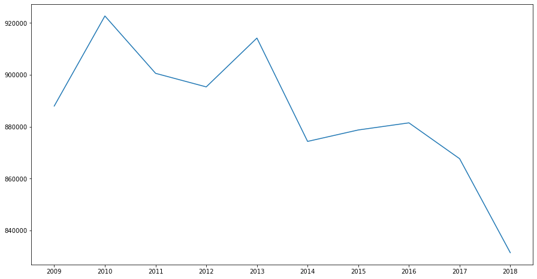


Looks like while Germany's GHG emissions were at their highest in 2010 and 2013 and they are generally trending downwards. 

If we wanted to explore the percentage year-on-year change in emissions we could use the pandas pct_change() function and add a new %change column to the germany df as follows. 

Note that we've added the cumsum() function after pct_change() to ensure that the percentage change calculated row by row is cumulative so the last row represents how emissions have changed since 2009. If you don't use cumsum() then the pct_change function will simply calculate the change between each row and the preceding one.


```python
#create new col for cumulative pct_change calculation

germany['pct_change'] = germany['GHG emissions'].pct_change().cumsum()
```


```python
germany
```


<div>
<style scoped>
    .dataframe tbody tr th:only-of-type {
        vertical-align: middle;
    }

    .dataframe tbody tr th {
        vertical-align: top;
    }

    .dataframe thead th {
        text-align: right;
    }
</style>
<table border="1" class="dataframe">
  <thead>
    <tr style="text-align: right;">
      <th></th>
      <th>Year</th>
      <th>GHG emissions</th>
      <th>pct_change</th>
    </tr>
    <tr>
      <th>country</th>
      <th></th>
      <th></th>
      <th></th>
    </tr>
  </thead>
  <tbody>
    <tr>
      <th>Germany</th>
      <td>2009</td>
      <td>887961</td>
      <td>NaN</td>
    </tr>
    <tr>
      <th>Germany</th>
      <td>2010</td>
      <td>922675</td>
      <td>0.039093</td>
    </tr>
    <tr>
      <th>Germany</th>
      <td>2011</td>
      <td>900566</td>
      <td>0.015132</td>
    </tr>
    <tr>
      <th>Germany</th>
      <td>2012</td>
      <td>895340</td>
      <td>0.009329</td>
    </tr>
    <tr>
      <th>Germany</th>
      <td>2013</td>
      <td>914158</td>
      <td>0.030347</td>
    </tr>
    <tr>
      <th>Germany</th>
      <td>2014</td>
      <td>874325</td>
      <td>-0.013227</td>
    </tr>
    <tr>
      <th>Germany</th>
      <td>2015</td>
      <td>878734</td>
      <td>-0.008184</td>
    </tr>
    <tr>
      <th>Germany</th>
      <td>2016</td>
      <td>881480</td>
      <td>-0.005059</td>
    </tr>
    <tr>
      <th>Germany</th>
      <td>2017</td>
      <td>867668</td>
      <td>-0.020728</td>
    </tr>
    <tr>
      <th>Germany</th>
      <td>2018</td>
      <td>831437</td>
      <td>-0.062485</td>
    </tr>
  </tbody>
</table>
</div>


Looks like we were right - Germany has reduced its GHG emissions by 6.2% between 2009 and 2018.

Let's add some data to our plot to visualise te other 4 countries and see how they trend compared to Germany.

To do so, we'll need to repeat the above process for each country.


```python
#subset data DF for each country and name each DF created
uk = data.loc['United Kingdom']

france = data.loc['France']

italy = data.loc['Italy']

turkey = data.loc['Turkey']
```


```python
##plot all 5 DFs

fig,ax = plt.subplots(figsize=(15,8))

ax.plot(germany['Year'], germany['GHG emissions'], label='Germany')

ax.plot(france['Year'], france['GHG emissions'], label='France')

ax.plot(italy['Year'], italy['GHG emissions'], label='Italy')

ax.plot(turkey['Year'], turkey['GHG emissions'], label='Turkey')

ax.plot(uk['Year'], uk['GHG emissions'], label='UK')

ax.set_title('EU countries GHG emissions 2009-18')
            
ax.set_xlabel('Time(years)')
             
ax.set_ylabel('1000s of Tonnes (CO2e)')
             
ax.legend(loc='best')

plt.show()
```


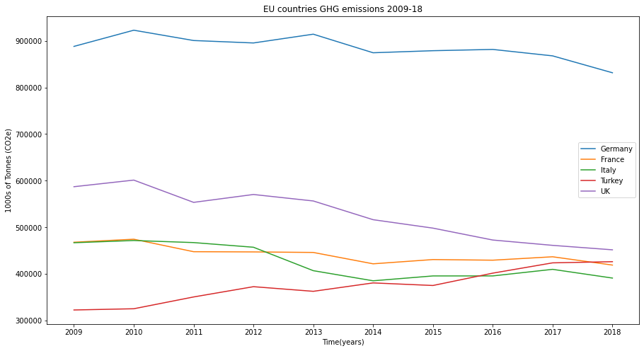


As we can see above, all five countries data is now plotted, the axes are labelled and the legend is in as well.

The only issue with the above plot is the y-axis labels. These are currently in 100s of thousands, per the source data. However, given this represents the data in thousands (ie the ectual number is in billions), we should change the y tick labels and scale, so this is correctly represented in the viz. 

This can be done with the ticker module as shown below.


```python
import matplotlib.ticker as ticker

fig,ax = plt.subplots(figsize=(15,8))

#set y scale to 100,000
scale_y = 1e5

#set y ticks format to divide the tick value by 100,000
ticks_y = ticker.FuncFormatter(lambda x, pos: '{0:g}'.format(x/scale_y))

#apply ticks_y to the y axis in the plot
ax.yaxis.set_major_formatter(ticks_y)

#plot per above
ax.plot(germany['Year'], germany['GHG emissions'], label='Germany')

ax.plot(france['Year'], france['GHG emissions'], label='France')

ax.plot(italy['Year'], italy['GHG emissions'], label='Italy')

ax.plot(turkey['Year'], turkey['GHG emissions'], label='Turkey')

ax.plot(uk['Year'], uk['GHG emissions'], label='UK')

ax.set_title('EU countries GHG emissions 2009-18')
            
ax.set_xlabel('Time(years)')
             
ax.set_ylabel('Billions of tonnes (CO2e)')
             
ax.legend(loc='best')

plt.show()
```


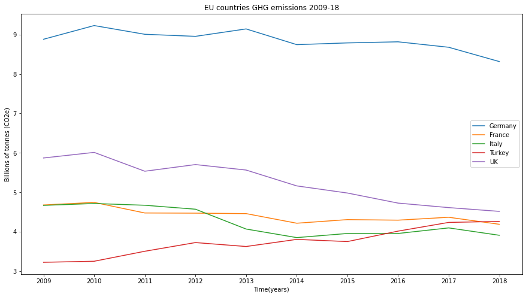


Nice. All fice countries have been plotted and the y axis is now formatted to billions.

Key insights:

- Germany's emissions are far higher than the other 4 countries in this plot.

- While GHG emissions in Germany, UK, France and Italy are trending down, Turkey's emissions seem to be trending up.

Let's explore the percetange change further and create a new column for each of DFs to examine by how much has each country's emissions gone up or down.


```python
france['pct_change'] = france['GHG emissions'].pct_change().cumsum()

italy['pct_change'] = italy['GHG emissions'].pct_change().cumsum()

turkey['pct_change'] = turkey['GHG emissions'].pct_change().cumsum()

uk['pct_change'] = uk['GHG emissions'].pct_change().cumsum()

print(france)

print(italy)

print(turkey)

print(uk)
```

             Year GHG emissions  pct_change
    country                                
    France   2009        468073         NaN
    France   2010        474543    0.013823
    France   2011        447777   -0.042582
    France   2012        447326   -0.043589
    France   2013        446187   -0.046136
    France   2014        421814   -0.100761
    France   2015        430951   -0.079100
    France   2016        429574   -0.082294
    France   2017        436899   -0.065242
    France   2018        419118   -0.105940
             Year GHG emissions  pct_change
    country                                
    Italy    2009        467023         NaN
    Italy    2010        471782    0.010190
    Italy    2011        467342    0.000780
    Italy    2012        457344   -0.020615
    Italy    2013        407098   -0.130478
    Italy    2014        385405   -0.183766
    Italy    2015        395822   -0.156737
    Italy    2016        395857   -0.156648
    Italy    2017        409964   -0.121011
    Italy    2018        391263   -0.166627
             Year GHG emissions  pct_change
    country                                
    Turkey   2009        322824         NaN
    Turkey   2010        325463    0.008174
    Turkey   2011        350750    0.085870
    Turkey   2012        372783    0.148687
    Turkey   2013        362834    0.121999
    Turkey   2014        380860    0.171680
    Turkey   2015        375330    0.157158
    Turkey   2016        401803    0.227693
    Turkey   2017        423870    0.282613
    Turkey   2018        426372    0.288515
                    Year GHG emissions  pct_change
    country                                       
    United Kingdom  2009        587132         NaN
    United Kingdom  2010        601300    0.024132
    United Kingdom  2011        553554   -0.055273
    United Kingdom  2012        570444   -0.024761
    United Kingdom  2013        556558   -0.049104
    United Kingdom  2014        516410   -0.121239
    United Kingdom  2015        498333   -0.156246
    United Kingdom  2016        472815   -0.207452
    United Kingdom  2017        461387   -0.231622
    United Kingdom  2018        451830   -0.252336


```python
fig,ax = plt.subplots(figsize=(15,8))

ax.plot(germany['Year'], germany['pct_change'], label='Germany')

ax.plot(france['Year'], france['pct_change'], label='France')

ax.plot(italy['Year'], italy['pct_change'], label='Italy')

ax.plot(turkey['Year'], turkey['pct_change'], label='Turkey')

ax.plot(uk['Year'], uk['pct_change'], label='UK')

ax.set_title('EU countries GHG emissions 2009-18 - cumulative percentage change YoY')
            
ax.set_xlabel('Time(years)')
             
ax.set_ylabel('% change in GHG emissions YoY')
             
ax.legend(loc='best')

plt.show()

```


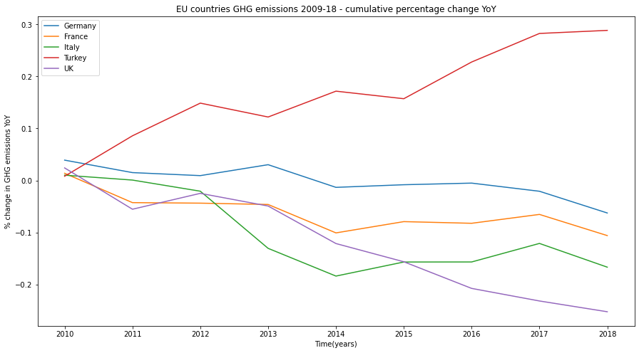


This plot tells an interesting story about how these countries have been trending overall. 

We can see that Turkey's GHG emissions have increased quite deramatically - by almost 30% between 2009 and 2018 while all other countries emissions have reduced over the same period, with the UK showing the biggest and most dramatic drop in emissions in this 9 year period, over 25%, follwed by Italy with a 16% drop, France with a 10% drop and Germany with around 6% drop.

## 7. Exploring & visualising GHG emissions by sector

To effectively reduce emissions we need to know what their source is – which sectors contribute the most? 

This analysis is important to the development of effective solutions and mitigation strategies to reduce our global GHG emissions. 

Questions to explore:

- which sectors are producing the most GHG globally?
- what percentage of global GHG emissions does each sector contribute?
- what sectors contribute the most to GHG emissions in Australia?
- what are the per capita GHG emissions by sector for each country?

The data can be found here:https://www.climatewatchdata.org/ghg-emissions?breakBy=sector&chartType=percentage&end_year=2016&sectors=agriculture%2Cbunker-fuels%2Cindustrial-processes%2Cland-use-change-and-forestry%2Cbuilding%2Celectricity-heat%2Cfugitive-emissions%2Cmanufacturing-construction%2Cother-fuel-combustion%2Ctransportation%2Cwaste&start_year=1990

### Cleaning and reshaping the data with drop(), melt(), sort_values & groupby()


```python
#read csv file and transform into DF
df = pd.read_csv('ghg-emissions_by_sector.csv')
```


```python
#display DF
df
```


<div>
<style scoped>
    .dataframe tbody tr th:only-of-type {
        vertical-align: middle;
    }

    .dataframe tbody tr th {
        vertical-align: top;
    }

    .dataframe thead th {
        text-align: right;
    }
</style>
<table border="1" class="dataframe">
  <thead>
    <tr style="text-align: right;">
      <th></th>
      <th>Sector</th>
      <th>unit</th>
      <th>1990</th>
      <th>1991</th>
      <th>1992</th>
      <th>1993</th>
      <th>1994</th>
      <th>1995</th>
      <th>1996</th>
      <th>1997</th>
      <th>...</th>
      <th>2007</th>
      <th>2008</th>
      <th>2009</th>
      <th>2010</th>
      <th>2011</th>
      <th>2012</th>
      <th>2013</th>
      <th>2014</th>
      <th>2015</th>
      <th>2016</th>
    </tr>
  </thead>
  <tbody>
    <tr>
      <th>0</th>
      <td>Agriculture</td>
      <td>MtCO2e</td>
      <td>5029.15</td>
      <td>5013.56</td>
      <td>4991.32</td>
      <td>4962.59</td>
      <td>5000.42</td>
      <td>5057.44</td>
      <td>5050.88</td>
      <td>4980.67</td>
      <td>...</td>
      <td>5460.19</td>
      <td>5473.29</td>
      <td>5467.33</td>
      <td>5542.99</td>
      <td>5678.14</td>
      <td>5693.47</td>
      <td>5633.18</td>
      <td>5678.15</td>
      <td>5742.44</td>
      <td>5795.51</td>
    </tr>
    <tr>
      <th>1</th>
      <td>Bunker Fuels</td>
      <td>MtCO2e</td>
      <td>630.6</td>
      <td>638.1</td>
      <td>674.9</td>
      <td>667.1</td>
      <td>694.3</td>
      <td>718.5</td>
      <td>740.2</td>
      <td>766.7</td>
      <td>...</td>
      <td>1095.50</td>
      <td>1103.40</td>
      <td>1050.80</td>
      <td>1120.30</td>
      <td>1136.70</td>
      <td>1093.20</td>
      <td>1101.60</td>
      <td>1138.90</td>
      <td>1194.00</td>
      <td>1240.10</td>
    </tr>
    <tr>
      <th>2</th>
      <td>Industrial Processes</td>
      <td>MtCO2e</td>
      <td>1011.04</td>
      <td>1015.01</td>
      <td>1031.6</td>
      <td>1045.74</td>
      <td>1153.32</td>
      <td>1226.4</td>
      <td>1278.71</td>
      <td>1320.85</td>
      <td>...</td>
      <td>1997.86</td>
      <td>2044.58</td>
      <td>2095.21</td>
      <td>2230.08</td>
      <td>2379.51</td>
      <td>2458.41</td>
      <td>2563.16</td>
      <td>2678.42</td>
      <td>2689.62</td>
      <td>2771.08</td>
    </tr>
    <tr>
      <th>3</th>
      <td>Land-Use Change and Forestry</td>
      <td>MtCO2e</td>
      <td>4196.64</td>
      <td>4196.65</td>
      <td>4196.62</td>
      <td>4196.65</td>
      <td>4196.66</td>
      <td>4196.67</td>
      <td>3671.01</td>
      <td>4637.86</td>
      <td>...</td>
      <td>3406.89</td>
      <td>3369.51</td>
      <td>3691.12</td>
      <td>3341.70</td>
      <td>3400.35</td>
      <td>3466.95</td>
      <td>3366.68</td>
      <td>3576.82</td>
      <td>3912.40</td>
      <td>3217.07</td>
    </tr>
    <tr>
      <th>4</th>
      <td>Waste</td>
      <td>MtCO2e</td>
      <td>1364.4</td>
      <td>1395.18</td>
      <td>1418.28</td>
      <td>1444.39</td>
      <td>1470.96</td>
      <td>1476.51</td>
      <td>1478.31</td>
      <td>1474.36</td>
      <td>...</td>
      <td>1441.86</td>
      <td>1446.93</td>
      <td>1454.29</td>
      <td>1465.13</td>
      <td>1467.31</td>
      <td>1476.63</td>
      <td>1484.04</td>
      <td>1514.26</td>
      <td>1543.59</td>
      <td>1560.85</td>
    </tr>
    <tr>
      <th>5</th>
      <td>Building</td>
      <td>MtCO2e</td>
      <td>2604.7</td>
      <td>2630.4</td>
      <td>2523.8</td>
      <td>2582.3</td>
      <td>2500.3</td>
      <td>2575.9</td>
      <td>2647</td>
      <td>2624.8</td>
      <td>...</td>
      <td>2640.00</td>
      <td>2706.30</td>
      <td>2656.20</td>
      <td>2706.70</td>
      <td>2655.10</td>
      <td>2607.60</td>
      <td>2713.00</td>
      <td>2667.20</td>
      <td>2680.60</td>
      <td>2720.70</td>
    </tr>
    <tr>
      <th>6</th>
      <td>Electricity/Heat</td>
      <td>MtCO2e</td>
      <td>8604.1</td>
      <td>8741.4</td>
      <td>8904</td>
      <td>8953.4</td>
      <td>9051</td>
      <td>9243.9</td>
      <td>9600</td>
      <td>9867</td>
      <td>...</td>
      <td>13454.90</td>
      <td>13458.30</td>
      <td>13266.00</td>
      <td>14140.30</td>
      <td>14720.50</td>
      <td>15018.90</td>
      <td>15292.50</td>
      <td>15226.50</td>
      <td>15020.50</td>
      <td>15005.30</td>
    </tr>
    <tr>
      <th>7</th>
      <td>Fugitive Emissions</td>
      <td>MtCO2e</td>
      <td>2253.38</td>
      <td>2261.86</td>
      <td>2165.36</td>
      <td>2129.69</td>
      <td>2063.05</td>
      <td>2073.7</td>
      <td>2106.34</td>
      <td>2091.65</td>
      <td>...</td>
      <td>2639.99</td>
      <td>2746.40</td>
      <td>2739.15</td>
      <td>2793.84</td>
      <td>2830.66</td>
      <td>2853.29</td>
      <td>2860.38</td>
      <td>2877.38</td>
      <td>2880.05</td>
      <td>2883.17</td>
    </tr>
    <tr>
      <th>8</th>
      <td>Manufacturing/Construction</td>
      <td>MtCO2e</td>
      <td>3953.6</td>
      <td>3869.5</td>
      <td>3734.8</td>
      <td>3685.1</td>
      <td>3704.3</td>
      <td>3931</td>
      <td>3821.2</td>
      <td>3846.6</td>
      <td>...</td>
      <td>5446.30</td>
      <td>5599.20</td>
      <td>5575.90</td>
      <td>6036.20</td>
      <td>6272.20</td>
      <td>6259.70</td>
      <td>6296.50</td>
      <td>6327.50</td>
      <td>6255.10</td>
      <td>6109.30</td>
    </tr>
    <tr>
      <th>9</th>
      <td>Other Fuel Combustion</td>
      <td>MtCO2e</td>
      <td>1354.93</td>
      <td>1363.19</td>
      <td>1273.96</td>
      <td>1292.77</td>
      <td>1263.4</td>
      <td>1213.92</td>
      <td>1151.39</td>
      <td>1199.71</td>
      <td>...</td>
      <td>1269.43</td>
      <td>1272.57</td>
      <td>1289.20</td>
      <td>1308.32</td>
      <td>1307.28</td>
      <td>1352.63</td>
      <td>1395.16</td>
      <td>1415.77</td>
      <td>1432.89</td>
      <td>1429.15</td>
    </tr>
    <tr>
      <th>10</th>
      <td>Transportation</td>
      <td>MtCO2e</td>
      <td>4595.4</td>
      <td>4638.7</td>
      <td>4745.9</td>
      <td>4786.9</td>
      <td>4884.3</td>
      <td>5017.1</td>
      <td>5220.2</td>
      <td>5298.9</td>
      <td>...</td>
      <td>6826.90</td>
      <td>6835.30</td>
      <td>6701.90</td>
      <td>6987.00</td>
      <td>7091.40</td>
      <td>7161.30</td>
      <td>7357.00</td>
      <td>7478.80</td>
      <td>7697.70</td>
      <td>7866.00</td>
    </tr>
    <tr>
      <th>11</th>
      <td>Data source</td>
      <td>CAIT</td>
      <td>NaN</td>
      <td>NaN</td>
      <td>NaN</td>
      <td>NaN</td>
      <td>NaN</td>
      <td>NaN</td>
      <td>NaN</td>
      <td>NaN</td>
      <td>...</td>
      <td>NaN</td>
      <td>NaN</td>
      <td>NaN</td>
      <td>NaN</td>
      <td>NaN</td>
      <td>NaN</td>
      <td>NaN</td>
      <td>NaN</td>
      <td>NaN</td>
      <td>NaN</td>
    </tr>
    <tr>
      <th>12</th>
      <td>Data for</td>
      <td>Countries/Regions: World. Sectors/Subsectors: ...</td>
      <td>Bunker Fuels</td>
      <td>Industrial Processes</td>
      <td>Land-Use Change and Forestry</td>
      <td>Waste</td>
      <td>Building</td>
      <td>Electricity/Heat</td>
      <td>Fugitive Emissions</td>
      <td>Manufacturing/Construction</td>
      <td>...</td>
      <td>NaN</td>
      <td>NaN</td>
      <td>NaN</td>
      <td>NaN</td>
      <td>NaN</td>
      <td>NaN</td>
      <td>NaN</td>
      <td>NaN</td>
      <td>NaN</td>
      <td>NaN</td>
    </tr>
  </tbody>
</table>
<p>13 rows × 29 columns</p>
</div>


```python
#drop unnecessary col
df.drop(['unit'], axis=1, inplace=True)
```


```python
df
```


<div>
<style scoped>
    .dataframe tbody tr th:only-of-type {
        vertical-align: middle;
    }

    .dataframe tbody tr th {
        vertical-align: top;
    }

    .dataframe thead th {
        text-align: right;
    }
</style>
<table border="1" class="dataframe">
  <thead>
    <tr style="text-align: right;">
      <th></th>
      <th>Sector</th>
      <th>1990</th>
      <th>1991</th>
      <th>1992</th>
      <th>1993</th>
      <th>1994</th>
      <th>1995</th>
      <th>1996</th>
      <th>1997</th>
      <th>1998</th>
      <th>...</th>
      <th>2007</th>
      <th>2008</th>
      <th>2009</th>
      <th>2010</th>
      <th>2011</th>
      <th>2012</th>
      <th>2013</th>
      <th>2014</th>
      <th>2015</th>
      <th>2016</th>
    </tr>
  </thead>
  <tbody>
    <tr>
      <th>0</th>
      <td>Agriculture</td>
      <td>5029.15</td>
      <td>5013.56</td>
      <td>4991.32</td>
      <td>4962.59</td>
      <td>5000.42</td>
      <td>5057.44</td>
      <td>5050.88</td>
      <td>4980.67</td>
      <td>5034.79</td>
      <td>...</td>
      <td>5460.19</td>
      <td>5473.29</td>
      <td>5467.33</td>
      <td>5542.99</td>
      <td>5678.14</td>
      <td>5693.47</td>
      <td>5633.18</td>
      <td>5678.15</td>
      <td>5742.44</td>
      <td>5795.51</td>
    </tr>
    <tr>
      <th>1</th>
      <td>Bunker Fuels</td>
      <td>630.6</td>
      <td>638.1</td>
      <td>674.9</td>
      <td>667.1</td>
      <td>694.3</td>
      <td>718.5</td>
      <td>740.2</td>
      <td>766.7</td>
      <td>791.1</td>
      <td>...</td>
      <td>1095.50</td>
      <td>1103.40</td>
      <td>1050.80</td>
      <td>1120.30</td>
      <td>1136.70</td>
      <td>1093.20</td>
      <td>1101.60</td>
      <td>1138.90</td>
      <td>1194.00</td>
      <td>1240.10</td>
    </tr>
    <tr>
      <th>2</th>
      <td>Industrial Processes</td>
      <td>1011.04</td>
      <td>1015.01</td>
      <td>1031.6</td>
      <td>1045.74</td>
      <td>1153.32</td>
      <td>1226.4</td>
      <td>1278.71</td>
      <td>1320.85</td>
      <td>1323.98</td>
      <td>...</td>
      <td>1997.86</td>
      <td>2044.58</td>
      <td>2095.21</td>
      <td>2230.08</td>
      <td>2379.51</td>
      <td>2458.41</td>
      <td>2563.16</td>
      <td>2678.42</td>
      <td>2689.62</td>
      <td>2771.08</td>
    </tr>
    <tr>
      <th>3</th>
      <td>Land-Use Change and Forestry</td>
      <td>4196.64</td>
      <td>4196.65</td>
      <td>4196.62</td>
      <td>4196.65</td>
      <td>4196.66</td>
      <td>4196.67</td>
      <td>3671.01</td>
      <td>4637.86</td>
      <td>4071.09</td>
      <td>...</td>
      <td>3406.89</td>
      <td>3369.51</td>
      <td>3691.12</td>
      <td>3341.70</td>
      <td>3400.35</td>
      <td>3466.95</td>
      <td>3366.68</td>
      <td>3576.82</td>
      <td>3912.40</td>
      <td>3217.07</td>
    </tr>
    <tr>
      <th>4</th>
      <td>Waste</td>
      <td>1364.4</td>
      <td>1395.18</td>
      <td>1418.28</td>
      <td>1444.39</td>
      <td>1470.96</td>
      <td>1476.51</td>
      <td>1478.31</td>
      <td>1474.36</td>
      <td>1466.28</td>
      <td>...</td>
      <td>1441.86</td>
      <td>1446.93</td>
      <td>1454.29</td>
      <td>1465.13</td>
      <td>1467.31</td>
      <td>1476.63</td>
      <td>1484.04</td>
      <td>1514.26</td>
      <td>1543.59</td>
      <td>1560.85</td>
    </tr>
    <tr>
      <th>5</th>
      <td>Building</td>
      <td>2604.7</td>
      <td>2630.4</td>
      <td>2523.8</td>
      <td>2582.3</td>
      <td>2500.3</td>
      <td>2575.9</td>
      <td>2647</td>
      <td>2624.8</td>
      <td>2471.7</td>
      <td>...</td>
      <td>2640.00</td>
      <td>2706.30</td>
      <td>2656.20</td>
      <td>2706.70</td>
      <td>2655.10</td>
      <td>2607.60</td>
      <td>2713.00</td>
      <td>2667.20</td>
      <td>2680.60</td>
      <td>2720.70</td>
    </tr>
    <tr>
      <th>6</th>
      <td>Electricity/Heat</td>
      <td>8604.1</td>
      <td>8741.4</td>
      <td>8904</td>
      <td>8953.4</td>
      <td>9051</td>
      <td>9243.9</td>
      <td>9600</td>
      <td>9867</td>
      <td>10091.4</td>
      <td>...</td>
      <td>13454.90</td>
      <td>13458.30</td>
      <td>13266.00</td>
      <td>14140.30</td>
      <td>14720.50</td>
      <td>15018.90</td>
      <td>15292.50</td>
      <td>15226.50</td>
      <td>15020.50</td>
      <td>15005.30</td>
    </tr>
    <tr>
      <th>7</th>
      <td>Fugitive Emissions</td>
      <td>2253.38</td>
      <td>2261.86</td>
      <td>2165.36</td>
      <td>2129.69</td>
      <td>2063.05</td>
      <td>2073.7</td>
      <td>2106.34</td>
      <td>2091.65</td>
      <td>2076.1</td>
      <td>...</td>
      <td>2639.99</td>
      <td>2746.40</td>
      <td>2739.15</td>
      <td>2793.84</td>
      <td>2830.66</td>
      <td>2853.29</td>
      <td>2860.38</td>
      <td>2877.38</td>
      <td>2880.05</td>
      <td>2883.17</td>
    </tr>
    <tr>
      <th>8</th>
      <td>Manufacturing/Construction</td>
      <td>3953.6</td>
      <td>3869.5</td>
      <td>3734.8</td>
      <td>3685.1</td>
      <td>3704.3</td>
      <td>3931</td>
      <td>3821.2</td>
      <td>3846.6</td>
      <td>3845.2</td>
      <td>...</td>
      <td>5446.30</td>
      <td>5599.20</td>
      <td>5575.90</td>
      <td>6036.20</td>
      <td>6272.20</td>
      <td>6259.70</td>
      <td>6296.50</td>
      <td>6327.50</td>
      <td>6255.10</td>
      <td>6109.30</td>
    </tr>
    <tr>
      <th>9</th>
      <td>Other Fuel Combustion</td>
      <td>1354.93</td>
      <td>1363.19</td>
      <td>1273.96</td>
      <td>1292.77</td>
      <td>1263.4</td>
      <td>1213.92</td>
      <td>1151.39</td>
      <td>1199.71</td>
      <td>1177.09</td>
      <td>...</td>
      <td>1269.43</td>
      <td>1272.57</td>
      <td>1289.20</td>
      <td>1308.32</td>
      <td>1307.28</td>
      <td>1352.63</td>
      <td>1395.16</td>
      <td>1415.77</td>
      <td>1432.89</td>
      <td>1429.15</td>
    </tr>
    <tr>
      <th>10</th>
      <td>Transportation</td>
      <td>4595.4</td>
      <td>4638.7</td>
      <td>4745.9</td>
      <td>4786.9</td>
      <td>4884.3</td>
      <td>5017.1</td>
      <td>5220.2</td>
      <td>5298.9</td>
      <td>5419.1</td>
      <td>...</td>
      <td>6826.90</td>
      <td>6835.30</td>
      <td>6701.90</td>
      <td>6987.00</td>
      <td>7091.40</td>
      <td>7161.30</td>
      <td>7357.00</td>
      <td>7478.80</td>
      <td>7697.70</td>
      <td>7866.00</td>
    </tr>
    <tr>
      <th>11</th>
      <td>Data source</td>
      <td>NaN</td>
      <td>NaN</td>
      <td>NaN</td>
      <td>NaN</td>
      <td>NaN</td>
      <td>NaN</td>
      <td>NaN</td>
      <td>NaN</td>
      <td>NaN</td>
      <td>...</td>
      <td>NaN</td>
      <td>NaN</td>
      <td>NaN</td>
      <td>NaN</td>
      <td>NaN</td>
      <td>NaN</td>
      <td>NaN</td>
      <td>NaN</td>
      <td>NaN</td>
      <td>NaN</td>
    </tr>
    <tr>
      <th>12</th>
      <td>Data for</td>
      <td>Bunker Fuels</td>
      <td>Industrial Processes</td>
      <td>Land-Use Change and Forestry</td>
      <td>Waste</td>
      <td>Building</td>
      <td>Electricity/Heat</td>
      <td>Fugitive Emissions</td>
      <td>Manufacturing/Construction</td>
      <td>Other Fuel Combustion</td>
      <td>...</td>
      <td>NaN</td>
      <td>NaN</td>
      <td>NaN</td>
      <td>NaN</td>
      <td>NaN</td>
      <td>NaN</td>
      <td>NaN</td>
      <td>NaN</td>
      <td>NaN</td>
      <td>NaN</td>
    </tr>
  </tbody>
</table>
<p>13 rows × 28 columns</p>
</div>


```python
#drop unnecessary rows
df.drop([11,12], inplace=True)
```


```python
df
```


<div>
<style scoped>
    .dataframe tbody tr th:only-of-type {
        vertical-align: middle;
    }

    .dataframe tbody tr th {
        vertical-align: top;
    }

    .dataframe thead th {
        text-align: right;
    }
</style>
<table border="1" class="dataframe">
  <thead>
    <tr style="text-align: right;">
      <th></th>
      <th>Sector</th>
      <th>1990</th>
      <th>1991</th>
      <th>1992</th>
      <th>1993</th>
      <th>1994</th>
      <th>1995</th>
      <th>1996</th>
      <th>1997</th>
      <th>1998</th>
      <th>...</th>
      <th>2007</th>
      <th>2008</th>
      <th>2009</th>
      <th>2010</th>
      <th>2011</th>
      <th>2012</th>
      <th>2013</th>
      <th>2014</th>
      <th>2015</th>
      <th>2016</th>
    </tr>
  </thead>
  <tbody>
    <tr>
      <th>0</th>
      <td>Agriculture</td>
      <td>5029.15</td>
      <td>5013.56</td>
      <td>4991.32</td>
      <td>4962.59</td>
      <td>5000.42</td>
      <td>5057.44</td>
      <td>5050.88</td>
      <td>4980.67</td>
      <td>5034.79</td>
      <td>...</td>
      <td>5460.19</td>
      <td>5473.29</td>
      <td>5467.33</td>
      <td>5542.99</td>
      <td>5678.14</td>
      <td>5693.47</td>
      <td>5633.18</td>
      <td>5678.15</td>
      <td>5742.44</td>
      <td>5795.51</td>
    </tr>
    <tr>
      <th>1</th>
      <td>Bunker Fuels</td>
      <td>630.6</td>
      <td>638.1</td>
      <td>674.9</td>
      <td>667.1</td>
      <td>694.3</td>
      <td>718.5</td>
      <td>740.2</td>
      <td>766.7</td>
      <td>791.1</td>
      <td>...</td>
      <td>1095.50</td>
      <td>1103.40</td>
      <td>1050.80</td>
      <td>1120.30</td>
      <td>1136.70</td>
      <td>1093.20</td>
      <td>1101.60</td>
      <td>1138.90</td>
      <td>1194.00</td>
      <td>1240.10</td>
    </tr>
    <tr>
      <th>2</th>
      <td>Industrial Processes</td>
      <td>1011.04</td>
      <td>1015.01</td>
      <td>1031.6</td>
      <td>1045.74</td>
      <td>1153.32</td>
      <td>1226.4</td>
      <td>1278.71</td>
      <td>1320.85</td>
      <td>1323.98</td>
      <td>...</td>
      <td>1997.86</td>
      <td>2044.58</td>
      <td>2095.21</td>
      <td>2230.08</td>
      <td>2379.51</td>
      <td>2458.41</td>
      <td>2563.16</td>
      <td>2678.42</td>
      <td>2689.62</td>
      <td>2771.08</td>
    </tr>
    <tr>
      <th>3</th>
      <td>Land-Use Change and Forestry</td>
      <td>4196.64</td>
      <td>4196.65</td>
      <td>4196.62</td>
      <td>4196.65</td>
      <td>4196.66</td>
      <td>4196.67</td>
      <td>3671.01</td>
      <td>4637.86</td>
      <td>4071.09</td>
      <td>...</td>
      <td>3406.89</td>
      <td>3369.51</td>
      <td>3691.12</td>
      <td>3341.70</td>
      <td>3400.35</td>
      <td>3466.95</td>
      <td>3366.68</td>
      <td>3576.82</td>
      <td>3912.40</td>
      <td>3217.07</td>
    </tr>
    <tr>
      <th>4</th>
      <td>Waste</td>
      <td>1364.4</td>
      <td>1395.18</td>
      <td>1418.28</td>
      <td>1444.39</td>
      <td>1470.96</td>
      <td>1476.51</td>
      <td>1478.31</td>
      <td>1474.36</td>
      <td>1466.28</td>
      <td>...</td>
      <td>1441.86</td>
      <td>1446.93</td>
      <td>1454.29</td>
      <td>1465.13</td>
      <td>1467.31</td>
      <td>1476.63</td>
      <td>1484.04</td>
      <td>1514.26</td>
      <td>1543.59</td>
      <td>1560.85</td>
    </tr>
    <tr>
      <th>5</th>
      <td>Building</td>
      <td>2604.7</td>
      <td>2630.4</td>
      <td>2523.8</td>
      <td>2582.3</td>
      <td>2500.3</td>
      <td>2575.9</td>
      <td>2647</td>
      <td>2624.8</td>
      <td>2471.7</td>
      <td>...</td>
      <td>2640.00</td>
      <td>2706.30</td>
      <td>2656.20</td>
      <td>2706.70</td>
      <td>2655.10</td>
      <td>2607.60</td>
      <td>2713.00</td>
      <td>2667.20</td>
      <td>2680.60</td>
      <td>2720.70</td>
    </tr>
    <tr>
      <th>6</th>
      <td>Electricity/Heat</td>
      <td>8604.1</td>
      <td>8741.4</td>
      <td>8904</td>
      <td>8953.4</td>
      <td>9051</td>
      <td>9243.9</td>
      <td>9600</td>
      <td>9867</td>
      <td>10091.4</td>
      <td>...</td>
      <td>13454.90</td>
      <td>13458.30</td>
      <td>13266.00</td>
      <td>14140.30</td>
      <td>14720.50</td>
      <td>15018.90</td>
      <td>15292.50</td>
      <td>15226.50</td>
      <td>15020.50</td>
      <td>15005.30</td>
    </tr>
    <tr>
      <th>7</th>
      <td>Fugitive Emissions</td>
      <td>2253.38</td>
      <td>2261.86</td>
      <td>2165.36</td>
      <td>2129.69</td>
      <td>2063.05</td>
      <td>2073.7</td>
      <td>2106.34</td>
      <td>2091.65</td>
      <td>2076.1</td>
      <td>...</td>
      <td>2639.99</td>
      <td>2746.40</td>
      <td>2739.15</td>
      <td>2793.84</td>
      <td>2830.66</td>
      <td>2853.29</td>
      <td>2860.38</td>
      <td>2877.38</td>
      <td>2880.05</td>
      <td>2883.17</td>
    </tr>
    <tr>
      <th>8</th>
      <td>Manufacturing/Construction</td>
      <td>3953.6</td>
      <td>3869.5</td>
      <td>3734.8</td>
      <td>3685.1</td>
      <td>3704.3</td>
      <td>3931</td>
      <td>3821.2</td>
      <td>3846.6</td>
      <td>3845.2</td>
      <td>...</td>
      <td>5446.30</td>
      <td>5599.20</td>
      <td>5575.90</td>
      <td>6036.20</td>
      <td>6272.20</td>
      <td>6259.70</td>
      <td>6296.50</td>
      <td>6327.50</td>
      <td>6255.10</td>
      <td>6109.30</td>
    </tr>
    <tr>
      <th>9</th>
      <td>Other Fuel Combustion</td>
      <td>1354.93</td>
      <td>1363.19</td>
      <td>1273.96</td>
      <td>1292.77</td>
      <td>1263.4</td>
      <td>1213.92</td>
      <td>1151.39</td>
      <td>1199.71</td>
      <td>1177.09</td>
      <td>...</td>
      <td>1269.43</td>
      <td>1272.57</td>
      <td>1289.20</td>
      <td>1308.32</td>
      <td>1307.28</td>
      <td>1352.63</td>
      <td>1395.16</td>
      <td>1415.77</td>
      <td>1432.89</td>
      <td>1429.15</td>
    </tr>
    <tr>
      <th>10</th>
      <td>Transportation</td>
      <td>4595.4</td>
      <td>4638.7</td>
      <td>4745.9</td>
      <td>4786.9</td>
      <td>4884.3</td>
      <td>5017.1</td>
      <td>5220.2</td>
      <td>5298.9</td>
      <td>5419.1</td>
      <td>...</td>
      <td>6826.90</td>
      <td>6835.30</td>
      <td>6701.90</td>
      <td>6987.00</td>
      <td>7091.40</td>
      <td>7161.30</td>
      <td>7357.00</td>
      <td>7478.80</td>
      <td>7697.70</td>
      <td>7866.00</td>
    </tr>
  </tbody>
</table>
<p>11 rows × 28 columns</p>
</div>


The current table is in wode format with 20 columns and only 11 rows. 

To make analysis of data in table easier, we can reshape the data into a more computer-friendly form using Pandas.melt() function, as we did with the previous dataframe above. Pandas.melt() unpivots a DataFrame from wide format to long format.

melt() function is useful to massage a DF into a format where one or more columns are identifier variables (here, the 'Sector' column), while all other columns (here the years columns), considered measured variables, are unpivoted to the row axis, leaving just two non-identifier columns, variable (which will be a new column named 'Year') and value (which will be a new column named 'GHG emissions').

The standard syntax is:

pandas.melt(frame, id_vars=None, value_vars=None, var_name=None, value_name='value', col_level=None)

As you'll see below, we've inputted the relevant column names into the var_name and value_name keyword arguments and specified that the 'Sector' column should be used as the identifier variable. 

Note that values_vars should be specified as the column to unpivot. If you don't specify anything here, melt() will use all columns that are not specified in id_vars. Here, we didn't specify the columns given we wanted to unpivot all columns except 'Sector'.

col_level is handy if you're dealing with a multi index - you can then specify the level to melt.


```python
df_melt = df.melt(id_vars='Sector', var_name='Year', value_name='GHG emissions' )
```


```python
df_melt
```


<div>
<style scoped>
    .dataframe tbody tr th:only-of-type {
        vertical-align: middle;
    }

    .dataframe tbody tr th {
        vertical-align: top;
    }

    .dataframe thead th {
        text-align: right;
    }
</style>
<table border="1" class="dataframe">
  <thead>
    <tr style="text-align: right;">
      <th></th>
      <th>Sector</th>
      <th>Year</th>
      <th>GHG emissions</th>
    </tr>
  </thead>
  <tbody>
    <tr>
      <th>0</th>
      <td>Agriculture</td>
      <td>1990</td>
      <td>5029.15</td>
    </tr>
    <tr>
      <th>1</th>
      <td>Bunker Fuels</td>
      <td>1990</td>
      <td>630.6</td>
    </tr>
    <tr>
      <th>2</th>
      <td>Industrial Processes</td>
      <td>1990</td>
      <td>1011.04</td>
    </tr>
    <tr>
      <th>3</th>
      <td>Land-Use Change and Forestry</td>
      <td>1990</td>
      <td>4196.64</td>
    </tr>
    <tr>
      <th>4</th>
      <td>Waste</td>
      <td>1990</td>
      <td>1364.4</td>
    </tr>
    <tr>
      <th>...</th>
      <td>...</td>
      <td>...</td>
      <td>...</td>
    </tr>
    <tr>
      <th>292</th>
      <td>Electricity/Heat</td>
      <td>2016</td>
      <td>15005.3</td>
    </tr>
    <tr>
      <th>293</th>
      <td>Fugitive Emissions</td>
      <td>2016</td>
      <td>2883.17</td>
    </tr>
    <tr>
      <th>294</th>
      <td>Manufacturing/Construction</td>
      <td>2016</td>
      <td>6109.3</td>
    </tr>
    <tr>
      <th>295</th>
      <td>Other Fuel Combustion</td>
      <td>2016</td>
      <td>1429.15</td>
    </tr>
    <tr>
      <th>296</th>
      <td>Transportation</td>
      <td>2016</td>
      <td>7866</td>
    </tr>
  </tbody>
</table>
<p>297 rows × 3 columns</p>
</div>


Now that the table has been melted, notice the rows are sorted by year (1990-2016). We want the rows to be sorted by sector, followed by year so we'll use the sort_values() function to do this. Note that the inplace argument should be set to True to ensure the sorting is done within the currect table.


```python
df_melt.sort_values(by=['Sector', 'Year'], ascending=True, inplace=True)
```


```python
df_melt
```


<div>
<style scoped>
    .dataframe tbody tr th:only-of-type {
        vertical-align: middle;
    }

    .dataframe tbody tr th {
        vertical-align: top;
    }

    .dataframe thead th {
        text-align: right;
    }
</style>
<table border="1" class="dataframe">
  <thead>
    <tr style="text-align: right;">
      <th></th>
      <th>Sector</th>
      <th>Year</th>
      <th>GHG emissions</th>
    </tr>
  </thead>
  <tbody>
    <tr>
      <th>0</th>
      <td>Agriculture</td>
      <td>1990</td>
      <td>5029.15</td>
    </tr>
    <tr>
      <th>11</th>
      <td>Agriculture</td>
      <td>1991</td>
      <td>5013.56</td>
    </tr>
    <tr>
      <th>22</th>
      <td>Agriculture</td>
      <td>1992</td>
      <td>4991.32</td>
    </tr>
    <tr>
      <th>33</th>
      <td>Agriculture</td>
      <td>1993</td>
      <td>4962.59</td>
    </tr>
    <tr>
      <th>44</th>
      <td>Agriculture</td>
      <td>1994</td>
      <td>5000.42</td>
    </tr>
    <tr>
      <th>...</th>
      <td>...</td>
      <td>...</td>
      <td>...</td>
    </tr>
    <tr>
      <th>246</th>
      <td>Waste</td>
      <td>2012</td>
      <td>1476.63</td>
    </tr>
    <tr>
      <th>257</th>
      <td>Waste</td>
      <td>2013</td>
      <td>1484.04</td>
    </tr>
    <tr>
      <th>268</th>
      <td>Waste</td>
      <td>2014</td>
      <td>1514.26</td>
    </tr>
    <tr>
      <th>279</th>
      <td>Waste</td>
      <td>2015</td>
      <td>1543.59</td>
    </tr>
    <tr>
      <th>290</th>
      <td>Waste</td>
      <td>2016</td>
      <td>1560.85</td>
    </tr>
  </tbody>
</table>
<p>297 rows × 3 columns</p>
</div>


Now that the table is sorted, we can further tidy it up by setting the Sector column as the index as folows:


```python
sector = df_melt.set_index('Sector')
sector
```


<div>
<style scoped>
    .dataframe tbody tr th:only-of-type {
        vertical-align: middle;
    }

    .dataframe tbody tr th {
        vertical-align: top;
    }

    .dataframe thead th {
        text-align: right;
    }
</style>
<table border="1" class="dataframe">
  <thead>
    <tr style="text-align: right;">
      <th></th>
      <th>Year</th>
      <th>GHG emissions</th>
    </tr>
    <tr>
      <th>Sector</th>
      <th></th>
      <th></th>
    </tr>
  </thead>
  <tbody>
    <tr>
      <th>Agriculture</th>
      <td>1990</td>
      <td>5029.15</td>
    </tr>
    <tr>
      <th>Agriculture</th>
      <td>1991</td>
      <td>5013.56</td>
    </tr>
    <tr>
      <th>Agriculture</th>
      <td>1992</td>
      <td>4991.32</td>
    </tr>
    <tr>
      <th>Agriculture</th>
      <td>1993</td>
      <td>4962.59</td>
    </tr>
    <tr>
      <th>Agriculture</th>
      <td>1994</td>
      <td>5000.42</td>
    </tr>
    <tr>
      <th>...</th>
      <td>...</td>
      <td>...</td>
    </tr>
    <tr>
      <th>Waste</th>
      <td>2012</td>
      <td>1476.63</td>
    </tr>
    <tr>
      <th>Waste</th>
      <td>2013</td>
      <td>1484.04</td>
    </tr>
    <tr>
      <th>Waste</th>
      <td>2014</td>
      <td>1514.26</td>
    </tr>
    <tr>
      <th>Waste</th>
      <td>2015</td>
      <td>1543.59</td>
    </tr>
    <tr>
      <th>Waste</th>
      <td>2016</td>
      <td>1560.85</td>
    </tr>
  </tbody>
</table>
<p>297 rows × 2 columns</p>
</div>


```python
sector.info()
```

    <class 'pandas.core.frame.DataFrame'>
    Index: 297 entries, Agriculture to Waste
    Data columns (total 2 columns):
     #   Column         Non-Null Count  Dtype 
    ---  ------         --------------  ----- 
     0   Year           297 non-null    object
     1   GHG emissions  297 non-null    object
    dtypes: object(2)
    memory usage: 7.0+ KB


### Exploratory data analysis & visualisation in Matplotlib and Tableau

The table is now far tidier and analysis friendly compared to where we started.

Let's run some exploratory data analysis tecniques to see if any interesting insights emerge.

We'll start by exploring which sector has been the biggest contributor globally to GHG emissions between 1990-2016.


```python
#inspect data types in table
sector.dtypes
```


    Year             object
    GHG emissions    object
    dtype: object


```python
#convert GHG emissions column to numeric so sum can be performed on it
s = sector['GHG emissions']
```


```python
sector['GHG emissions'] = pd.to_numeric(s)
```


```python
#view types again to ensure conversion worked
sector.dtypes
```


    Year              object
    GHG emissions    float64
    dtype: object


```python
#group data by sector, calculate total emissions per sector and sort from high to low
sec_totals = sector.groupby('Sector')['GHG emissions'].sum().sort_values(ascending=False)
```


```python
#view results
sec_totals
```


    Sector
    Electricity/Heat                319055.40
    Transportation                  165152.80
    Agriculture                     142954.97
    Manufacturing/Construction      128562.70
    Land-Use Change and Forestry    106594.14
    Building                         70751.30
    Fugitive Emissions               65718.26
    Industrial Processes             46753.85
    Waste                            39407.72
    Other Fuel Combustion            34287.72
    Bunker Fuels                     24819.30
    Name: GHG emissions, dtype: float64


Looks like, globally, the electricty/heat sector is responsible for the most GHG emissions with 319Gt, followed by transportaion, agriculture, manufacturing & construction, land use & forestry. Other sectors also emit GHG (building, industrial processes, waste and fuel combustion) but those sectors emit musch less.

Obviously, these measurements vary from country to country so it would be good to visualise the mean number of emissions per category to get a feel for average emissions across each sector on a global level.

Let's visualise this in seaborn.

Now that we have a summary of GHG emissions per sector we need to convert this series object into a dataframe so we can plot it. We'll use the to_frame() function: sec_totals = sec_totals.to_frame() 


```python
#view the DF object
sec_totals
```


<div>
<style scoped>
    .dataframe tbody tr th:only-of-type {
        vertical-align: middle;
    }

    .dataframe tbody tr th {
        vertical-align: top;
    }

    .dataframe thead th {
        text-align: right;
    }
</style>
<table border="1" class="dataframe">
  <thead>
    <tr style="text-align: right;">
      <th></th>
      <th>GHG emissions</th>
    </tr>
    <tr>
      <th>Sector</th>
      <th></th>
    </tr>
  </thead>
  <tbody>
    <tr>
      <th>Electricity/Heat</th>
      <td>319055.40</td>
    </tr>
    <tr>
      <th>Transportation</th>
      <td>165152.80</td>
    </tr>
    <tr>
      <th>Agriculture</th>
      <td>142954.97</td>
    </tr>
    <tr>
      <th>Manufacturing/Construction</th>
      <td>128562.70</td>
    </tr>
    <tr>
      <th>Land-Use Change and Forestry</th>
      <td>106594.14</td>
    </tr>
    <tr>
      <th>Building</th>
      <td>70751.30</td>
    </tr>
    <tr>
      <th>Fugitive Emissions</th>
      <td>65718.26</td>
    </tr>
    <tr>
      <th>Industrial Processes</th>
      <td>46753.85</td>
    </tr>
    <tr>
      <th>Waste</th>
      <td>39407.72</td>
    </tr>
    <tr>
      <th>Other Fuel Combustion</th>
      <td>34287.72</td>
    </tr>
    <tr>
      <th>Bunker Fuels</th>
      <td>24819.30</td>
    </tr>
  </tbody>
</table>
</div>


```python
#visualise the data
fig, ax = plt.subplots()

ax.bar(sec_totals.index, sec_totals["GHG emissions"])

plt.show()
```


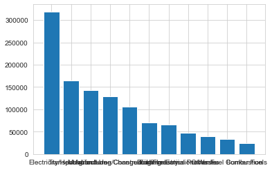


Looks like the x tick labels are overlapping and the table size could be made bigger. Let's also add a title and axis labels to make this plot more informative and useful.


```python
fig, ax = plt.subplots(figsize=(15,8))

ax.bar(sec_totals.index, sec_totals["GHG emissions"])

ax.set_xticklabels(sec_totals.index, rotation=45)

ax.set_ylabel("GHG emissions (tonnes)")

ax.set_title('Global GHG emissions by sector 1990-2016')
plt.show()
```


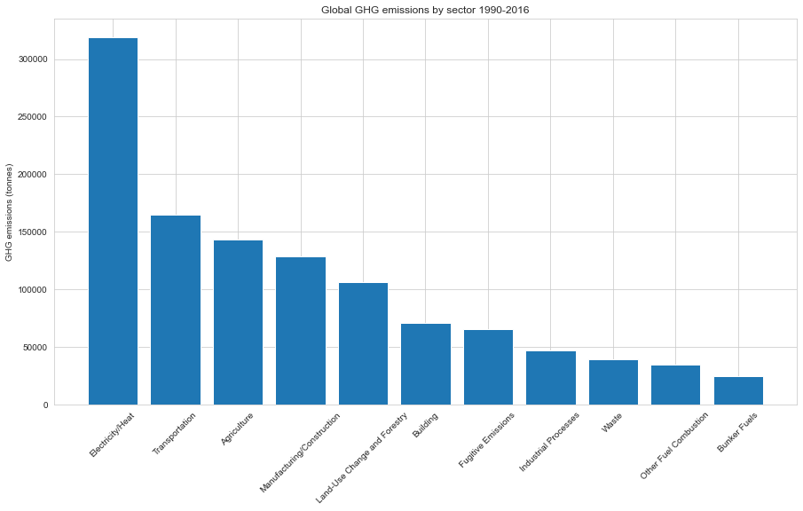


```python
#download DF as csv
sec_totals.to_csv (r'C:\Users\racheldulberg\Downloads\sector_totals.csv',header=True)
```

You can easily plot the sec_totals DF in Tableau to create a visually appealing packed bubble graphic that shows the different sectors and their % of the total global GHG emissions:


It would also be interesting to explore how each sector has fared over time given our data covers a 26 year period, focusing on the top 5 polluting sectors. 

Let's plot this in matplotlib first using the "sector" dataframe we created earlier.


```python
sector
```


<div>
<style scoped>
    .dataframe tbody tr th:only-of-type {
        vertical-align: middle;
    }

    .dataframe tbody tr th {
        vertical-align: top;
    }

    .dataframe thead th {
        text-align: right;
    }
</style>
<table border="1" class="dataframe">
  <thead>
    <tr style="text-align: right;">
      <th></th>
      <th>Year</th>
      <th>GHG emissions</th>
    </tr>
    <tr>
      <th>Sector</th>
      <th></th>
      <th></th>
    </tr>
  </thead>
  <tbody>
    <tr>
      <th>Agriculture</th>
      <td>1990</td>
      <td>5029.15</td>
    </tr>
    <tr>
      <th>Agriculture</th>
      <td>1991</td>
      <td>5013.56</td>
    </tr>
    <tr>
      <th>Agriculture</th>
      <td>1992</td>
      <td>4991.32</td>
    </tr>
    <tr>
      <th>Agriculture</th>
      <td>1993</td>
      <td>4962.59</td>
    </tr>
    <tr>
      <th>Agriculture</th>
      <td>1994</td>
      <td>5000.42</td>
    </tr>
    <tr>
      <th>...</th>
      <td>...</td>
      <td>...</td>
    </tr>
    <tr>
      <th>Waste</th>
      <td>2012</td>
      <td>1476.63</td>
    </tr>
    <tr>
      <th>Waste</th>
      <td>2013</td>
      <td>1484.04</td>
    </tr>
    <tr>
      <th>Waste</th>
      <td>2014</td>
      <td>1514.26</td>
    </tr>
    <tr>
      <th>Waste</th>
      <td>2015</td>
      <td>1543.59</td>
    </tr>
    <tr>
      <th>Waste</th>
      <td>2016</td>
      <td>1560.85</td>
    </tr>
  </tbody>
</table>
<p>297 rows × 2 columns</p>
</div>


```python
#subset DF by index label and name it: electricity_heat
electricity_heat = sector.loc[['Electricity/Heat']]
```


```python
#view DF
electricity_heat
```


<div>
<style scoped>
    .dataframe tbody tr th:only-of-type {
        vertical-align: middle;
    }

    .dataframe tbody tr th {
        vertical-align: top;
    }

    .dataframe thead th {
        text-align: right;
    }
</style>
<table border="1" class="dataframe">
  <thead>
    <tr style="text-align: right;">
      <th></th>
      <th>Year</th>
      <th>GHG emissions</th>
    </tr>
    <tr>
      <th>Sector</th>
      <th></th>
      <th></th>
    </tr>
  </thead>
  <tbody>
    <tr>
      <th>Electricity/Heat</th>
      <td>1990</td>
      <td>8604.1</td>
    </tr>
    <tr>
      <th>Electricity/Heat</th>
      <td>1991</td>
      <td>8741.4</td>
    </tr>
    <tr>
      <th>Electricity/Heat</th>
      <td>1992</td>
      <td>8904.0</td>
    </tr>
    <tr>
      <th>Electricity/Heat</th>
      <td>1993</td>
      <td>8953.4</td>
    </tr>
    <tr>
      <th>Electricity/Heat</th>
      <td>1994</td>
      <td>9051.0</td>
    </tr>
    <tr>
      <th>Electricity/Heat</th>
      <td>1995</td>
      <td>9243.9</td>
    </tr>
    <tr>
      <th>Electricity/Heat</th>
      <td>1996</td>
      <td>9600.0</td>
    </tr>
    <tr>
      <th>Electricity/Heat</th>
      <td>1997</td>
      <td>9867.0</td>
    </tr>
    <tr>
      <th>Electricity/Heat</th>
      <td>1998</td>
      <td>10091.4</td>
    </tr>
    <tr>
      <th>Electricity/Heat</th>
      <td>1999</td>
      <td>10137.4</td>
    </tr>
    <tr>
      <th>Electricity/Heat</th>
      <td>2000</td>
      <td>10554.2</td>
    </tr>
    <tr>
      <th>Electricity/Heat</th>
      <td>2001</td>
      <td>10814.0</td>
    </tr>
    <tr>
      <th>Electricity/Heat</th>
      <td>2002</td>
      <td>10999.0</td>
    </tr>
    <tr>
      <th>Electricity/Heat</th>
      <td>2003</td>
      <td>11622.2</td>
    </tr>
    <tr>
      <th>Electricity/Heat</th>
      <td>2004</td>
      <td>11999.7</td>
    </tr>
    <tr>
      <th>Electricity/Heat</th>
      <td>2005</td>
      <td>12389.8</td>
    </tr>
    <tr>
      <th>Electricity/Heat</th>
      <td>2006</td>
      <td>12879.2</td>
    </tr>
    <tr>
      <th>Electricity/Heat</th>
      <td>2007</td>
      <td>13454.9</td>
    </tr>
    <tr>
      <th>Electricity/Heat</th>
      <td>2008</td>
      <td>13458.3</td>
    </tr>
    <tr>
      <th>Electricity/Heat</th>
      <td>2009</td>
      <td>13266.0</td>
    </tr>
    <tr>
      <th>Electricity/Heat</th>
      <td>2010</td>
      <td>14140.3</td>
    </tr>
    <tr>
      <th>Electricity/Heat</th>
      <td>2011</td>
      <td>14720.5</td>
    </tr>
    <tr>
      <th>Electricity/Heat</th>
      <td>2012</td>
      <td>15018.9</td>
    </tr>
    <tr>
      <th>Electricity/Heat</th>
      <td>2013</td>
      <td>15292.5</td>
    </tr>
    <tr>
      <th>Electricity/Heat</th>
      <td>2014</td>
      <td>15226.5</td>
    </tr>
    <tr>
      <th>Electricity/Heat</th>
      <td>2015</td>
      <td>15020.5</td>
    </tr>
    <tr>
      <th>Electricity/Heat</th>
      <td>2016</td>
      <td>15005.3</td>
    </tr>
  </tbody>
</table>
</div>


```python
electricity_heat['Gt'] = electricity_heat['GHG emissions']/1000
```


```python
electricity_heat
```


<div>
<style scoped>
    .dataframe tbody tr th:only-of-type {
        vertical-align: middle;
    }

    .dataframe tbody tr th {
        vertical-align: top;
    }

    .dataframe thead th {
        text-align: right;
    }
</style>
<table border="1" class="dataframe">
  <thead>
    <tr style="text-align: right;">
      <th></th>
      <th>Year</th>
      <th>GHG emissions</th>
      <th>Gt</th>
    </tr>
    <tr>
      <th>Sector</th>
      <th></th>
      <th></th>
      <th></th>
    </tr>
  </thead>
  <tbody>
    <tr>
      <th>Electricity/Heat</th>
      <td>1990</td>
      <td>8604.1</td>
      <td>8.6041</td>
    </tr>
    <tr>
      <th>Electricity/Heat</th>
      <td>1991</td>
      <td>8741.4</td>
      <td>8.7414</td>
    </tr>
    <tr>
      <th>Electricity/Heat</th>
      <td>1992</td>
      <td>8904.0</td>
      <td>8.9040</td>
    </tr>
    <tr>
      <th>Electricity/Heat</th>
      <td>1993</td>
      <td>8953.4</td>
      <td>8.9534</td>
    </tr>
    <tr>
      <th>Electricity/Heat</th>
      <td>1994</td>
      <td>9051.0</td>
      <td>9.0510</td>
    </tr>
    <tr>
      <th>Electricity/Heat</th>
      <td>1995</td>
      <td>9243.9</td>
      <td>9.2439</td>
    </tr>
    <tr>
      <th>Electricity/Heat</th>
      <td>1996</td>
      <td>9600.0</td>
      <td>9.6000</td>
    </tr>
    <tr>
      <th>Electricity/Heat</th>
      <td>1997</td>
      <td>9867.0</td>
      <td>9.8670</td>
    </tr>
    <tr>
      <th>Electricity/Heat</th>
      <td>1998</td>
      <td>10091.4</td>
      <td>10.0914</td>
    </tr>
    <tr>
      <th>Electricity/Heat</th>
      <td>1999</td>
      <td>10137.4</td>
      <td>10.1374</td>
    </tr>
    <tr>
      <th>Electricity/Heat</th>
      <td>2000</td>
      <td>10554.2</td>
      <td>10.5542</td>
    </tr>
    <tr>
      <th>Electricity/Heat</th>
      <td>2001</td>
      <td>10814.0</td>
      <td>10.8140</td>
    </tr>
    <tr>
      <th>Electricity/Heat</th>
      <td>2002</td>
      <td>10999.0</td>
      <td>10.9990</td>
    </tr>
    <tr>
      <th>Electricity/Heat</th>
      <td>2003</td>
      <td>11622.2</td>
      <td>11.6222</td>
    </tr>
    <tr>
      <th>Electricity/Heat</th>
      <td>2004</td>
      <td>11999.7</td>
      <td>11.9997</td>
    </tr>
    <tr>
      <th>Electricity/Heat</th>
      <td>2005</td>
      <td>12389.8</td>
      <td>12.3898</td>
    </tr>
    <tr>
      <th>Electricity/Heat</th>
      <td>2006</td>
      <td>12879.2</td>
      <td>12.8792</td>
    </tr>
    <tr>
      <th>Electricity/Heat</th>
      <td>2007</td>
      <td>13454.9</td>
      <td>13.4549</td>
    </tr>
    <tr>
      <th>Electricity/Heat</th>
      <td>2008</td>
      <td>13458.3</td>
      <td>13.4583</td>
    </tr>
    <tr>
      <th>Electricity/Heat</th>
      <td>2009</td>
      <td>13266.0</td>
      <td>13.2660</td>
    </tr>
    <tr>
      <th>Electricity/Heat</th>
      <td>2010</td>
      <td>14140.3</td>
      <td>14.1403</td>
    </tr>
    <tr>
      <th>Electricity/Heat</th>
      <td>2011</td>
      <td>14720.5</td>
      <td>14.7205</td>
    </tr>
    <tr>
      <th>Electricity/Heat</th>
      <td>2012</td>
      <td>15018.9</td>
      <td>15.0189</td>
    </tr>
    <tr>
      <th>Electricity/Heat</th>
      <td>2013</td>
      <td>15292.5</td>
      <td>15.2925</td>
    </tr>
    <tr>
      <th>Electricity/Heat</th>
      <td>2014</td>
      <td>15226.5</td>
      <td>15.2265</td>
    </tr>
    <tr>
      <th>Electricity/Heat</th>
      <td>2015</td>
      <td>15020.5</td>
      <td>15.0205</td>
    </tr>
    <tr>
      <th>Electricity/Heat</th>
      <td>2016</td>
      <td>15005.3</td>
      <td>15.0053</td>
    </tr>
  </tbody>
</table>
</div>


```python
sector['Gt'] = sector['GHG emissions']/1000
```


```python
sector
```


<div>
<style scoped>
    .dataframe tbody tr th:only-of-type {
        vertical-align: middle;
    }

    .dataframe tbody tr th {
        vertical-align: top;
    }

    .dataframe thead th {
        text-align: right;
    }
</style>
<table border="1" class="dataframe">
  <thead>
    <tr style="text-align: right;">
      <th></th>
      <th>Year</th>
      <th>GHG emissions</th>
      <th>Gt</th>
    </tr>
    <tr>
      <th>Sector</th>
      <th></th>
      <th></th>
      <th></th>
    </tr>
  </thead>
  <tbody>
    <tr>
      <th>Agriculture</th>
      <td>1990</td>
      <td>5029.15</td>
      <td>5.02915</td>
    </tr>
    <tr>
      <th>Agriculture</th>
      <td>1991</td>
      <td>5013.56</td>
      <td>5.01356</td>
    </tr>
    <tr>
      <th>Agriculture</th>
      <td>1992</td>
      <td>4991.32</td>
      <td>4.99132</td>
    </tr>
    <tr>
      <th>Agriculture</th>
      <td>1993</td>
      <td>4962.59</td>
      <td>4.96259</td>
    </tr>
    <tr>
      <th>Agriculture</th>
      <td>1994</td>
      <td>5000.42</td>
      <td>5.00042</td>
    </tr>
    <tr>
      <th>...</th>
      <td>...</td>
      <td>...</td>
      <td>...</td>
    </tr>
    <tr>
      <th>Waste</th>
      <td>2012</td>
      <td>1476.63</td>
      <td>1.47663</td>
    </tr>
    <tr>
      <th>Waste</th>
      <td>2013</td>
      <td>1484.04</td>
      <td>1.48404</td>
    </tr>
    <tr>
      <th>Waste</th>
      <td>2014</td>
      <td>1514.26</td>
      <td>1.51426</td>
    </tr>
    <tr>
      <th>Waste</th>
      <td>2015</td>
      <td>1543.59</td>
      <td>1.54359</td>
    </tr>
    <tr>
      <th>Waste</th>
      <td>2016</td>
      <td>1560.85</td>
      <td>1.56085</td>
    </tr>
  </tbody>
</table>
<p>297 rows × 3 columns</p>
</div>


```python
fig, ax = plt.subplots(figsize=(15,8))

ax.plot(electricity_heat["Year"], electricity_heat["Gt"], label='Electricity & Heat', marker='o')

ax.set_title('Global GHG emissions by top 5 sectors 1990 - 2016')
            
ax.set_xlabel('Time(years)')
             
ax.set_ylabel('GHG emissions (CO2e Gt)')
             
ax.legend(loc='best')

plt.show()

```


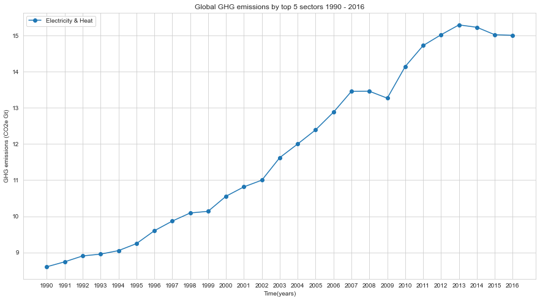


Looks like GHG emissions from electricity and heat have increased quite significantly since 1990. 

We can now add the other 4 sectors and see how they compare. 


```python
sector
```


<div>
<style scoped>
    .dataframe tbody tr th:only-of-type {
        vertical-align: middle;
    }

    .dataframe tbody tr th {
        vertical-align: top;
    }

    .dataframe thead th {
        text-align: right;
    }
</style>
<table border="1" class="dataframe">
  <thead>
    <tr style="text-align: right;">
      <th></th>
      <th>Year</th>
      <th>GHG emissions</th>
      <th>Gt</th>
    </tr>
    <tr>
      <th>Sector</th>
      <th></th>
      <th></th>
      <th></th>
    </tr>
  </thead>
  <tbody>
    <tr>
      <th>Agriculture</th>
      <td>1990</td>
      <td>5029.15</td>
      <td>5.02915</td>
    </tr>
    <tr>
      <th>Agriculture</th>
      <td>1991</td>
      <td>5013.56</td>
      <td>5.01356</td>
    </tr>
    <tr>
      <th>Agriculture</th>
      <td>1992</td>
      <td>4991.32</td>
      <td>4.99132</td>
    </tr>
    <tr>
      <th>Agriculture</th>
      <td>1993</td>
      <td>4962.59</td>
      <td>4.96259</td>
    </tr>
    <tr>
      <th>Agriculture</th>
      <td>1994</td>
      <td>5000.42</td>
      <td>5.00042</td>
    </tr>
    <tr>
      <th>...</th>
      <td>...</td>
      <td>...</td>
      <td>...</td>
    </tr>
    <tr>
      <th>Waste</th>
      <td>2012</td>
      <td>1476.63</td>
      <td>1.47663</td>
    </tr>
    <tr>
      <th>Waste</th>
      <td>2013</td>
      <td>1484.04</td>
      <td>1.48404</td>
    </tr>
    <tr>
      <th>Waste</th>
      <td>2014</td>
      <td>1514.26</td>
      <td>1.51426</td>
    </tr>
    <tr>
      <th>Waste</th>
      <td>2015</td>
      <td>1543.59</td>
      <td>1.54359</td>
    </tr>
    <tr>
      <th>Waste</th>
      <td>2016</td>
      <td>1560.85</td>
      <td>1.56085</td>
    </tr>
  </tbody>
</table>
<p>297 rows × 3 columns</p>
</div>


```python
#subset DF for other sectors

transp = sector.loc[['Transportation']]

ag = sector.loc[['Agriculture']]

manu_const  = sector.loc[['Manufacturing/Construction']]

land = sector.loc[['Land-Use Change and Forestry']]
```


```python
#plot all 5 sectors

fig, ax = plt.subplots(figsize=(15,8))

ax.plot(electricity_heat["Year"], electricity_heat["Gt"], label='Electricity & Heat', marker='o')

ax.plot(transp["Year"], transp["Gt"], label='Transportation', marker='o')

ax.plot(ag["Year"], ag["Gt"], label='Agriculture', marker='o')

ax.plot(manu_const["Year"], manu_const["Gt"], label='Manufacturing & Construction', marker='o')

ax.plot(land["Year"], land["Gt"], label='Land Use Change & Forestry', marker='o')

ax.set_title('Global GHG emissions by top 5 sectors 1990 - 2016')
            
ax.set_xlabel('Time(years)')
             
ax.set_ylabel('GHG emissions (CO2e Gt)')
             
ax.legend(loc='best')

plt.show()
```


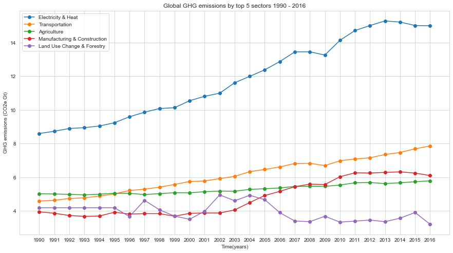


This plot clearly shows that the electricity & heat sector isn't only the biggest source of GHG emissions globally - accounting for nearly 28% of global emissions - but it's also increased the most since 1990 (by a huge 87%), from 8Gt to 15 Gt. 

Interestingly, it seems that emissions from land use and forestry have actually decreased since 1990. 

It's also not surprising that emissions from transportation, manufacturing and agriculture have also increased in this period.

These are interesting insights at a global level but it would be interesting to see which sectors are the most polluting at a country level, given the data varies from country to country.

Country GHG data can be downloaded from the Climate Watch website: https://www.climatewatchdata.org/ghg-emissions?breakBy=sector&chartType=line&end_year=2016&regions=AUS&start_year=1990

It would be interesting to see how Australia performs compared to the top emitters according to Climate Watch: China, US, India, EU and Russia, and explore which sectors contribute the most in each.

Let's look at Australia's data first.

## 8. Exploring GHG emissions by country and sector

### Australia

We'll upload the Australia dataset and carry out the same workflow as above to tidy up and prepare the data for analysis and visualisation. 


```python
au = pd.read_csv('au_ghg_emissions.csv')

au
```


<div>
<style scoped>
    .dataframe tbody tr th:only-of-type {
        vertical-align: middle;
    }

    .dataframe tbody tr th {
        vertical-align: top;
    }

    .dataframe thead th {
        text-align: right;
    }
</style>
<table border="1" class="dataframe">
  <thead>
    <tr style="text-align: right;">
      <th></th>
      <th>Sector</th>
      <th>unit</th>
      <th>1990</th>
      <th>1991</th>
      <th>1992</th>
      <th>1993</th>
      <th>1994</th>
      <th>1995</th>
      <th>1996</th>
      <th>1997</th>
      <th>...</th>
      <th>2007</th>
      <th>2008</th>
      <th>2009</th>
      <th>2010</th>
      <th>2011</th>
      <th>2012</th>
      <th>2013</th>
      <th>2014</th>
      <th>2015</th>
      <th>2016</th>
    </tr>
  </thead>
  <tbody>
    <tr>
      <th>0</th>
      <td>Energy</td>
      <td>MtCO2e</td>
      <td>295.07</td>
      <td>297.13</td>
      <td>303.14</td>
      <td>305.85</td>
      <td>309.55</td>
      <td>321.21</td>
      <td>332.66</td>
      <td>342.70</td>
      <td>...</td>
      <td>427.95</td>
      <td>430.55</td>
      <td>436.38</td>
      <td>429.39</td>
      <td>426.93</td>
      <td>426.45</td>
      <td>422.17</td>
      <td>411.14</td>
      <td>420.39</td>
      <td>434.90</td>
    </tr>
    <tr>
      <th>1</th>
      <td>Industrial Processes</td>
      <td>MtCO2e</td>
      <td>10.81</td>
      <td>10.37</td>
      <td>10.30</td>
      <td>9.91</td>
      <td>8.45</td>
      <td>7.69</td>
      <td>7.73</td>
      <td>7.63</td>
      <td>...</td>
      <td>13.98</td>
      <td>15.20</td>
      <td>15.83</td>
      <td>16.70</td>
      <td>16.92</td>
      <td>17.36</td>
      <td>16.79</td>
      <td>17.25</td>
      <td>17.92</td>
      <td>18.19</td>
    </tr>
    <tr>
      <th>2</th>
      <td>Agriculture</td>
      <td>MtCO2e</td>
      <td>182.84</td>
      <td>181.13</td>
      <td>177.69</td>
      <td>175.21</td>
      <td>176.70</td>
      <td>173.94</td>
      <td>156.99</td>
      <td>155.51</td>
      <td>...</td>
      <td>166.99</td>
      <td>136.59</td>
      <td>143.41</td>
      <td>117.87</td>
      <td>227.56</td>
      <td>228.01</td>
      <td>140.26</td>
      <td>162.86</td>
      <td>153.46</td>
      <td>119.64</td>
    </tr>
    <tr>
      <th>3</th>
      <td>Waste</td>
      <td>MtCO2e</td>
      <td>19.93</td>
      <td>19.91</td>
      <td>19.65</td>
      <td>19.49</td>
      <td>18.79</td>
      <td>18.73</td>
      <td>17.14</td>
      <td>16.90</td>
      <td>...</td>
      <td>14.40</td>
      <td>14.87</td>
      <td>14.80</td>
      <td>15.12</td>
      <td>14.49</td>
      <td>12.84</td>
      <td>12.02</td>
      <td>12.18</td>
      <td>11.54</td>
      <td>12.12</td>
    </tr>
    <tr>
      <th>4</th>
      <td>Land-Use Change and Forestry</td>
      <td>MtCO2e</td>
      <td>2.54</td>
      <td>2.54</td>
      <td>2.54</td>
      <td>2.54</td>
      <td>2.54</td>
      <td>2.54</td>
      <td>2.60</td>
      <td>5.43</td>
      <td>...</td>
      <td>5.45</td>
      <td>0.21</td>
      <td>7.50</td>
      <td>0.06</td>
      <td>-68.11</td>
      <td>-66.81</td>
      <td>-61.99</td>
      <td>-65.47</td>
      <td>-66.99</td>
      <td>-65.76</td>
    </tr>
    <tr>
      <th>5</th>
      <td>Data source</td>
      <td>CAIT</td>
      <td>NaN</td>
      <td>NaN</td>
      <td>NaN</td>
      <td>NaN</td>
      <td>NaN</td>
      <td>NaN</td>
      <td>NaN</td>
      <td>NaN</td>
      <td>...</td>
      <td>NaN</td>
      <td>NaN</td>
      <td>NaN</td>
      <td>NaN</td>
      <td>NaN</td>
      <td>NaN</td>
      <td>NaN</td>
      <td>NaN</td>
      <td>NaN</td>
      <td>NaN</td>
    </tr>
    <tr>
      <th>6</th>
      <td>Data for</td>
      <td>Countries/Regions: Australia. Sectors/Subsecto...</td>
      <td>NaN</td>
      <td>NaN</td>
      <td>NaN</td>
      <td>NaN</td>
      <td>NaN</td>
      <td>NaN</td>
      <td>NaN</td>
      <td>NaN</td>
      <td>...</td>
      <td>NaN</td>
      <td>NaN</td>
      <td>NaN</td>
      <td>NaN</td>
      <td>NaN</td>
      <td>NaN</td>
      <td>NaN</td>
      <td>NaN</td>
      <td>NaN</td>
      <td>NaN</td>
    </tr>
  </tbody>
</table>
<p>7 rows × 29 columns</p>
</div>


```python
#drop all columns with NaN values 
au.dropna(how='all', axis=1, inplace=True)

#drop all rows with NaN values
au.dropna(how='all', axis=0, inplace=True)

au
```


<div>
<style scoped>
    .dataframe tbody tr th:only-of-type {
        vertical-align: middle;
    }

    .dataframe tbody tr th {
        vertical-align: top;
    }

    .dataframe thead th {
        text-align: right;
    }
</style>
<table border="1" class="dataframe">
  <thead>
    <tr style="text-align: right;">
      <th></th>
      <th>Sector</th>
      <th>unit</th>
      <th>1990</th>
      <th>1991</th>
      <th>1992</th>
      <th>1993</th>
      <th>1994</th>
      <th>1995</th>
      <th>1996</th>
      <th>1997</th>
      <th>...</th>
      <th>2007</th>
      <th>2008</th>
      <th>2009</th>
      <th>2010</th>
      <th>2011</th>
      <th>2012</th>
      <th>2013</th>
      <th>2014</th>
      <th>2015</th>
      <th>2016</th>
    </tr>
  </thead>
  <tbody>
    <tr>
      <th>0</th>
      <td>Energy</td>
      <td>MtCO2e</td>
      <td>295.07</td>
      <td>297.13</td>
      <td>303.14</td>
      <td>305.85</td>
      <td>309.55</td>
      <td>321.21</td>
      <td>332.66</td>
      <td>342.70</td>
      <td>...</td>
      <td>427.95</td>
      <td>430.55</td>
      <td>436.38</td>
      <td>429.39</td>
      <td>426.93</td>
      <td>426.45</td>
      <td>422.17</td>
      <td>411.14</td>
      <td>420.39</td>
      <td>434.90</td>
    </tr>
    <tr>
      <th>1</th>
      <td>Industrial Processes</td>
      <td>MtCO2e</td>
      <td>10.81</td>
      <td>10.37</td>
      <td>10.30</td>
      <td>9.91</td>
      <td>8.45</td>
      <td>7.69</td>
      <td>7.73</td>
      <td>7.63</td>
      <td>...</td>
      <td>13.98</td>
      <td>15.20</td>
      <td>15.83</td>
      <td>16.70</td>
      <td>16.92</td>
      <td>17.36</td>
      <td>16.79</td>
      <td>17.25</td>
      <td>17.92</td>
      <td>18.19</td>
    </tr>
    <tr>
      <th>2</th>
      <td>Agriculture</td>
      <td>MtCO2e</td>
      <td>182.84</td>
      <td>181.13</td>
      <td>177.69</td>
      <td>175.21</td>
      <td>176.70</td>
      <td>173.94</td>
      <td>156.99</td>
      <td>155.51</td>
      <td>...</td>
      <td>166.99</td>
      <td>136.59</td>
      <td>143.41</td>
      <td>117.87</td>
      <td>227.56</td>
      <td>228.01</td>
      <td>140.26</td>
      <td>162.86</td>
      <td>153.46</td>
      <td>119.64</td>
    </tr>
    <tr>
      <th>3</th>
      <td>Waste</td>
      <td>MtCO2e</td>
      <td>19.93</td>
      <td>19.91</td>
      <td>19.65</td>
      <td>19.49</td>
      <td>18.79</td>
      <td>18.73</td>
      <td>17.14</td>
      <td>16.90</td>
      <td>...</td>
      <td>14.40</td>
      <td>14.87</td>
      <td>14.80</td>
      <td>15.12</td>
      <td>14.49</td>
      <td>12.84</td>
      <td>12.02</td>
      <td>12.18</td>
      <td>11.54</td>
      <td>12.12</td>
    </tr>
    <tr>
      <th>4</th>
      <td>Land-Use Change and Forestry</td>
      <td>MtCO2e</td>
      <td>2.54</td>
      <td>2.54</td>
      <td>2.54</td>
      <td>2.54</td>
      <td>2.54</td>
      <td>2.54</td>
      <td>2.60</td>
      <td>5.43</td>
      <td>...</td>
      <td>5.45</td>
      <td>0.21</td>
      <td>7.50</td>
      <td>0.06</td>
      <td>-68.11</td>
      <td>-66.81</td>
      <td>-61.99</td>
      <td>-65.47</td>
      <td>-66.99</td>
      <td>-65.76</td>
    </tr>
    <tr>
      <th>5</th>
      <td>Data source</td>
      <td>CAIT</td>
      <td>NaN</td>
      <td>NaN</td>
      <td>NaN</td>
      <td>NaN</td>
      <td>NaN</td>
      <td>NaN</td>
      <td>NaN</td>
      <td>NaN</td>
      <td>...</td>
      <td>NaN</td>
      <td>NaN</td>
      <td>NaN</td>
      <td>NaN</td>
      <td>NaN</td>
      <td>NaN</td>
      <td>NaN</td>
      <td>NaN</td>
      <td>NaN</td>
      <td>NaN</td>
    </tr>
    <tr>
      <th>6</th>
      <td>Data for</td>
      <td>Countries/Regions: Australia. Sectors/Subsecto...</td>
      <td>NaN</td>
      <td>NaN</td>
      <td>NaN</td>
      <td>NaN</td>
      <td>NaN</td>
      <td>NaN</td>
      <td>NaN</td>
      <td>NaN</td>
      <td>...</td>
      <td>NaN</td>
      <td>NaN</td>
      <td>NaN</td>
      <td>NaN</td>
      <td>NaN</td>
      <td>NaN</td>
      <td>NaN</td>
      <td>NaN</td>
      <td>NaN</td>
      <td>NaN</td>
    </tr>
  </tbody>
</table>
<p>7 rows × 29 columns</p>
</div>


```python
#drop col
au.drop(['unit'], axis=1, inplace=True)
#drop rows
au.drop([5,6], inplace=True)
```


```python
#view DF to validate changes are in place
au
```


<div>
<style scoped>
    .dataframe tbody tr th:only-of-type {
        vertical-align: middle;
    }

    .dataframe tbody tr th {
        vertical-align: top;
    }

    .dataframe thead th {
        text-align: right;
    }
</style>
<table border="1" class="dataframe">
  <thead>
    <tr style="text-align: right;">
      <th></th>
      <th>Sector</th>
      <th>1990</th>
      <th>1991</th>
      <th>1992</th>
      <th>1993</th>
      <th>1994</th>
      <th>1995</th>
      <th>1996</th>
      <th>1997</th>
      <th>1998</th>
      <th>...</th>
      <th>2007</th>
      <th>2008</th>
      <th>2009</th>
      <th>2010</th>
      <th>2011</th>
      <th>2012</th>
      <th>2013</th>
      <th>2014</th>
      <th>2015</th>
      <th>2016</th>
    </tr>
  </thead>
  <tbody>
    <tr>
      <th>0</th>
      <td>Energy</td>
      <td>295.07</td>
      <td>297.13</td>
      <td>303.14</td>
      <td>305.85</td>
      <td>309.55</td>
      <td>321.21</td>
      <td>332.66</td>
      <td>342.70</td>
      <td>363.41</td>
      <td>...</td>
      <td>427.95</td>
      <td>430.55</td>
      <td>436.38</td>
      <td>429.39</td>
      <td>426.93</td>
      <td>426.45</td>
      <td>422.17</td>
      <td>411.14</td>
      <td>420.39</td>
      <td>434.90</td>
    </tr>
    <tr>
      <th>1</th>
      <td>Industrial Processes</td>
      <td>10.81</td>
      <td>10.37</td>
      <td>10.30</td>
      <td>9.91</td>
      <td>8.45</td>
      <td>7.69</td>
      <td>7.73</td>
      <td>7.63</td>
      <td>8.54</td>
      <td>...</td>
      <td>13.98</td>
      <td>15.20</td>
      <td>15.83</td>
      <td>16.70</td>
      <td>16.92</td>
      <td>17.36</td>
      <td>16.79</td>
      <td>17.25</td>
      <td>17.92</td>
      <td>18.19</td>
    </tr>
    <tr>
      <th>2</th>
      <td>Agriculture</td>
      <td>182.84</td>
      <td>181.13</td>
      <td>177.69</td>
      <td>175.21</td>
      <td>176.70</td>
      <td>173.94</td>
      <td>156.99</td>
      <td>155.51</td>
      <td>162.50</td>
      <td>...</td>
      <td>166.99</td>
      <td>136.59</td>
      <td>143.41</td>
      <td>117.87</td>
      <td>227.56</td>
      <td>228.01</td>
      <td>140.26</td>
      <td>162.86</td>
      <td>153.46</td>
      <td>119.64</td>
    </tr>
    <tr>
      <th>3</th>
      <td>Waste</td>
      <td>19.93</td>
      <td>19.91</td>
      <td>19.65</td>
      <td>19.49</td>
      <td>18.79</td>
      <td>18.73</td>
      <td>17.14</td>
      <td>16.90</td>
      <td>16.08</td>
      <td>...</td>
      <td>14.40</td>
      <td>14.87</td>
      <td>14.80</td>
      <td>15.12</td>
      <td>14.49</td>
      <td>12.84</td>
      <td>12.02</td>
      <td>12.18</td>
      <td>11.54</td>
      <td>12.12</td>
    </tr>
    <tr>
      <th>4</th>
      <td>Land-Use Change and Forestry</td>
      <td>2.54</td>
      <td>2.54</td>
      <td>2.54</td>
      <td>2.54</td>
      <td>2.54</td>
      <td>2.54</td>
      <td>2.60</td>
      <td>5.43</td>
      <td>3.64</td>
      <td>...</td>
      <td>5.45</td>
      <td>0.21</td>
      <td>7.50</td>
      <td>0.06</td>
      <td>-68.11</td>
      <td>-66.81</td>
      <td>-61.99</td>
      <td>-65.47</td>
      <td>-66.99</td>
      <td>-65.76</td>
    </tr>
  </tbody>
</table>
<p>5 rows × 28 columns</p>
</div>


```python
#melt the DF
au_melt = au.melt(id_vars='Sector', var_name='Year', value_name='GHG emissions' )
```


```python
#sort values by sector from 1990 to 2016
au_melt.sort_values(by=['Sector', 'Year'], ascending=True, inplace=True)
```


```python
#set the sector col as index
au_melt = au_melt.set_index('Sector')
```


```python
#view results
au_melt
```


<div>
<style scoped>
    .dataframe tbody tr th:only-of-type {
        vertical-align: middle;
    }

    .dataframe tbody tr th {
        vertical-align: top;
    }

    .dataframe thead th {
        text-align: right;
    }
</style>
<table border="1" class="dataframe">
  <thead>
    <tr style="text-align: right;">
      <th></th>
      <th>Year</th>
      <th>GHG emissions</th>
    </tr>
    <tr>
      <th>Sector</th>
      <th></th>
      <th></th>
    </tr>
  </thead>
  <tbody>
    <tr>
      <th>Agriculture</th>
      <td>1990</td>
      <td>182.84</td>
    </tr>
    <tr>
      <th>Agriculture</th>
      <td>1991</td>
      <td>181.13</td>
    </tr>
    <tr>
      <th>Agriculture</th>
      <td>1992</td>
      <td>177.69</td>
    </tr>
    <tr>
      <th>Agriculture</th>
      <td>1993</td>
      <td>175.21</td>
    </tr>
    <tr>
      <th>Agriculture</th>
      <td>1994</td>
      <td>176.70</td>
    </tr>
    <tr>
      <th>...</th>
      <td>...</td>
      <td>...</td>
    </tr>
    <tr>
      <th>Waste</th>
      <td>2012</td>
      <td>12.84</td>
    </tr>
    <tr>
      <th>Waste</th>
      <td>2013</td>
      <td>12.02</td>
    </tr>
    <tr>
      <th>Waste</th>
      <td>2014</td>
      <td>12.18</td>
    </tr>
    <tr>
      <th>Waste</th>
      <td>2015</td>
      <td>11.54</td>
    </tr>
    <tr>
      <th>Waste</th>
      <td>2016</td>
      <td>12.12</td>
    </tr>
  </tbody>
</table>
<p>135 rows × 2 columns</p>
</div>


```python
#run exploratory stats to see how sectors rank
au_totals = au_melt.groupby('Sector')['GHG emissions'].sum().sort_values(ascending=False)
```


```python
#view results
au_totals
```


    Sector
    Energy                          10257.87
    Agriculture                      4658.11
    Waste                             422.02
    Industrial Processes              335.35
    Land-Use Change and Forestry      -72.03
    Name: GHG emissions, dtype: float64


```python
#convert series object into DF
au_sec_df = au_totals.to_frame()
```


```python
#view results
au_sec_df
```


<div>
<style scoped>
    .dataframe tbody tr th:only-of-type {
        vertical-align: middle;
    }

    .dataframe tbody tr th {
        vertical-align: top;
    }

    .dataframe thead th {
        text-align: right;
    }
</style>
<table border="1" class="dataframe">
  <thead>
    <tr style="text-align: right;">
      <th></th>
      <th>GHG emissions</th>
    </tr>
    <tr>
      <th>Sector</th>
      <th></th>
    </tr>
  </thead>
  <tbody>
    <tr>
      <th>Energy</th>
      <td>10257.87</td>
    </tr>
    <tr>
      <th>Agriculture</th>
      <td>4658.11</td>
    </tr>
    <tr>
      <th>Waste</th>
      <td>422.02</td>
    </tr>
    <tr>
      <th>Industrial Processes</th>
      <td>335.35</td>
    </tr>
    <tr>
      <th>Land-Use Change and Forestry</th>
      <td>-72.03</td>
    </tr>
  </tbody>
</table>
</div>


```python
#add Gt column
au_sec_df['Gt'] = au_sec_df['GHG emissions']/1000
```


```python
#view results
au_sec_df
```


<div>
<style scoped>
    .dataframe tbody tr th:only-of-type {
        vertical-align: middle;
    }

    .dataframe tbody tr th {
        vertical-align: top;
    }

    .dataframe thead th {
        text-align: right;
    }
</style>
<table border="1" class="dataframe">
  <thead>
    <tr style="text-align: right;">
      <th></th>
      <th>GHG emissions</th>
      <th>Gt</th>
    </tr>
    <tr>
      <th>Sector</th>
      <th></th>
      <th></th>
    </tr>
  </thead>
  <tbody>
    <tr>
      <th>Energy</th>
      <td>10257.87</td>
      <td>10.25787</td>
    </tr>
    <tr>
      <th>Agriculture</th>
      <td>4658.11</td>
      <td>4.65811</td>
    </tr>
    <tr>
      <th>Waste</th>
      <td>422.02</td>
      <td>0.42202</td>
    </tr>
    <tr>
      <th>Industrial Processes</th>
      <td>335.35</td>
      <td>0.33535</td>
    </tr>
    <tr>
      <th>Land-Use Change and Forestry</th>
      <td>-72.03</td>
      <td>-0.07203</td>
    </tr>
  </tbody>
</table>
</div>


```python
fig, ax = plt.subplots(figsize=(15,8))

ax.bar(au_sec_df.index, au_sec_df['Gt'], color='g')

ax.set_ylabel("GHG emissions (CO2e Gt)")

ax.set_title("Australia GHG emissions by top emitting sectors (1990-2016)")

plt.show()
```


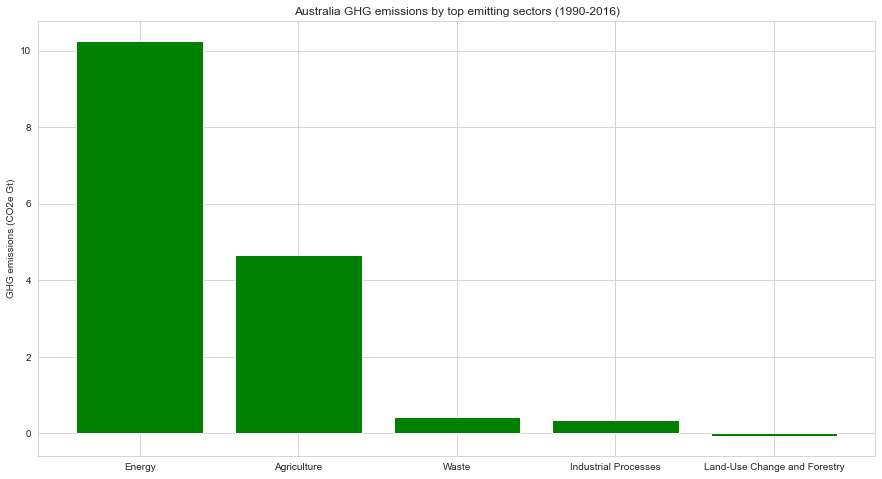


### Insights

- Looks like in Australia, Energy is the top GHG emitter, emitting over 10.2Gt in total for the 1990-2016 period. 

- This sector's GHG emissions are more than double those emitted by the Agriculture sector, which is the second largest emitter in Australia with over 4.6Gt emitted since 1990.

- Waste, industrial processes and land use and forestry also contribute to Australia's GHG emissions but far less than the energy and agriculture sector.

Next, let's explore how each sectors has performed over time.


```python
#subset by row label to create a DF for each sector
energy = au_melt.loc[['Energy']]

ag = au_melt.loc[['Agriculture']]

wst = au_melt.loc[['Waste']]

ind = au_melt.loc[['Industrial Processes']]

lf = au_melt.loc[['Land-Use Change and Forestry']]
```


```python
energy
```


<div>
<style scoped>
    .dataframe tbody tr th:only-of-type {
        vertical-align: middle;
    }

    .dataframe tbody tr th {
        vertical-align: top;
    }

    .dataframe thead th {
        text-align: right;
    }
</style>
<table border="1" class="dataframe">
  <thead>
    <tr style="text-align: right;">
      <th></th>
      <th>Year</th>
      <th>GHG emissions</th>
    </tr>
    <tr>
      <th>Sector</th>
      <th></th>
      <th></th>
    </tr>
  </thead>
  <tbody>
    <tr>
      <th>Energy</th>
      <td>1990</td>
      <td>295.07</td>
    </tr>
    <tr>
      <th>Energy</th>
      <td>1991</td>
      <td>297.13</td>
    </tr>
    <tr>
      <th>Energy</th>
      <td>1992</td>
      <td>303.14</td>
    </tr>
    <tr>
      <th>Energy</th>
      <td>1993</td>
      <td>305.85</td>
    </tr>
    <tr>
      <th>Energy</th>
      <td>1994</td>
      <td>309.55</td>
    </tr>
    <tr>
      <th>Energy</th>
      <td>1995</td>
      <td>321.21</td>
    </tr>
    <tr>
      <th>Energy</th>
      <td>1996</td>
      <td>332.66</td>
    </tr>
    <tr>
      <th>Energy</th>
      <td>1997</td>
      <td>342.70</td>
    </tr>
    <tr>
      <th>Energy</th>
      <td>1998</td>
      <td>363.41</td>
    </tr>
    <tr>
      <th>Energy</th>
      <td>1999</td>
      <td>365.21</td>
    </tr>
    <tr>
      <th>Energy</th>
      <td>2000</td>
      <td>372.96</td>
    </tr>
    <tr>
      <th>Energy</th>
      <td>2001</td>
      <td>378.67</td>
    </tr>
    <tr>
      <th>Energy</th>
      <td>2002</td>
      <td>385.41</td>
    </tr>
    <tr>
      <th>Energy</th>
      <td>2003</td>
      <td>388.97</td>
    </tr>
    <tr>
      <th>Energy</th>
      <td>2004</td>
      <td>403.54</td>
    </tr>
    <tr>
      <th>Energy</th>
      <td>2005</td>
      <td>409.82</td>
    </tr>
    <tr>
      <th>Energy</th>
      <td>2006</td>
      <td>416.32</td>
    </tr>
    <tr>
      <th>Energy</th>
      <td>2007</td>
      <td>427.95</td>
    </tr>
    <tr>
      <th>Energy</th>
      <td>2008</td>
      <td>430.55</td>
    </tr>
    <tr>
      <th>Energy</th>
      <td>2009</td>
      <td>436.38</td>
    </tr>
    <tr>
      <th>Energy</th>
      <td>2010</td>
      <td>429.39</td>
    </tr>
    <tr>
      <th>Energy</th>
      <td>2011</td>
      <td>426.93</td>
    </tr>
    <tr>
      <th>Energy</th>
      <td>2012</td>
      <td>426.45</td>
    </tr>
    <tr>
      <th>Energy</th>
      <td>2013</td>
      <td>422.17</td>
    </tr>
    <tr>
      <th>Energy</th>
      <td>2014</td>
      <td>411.14</td>
    </tr>
    <tr>
      <th>Energy</th>
      <td>2015</td>
      <td>420.39</td>
    </tr>
    <tr>
      <th>Energy</th>
      <td>2016</td>
      <td>434.90</td>
    </tr>
  </tbody>
</table>
</div>


### Visualising Australia's GHG emissions by sector over time


```python
fig, ax = plt.subplots(figsize=(15,8))

ax.plot(energy.Year, energy['GHG emissions'], label='Energy', marker='o')

ax.plot(ag.Year, ag['GHG emissions'], label='Agriculture', marker='v')

ax.plot(wst.Year, wst['GHG emissions'], label='Waste', marker='s')

ax.plot(ind.Year, ind['GHG emissions'], label='Industrial Processes', marker='D')

ax.plot(lf.Year, lf['GHG emissions'], label='Land use & Forestry', marker='X')

ax.set_title('Australia GHG emissions by sector (1990-2016)')

ax.set_ylabel('GHG emissions (thousands of tonnes (CO2e))')

ax.legend(loc='best')

plt.show()
```


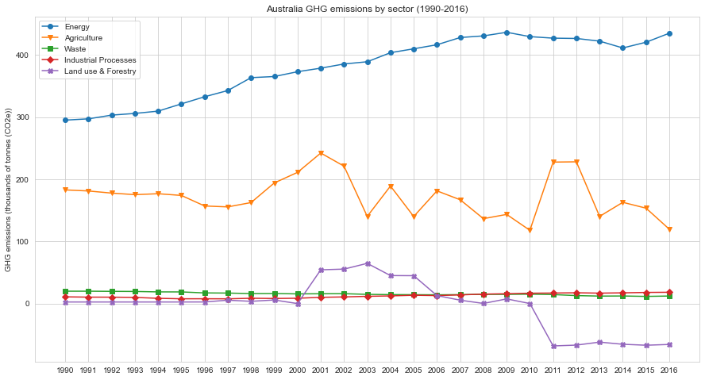


This plot tells an interesting story - 

- it seems GHG emissions from the Australian energy sector have increased quite significantly since 1990 whereas waste and industrial processes emissions have stayed fairly consistently low. 

- while agricultural emissions have peaked in 2001 and 2011/12, they've decreased since and were lower in 2016 than they were in the 1990s.

- emissions from land use & forestry have decreased dramatically since the 90s (after peaking in 2003) and have remained negative since 2011.

To calculate the exact cumulative increase in the Energy sector we can run the pandas' pct_change() function.


```python
energy['pct_change'] = energy['GHG emissions'].pct_change().cumsum()

energy
```


<div>
<style scoped>
    .dataframe tbody tr th:only-of-type {
        vertical-align: middle;
    }

    .dataframe tbody tr th {
        vertical-align: top;
    }

    .dataframe thead th {
        text-align: right;
    }
</style>
<table border="1" class="dataframe">
  <thead>
    <tr style="text-align: right;">
      <th></th>
      <th>Year</th>
      <th>GHG emissions</th>
      <th>pct_change</th>
    </tr>
    <tr>
      <th>Sector</th>
      <th></th>
      <th></th>
      <th></th>
    </tr>
  </thead>
  <tbody>
    <tr>
      <th>Energy</th>
      <td>1990</td>
      <td>295.07</td>
      <td>NaN</td>
    </tr>
    <tr>
      <th>Energy</th>
      <td>1991</td>
      <td>297.13</td>
      <td>0.006981</td>
    </tr>
    <tr>
      <th>Energy</th>
      <td>1992</td>
      <td>303.14</td>
      <td>0.027208</td>
    </tr>
    <tr>
      <th>Energy</th>
      <td>1993</td>
      <td>305.85</td>
      <td>0.036148</td>
    </tr>
    <tr>
      <th>Energy</th>
      <td>1994</td>
      <td>309.55</td>
      <td>0.048245</td>
    </tr>
    <tr>
      <th>Energy</th>
      <td>1995</td>
      <td>321.21</td>
      <td>0.085913</td>
    </tr>
    <tr>
      <th>Energy</th>
      <td>1996</td>
      <td>332.66</td>
      <td>0.121559</td>
    </tr>
    <tr>
      <th>Energy</th>
      <td>1997</td>
      <td>342.70</td>
      <td>0.151740</td>
    </tr>
    <tr>
      <th>Energy</th>
      <td>1998</td>
      <td>363.41</td>
      <td>0.212172</td>
    </tr>
    <tr>
      <th>Energy</th>
      <td>1999</td>
      <td>365.21</td>
      <td>0.217125</td>
    </tr>
    <tr>
      <th>Energy</th>
      <td>2000</td>
      <td>372.96</td>
      <td>0.238346</td>
    </tr>
    <tr>
      <th>Energy</th>
      <td>2001</td>
      <td>378.67</td>
      <td>0.253656</td>
    </tr>
    <tr>
      <th>Energy</th>
      <td>2002</td>
      <td>385.41</td>
      <td>0.271455</td>
    </tr>
    <tr>
      <th>Energy</th>
      <td>2003</td>
      <td>388.97</td>
      <td>0.280692</td>
    </tr>
    <tr>
      <th>Energy</th>
      <td>2004</td>
      <td>403.54</td>
      <td>0.318150</td>
    </tr>
    <tr>
      <th>Energy</th>
      <td>2005</td>
      <td>409.82</td>
      <td>0.333712</td>
    </tr>
    <tr>
      <th>Energy</th>
      <td>2006</td>
      <td>416.32</td>
      <td>0.349573</td>
    </tr>
    <tr>
      <th>Energy</th>
      <td>2007</td>
      <td>427.95</td>
      <td>0.377508</td>
    </tr>
    <tr>
      <th>Energy</th>
      <td>2008</td>
      <td>430.55</td>
      <td>0.383584</td>
    </tr>
    <tr>
      <th>Energy</th>
      <td>2009</td>
      <td>436.38</td>
      <td>0.397124</td>
    </tr>
    <tr>
      <th>Energy</th>
      <td>2010</td>
      <td>429.39</td>
      <td>0.381106</td>
    </tr>
    <tr>
      <th>Energy</th>
      <td>2011</td>
      <td>426.93</td>
      <td>0.375377</td>
    </tr>
    <tr>
      <th>Energy</th>
      <td>2012</td>
      <td>426.45</td>
      <td>0.374253</td>
    </tr>
    <tr>
      <th>Energy</th>
      <td>2013</td>
      <td>422.17</td>
      <td>0.364217</td>
    </tr>
    <tr>
      <th>Energy</th>
      <td>2014</td>
      <td>411.14</td>
      <td>0.338090</td>
    </tr>
    <tr>
      <th>Energy</th>
      <td>2015</td>
      <td>420.39</td>
      <td>0.360588</td>
    </tr>
    <tr>
      <th>Energy</th>
      <td>2016</td>
      <td>434.90</td>
      <td>0.395104</td>
    </tr>
  </tbody>
</table>
</div>


```python
energy.plot(x='Year', y='pct_change',marker='o', color='m', figsize=(15,8), title='Australian energy sector GHG emissions % change (1990-2016)')

plt.show()
```


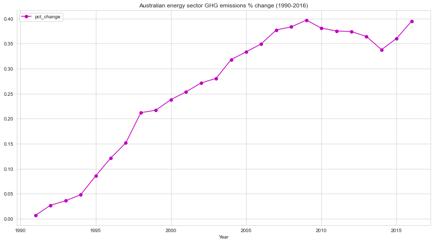


This plot demonstrates a 40% cumulative increase in Australia's energy sector GHG emissions since 1990. There seems to have bee a slight drop between 2009-2014 but emissions have been inceasing again since.

If you'd like to find out more about the topics covered in this project, or would like to explore more datasets, please visit the climate watch website.


```python

```
